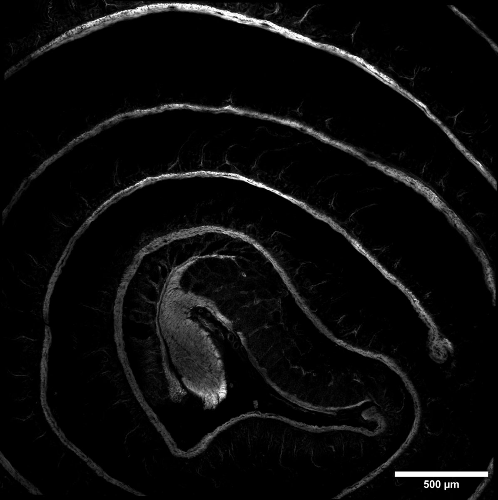

# Configurations

| UniProt Accession Number   | Reagent Type     | Target Name / Protein Biomarker   | Target Species   | Host Organism   | Isotype   | Clonality   | Vendor                   | Catalog Number   | Conjugate   | RRID       | Availability   | Method        | Tissue Preservation               | Target Tissue   | Tissue State   | Detergent         | Antigen Retrieval Conditions   | Dye Inactivation Conditions   | Recommend   | Agree                                                        | Disagree   | Contributor                                                  | Notes   |
|:---------------------------|:-----------------|:----------------------------------|:-----------------|:----------------|:----------|:------------|:-------------------------|:-----------------|:------------|:-----------|:---------------|:--------------|:----------------------------------|:----------------|:---------------|:------------------|:-------------------------------|:------------------------------|:------------|:-------------------------------------------------------------|:-----------|:-------------------------------------------------------------|:--------|
| P62737                     | Primary Antibody | Alpha smooth muscle actin         | Mouse            | Mouse           | IgG2a     | 1A4         | Thermo Fisher Scientific | 53-9760-82       | AF488       | AB_2574461 | Stock          | IBEX2D Manual | 1:4 Cytofix/Cytoperm Fixed Frozen | Small Intestine      | NA             | 0.3% Triton-X-100 | NA                             | 1 mg/ml LiBH4 15 minutes      | Yes         | [0000-0002-1461-0999](https://orcid.org/0000-0002-1461-0999) | NA         | [0000-0002-1461-0999](https://orcid.org/0000-0002-1461-0999) |         |

# Publications

# Additional Notes

| Mouse small intestine: alpha smooth muscle actin (grey, catalogue number 53-9760-82) |
|:-------:|
|  |
