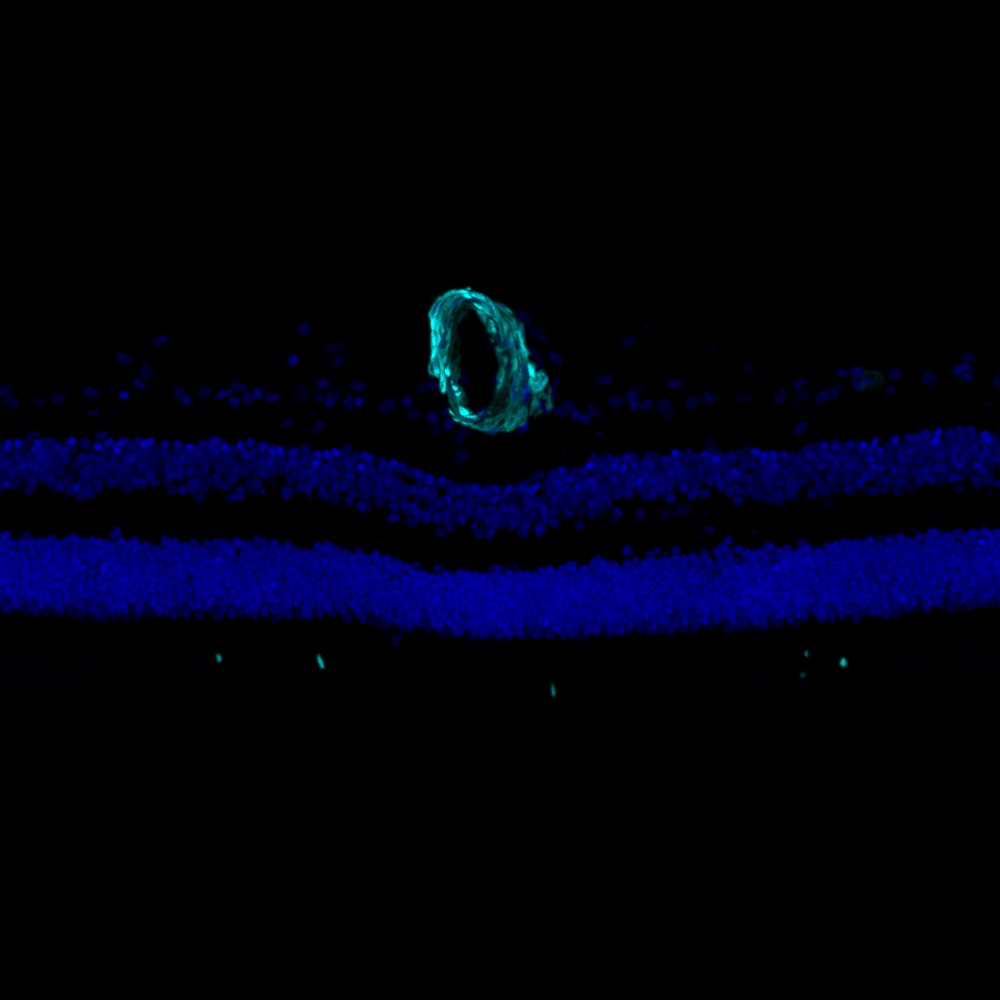

# Configurations

| UniProt Accession Number   | Reagent Type     | Target Name / Protein Biomarker   | Target Species   | Host Organism   | Isotype   | Clonality   | Vendor                   | Catalog Number   | Conjugate   | RRID       | Availability   | Method        | Tissue Preservation               | Target Tissue   | Tissue State   | Detergent    | Antigen Retrieval Conditions   | Dye Inactivation Conditions   | Recommend   | Agree                                                        | Disagree   | Contributor                                                  | Notes       |
|:---------------------------|:-----------------|:----------------------------------|:-----------------|:----------------|:----------|:------------|:-------------------------|:-----------------|:------------|:-----------|:---------------|:--------------|:----------------------------------|:----------------|:---------------|:-------------|:-------------------------------|:------------------------------|:------------|:-------------------------------------------------------------|:-----------|:-------------------------------------------------------------|:------------|
| P62736                     | Primary Antibody | Alpha smooth muscle actin         | Human            | Mouse           | IgG2a     | 1A4         | Thermo Fisher Scientific | 53-9760-82       | AF488       | AB_2574461 | Stock          | IBEX2D Manual | 1:4 Cytofix/Cytoperm Fixed Frozen | Retina          | NA             | 0.1% Saponin | NA                             | 1 mg/ml LiBH4 15 minutes      | Yes         | [0000-0003-2088-8310](https://orcid.org/0000-0003-2088-8310) | NA         | [0000-0003-2088-8310](https://orcid.org/0000-0003-2088-8310) | [1](#notes) |

# Publications

# Additional Notes

1. Lineage marker for smooth muscle cells and pericytes. Stains retinal arteries.

| Human retina: Alpha smooth muscle actin (cyan, catalog number 53-9760-82) and Hoechst (blue, catalog number 40046) |
|:-------:|
|  |
