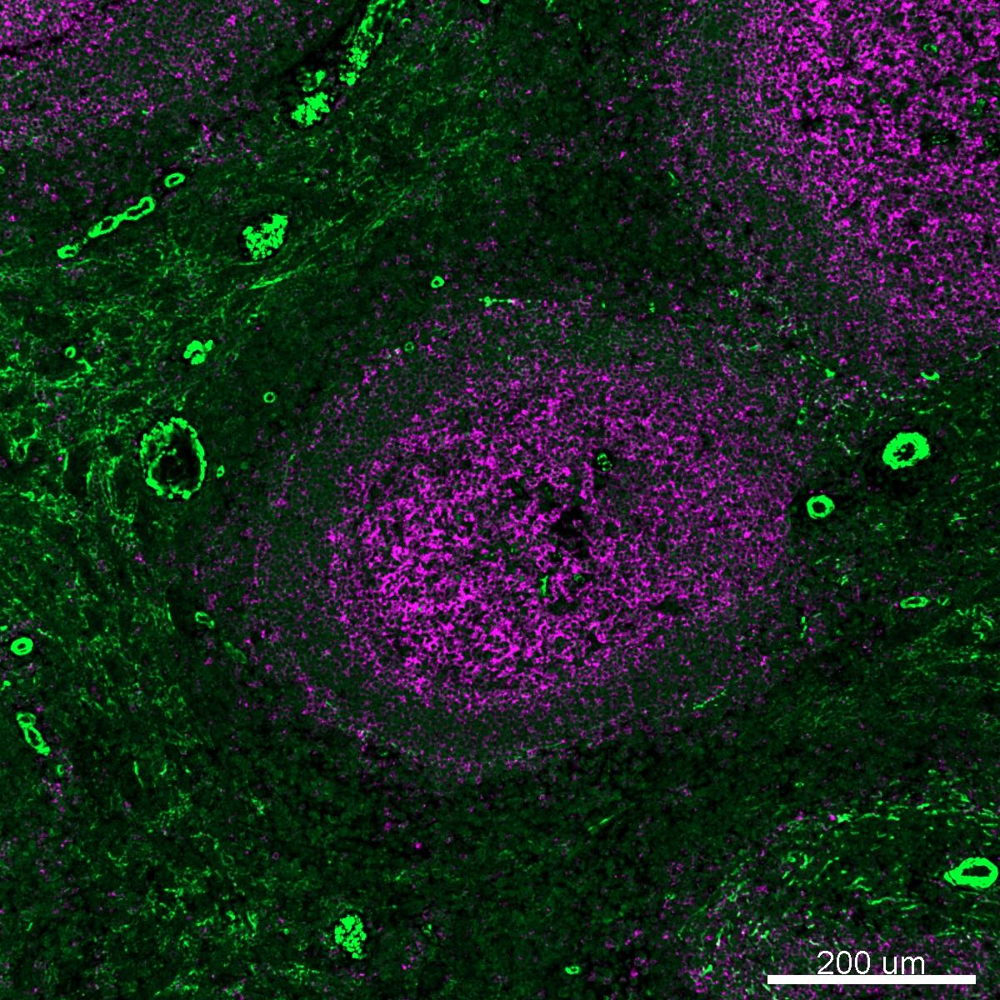

# Configurations

| UniProt Accession Number   | Reagent Type     | Target Name / Protein Biomarker   | Target Species   | Host Organism   | Isotype   | Clonality   | Vendor                   | Catalog Number   | Conjugate   | RRID       | Availability   | Method                 | Tissue Preservation   | Target Tissue   | Tissue State   | Detergent         | Antigen Retrieval Conditions                          | Dye Inactivation Conditions   | Recommend   | Agree                                                        | Disagree   | Contributor                                                  | Notes       |
|:---------------------------|:-----------------|:----------------------------------|:-----------------|:----------------|:----------|:------------|:-------------------------|:-----------------|:------------|:-----------|:---------------|:-----------------------|:----------------------|:----------------|:---------------|:------------------|:------------------------------------------------------|:------------------------------|:------------|:-------------------------------------------------------------|:-----------|:-------------------------------------------------------------|:------------|
| NA                         | Primary Antibody | Alpha smooth muscle actin         | Rhesus Macaque   | Mouse           | IgG2a     | 1A4         | Thermo Fisher Scientific | 53-9760-82       | AF488       | AB_2574461 | Stock          | Multiplexed 2D Imaging | FFPE                  | Spleen          | NA             | 0.3% Triton-X-100 | pH 6 for 20 minutes ER1 (AR9961) using the Leica Bond | NA                            | Yes         | [0009-0004-2746-8743](https://orcid.org/0009-0004-2746-8743) | NA         | [0009-0004-2746-8743](https://orcid.org/0009-0004-2746-8743) | [1](#notes) |

# Publications

# Additional Notes

1. Labels stroma, fibroblasts and smooth muscle cells, of the spleen. High autofluorescence in AF488 channel. Good signal with 1:50 dilution.

| NHP spleen: CD20 (magenta, catalog number 50-0202-82) and a-SMA (green, catalog number 53-9760-82) |
|:-------:|
|  |
