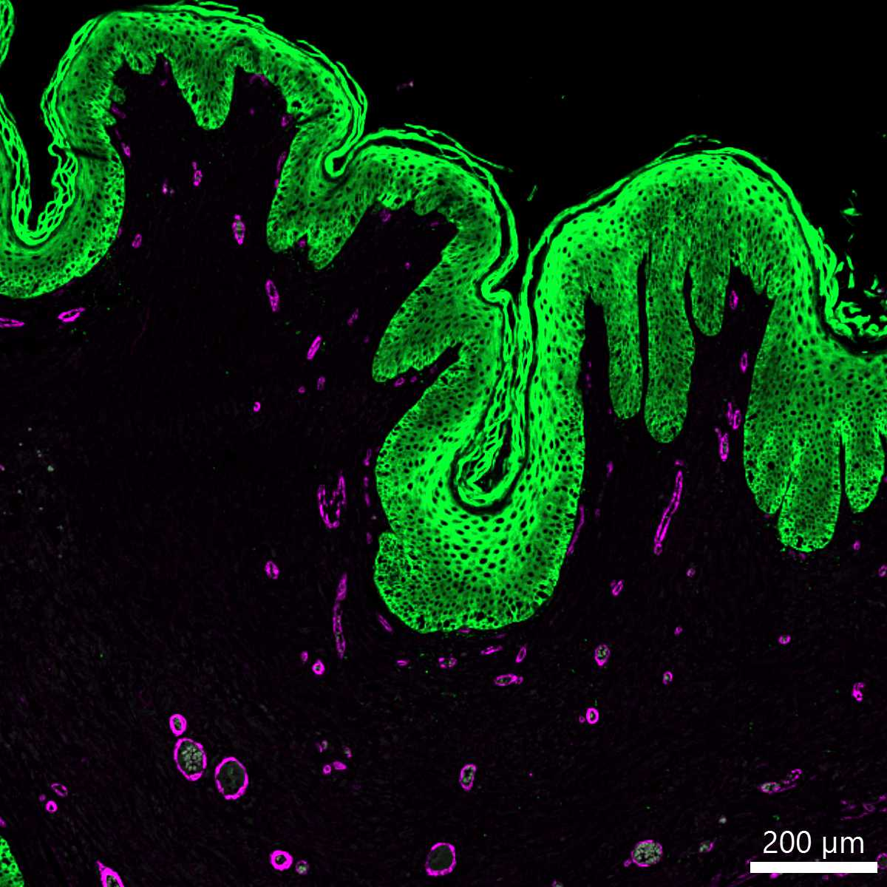

# Configurations

| UniProt Accession Number   | Reagent Type     | Target Name / Protein Biomarker   | Target Species   | Host Organism   | Isotype   | Clonality   | Vendor                   | Catalog Number   | Conjugate   | RRID       | Availability   | Method                 | Tissue Preservation   | Target Tissue   | Tissue State   | Detergent         | Antigen Retrieval Conditions                                                               | Dye Inactivation Conditions   | Recommend   | Agree                                                        | Disagree   | Contributor                                                  | Notes   |
|:---------------------------|:-----------------|:----------------------------------|:-----------------|:----------------|:----------|:------------|:-------------------------|:-----------------|:------------|:-----------|:---------------|:-----------------------|:----------------------|:----------------|:---------------|:------------------|:-------------------------------------------------------------------------------------------|:------------------------------|:------------|:-------------------------------------------------------------|:-----------|:-------------------------------------------------------------|:--------|
| NA                         | Primary Antibody | Alpha smooth muscle actin         | Canine           | Mouse           | IgG2a     | 1A4         | Thermo Fisher Scientific | 41-9760-82       | eF570       | AB_2573631 | Stock          | Multiplexed 2D Imaging | FFPE                  | Skin            | Melanoma       | 0.3% Triton-X-100 | pH 6 for 30 minutes ER1 (AR9961) and pH 9 for 30 minutes ER2 (AR9640) using the Leica Bond | NA                            | Yes         | [0000-0001-5088-7808](https://orcid.org/0000-0001-5088-7808) | NA         | [0000-0001-5088-7808](https://orcid.org/0000-0001-5088-7808) |         |

# Publications

# Additional Notes

| Canine melanoma skin FFPE: a-SMA (magenta, catalog number 41-9760-82) and pan-cytokeratin (green, catalog number 53-9003-80) |
|:-------:|
|  |
