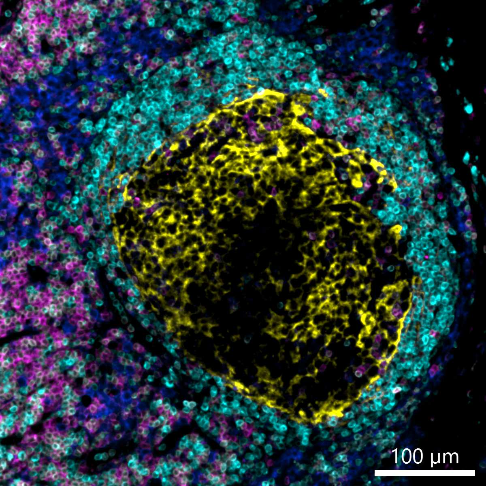
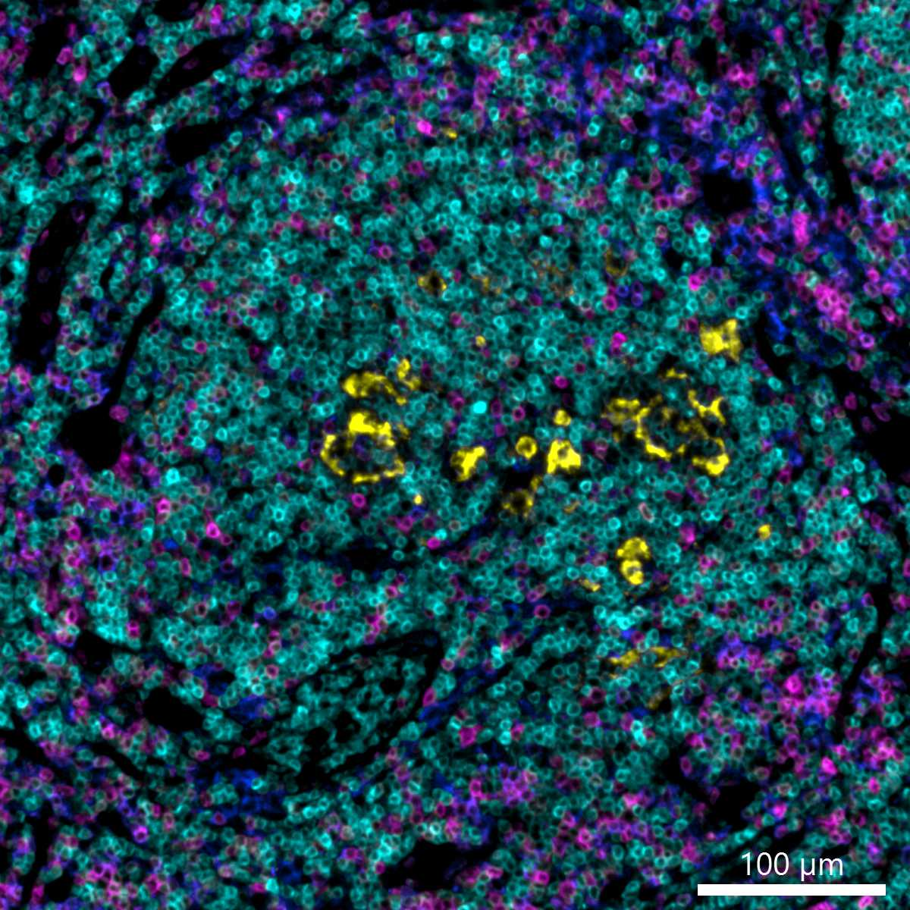
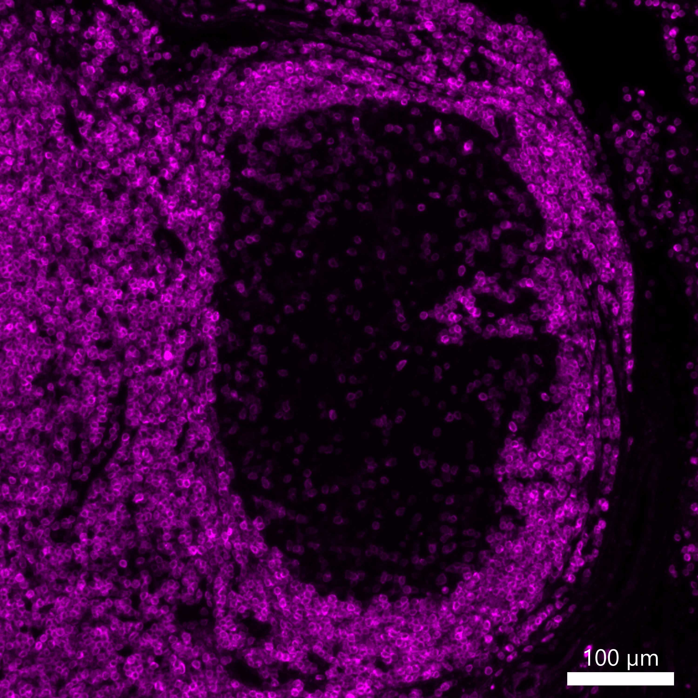

# Configurations

| UniProt Accession Number   | Reagent Type     | Target Name / Protein Biomarker   | Target Species   | Host Organism   | Isotype   | Clonality   | Vendor   | Catalog Number   | Conjugate    | RRID   | Availability   | Method                 | Tissue Preservation   | Target Tissue   | Tissue State        | Detergent         | Antigen Retrieval Conditions                                                               | Dye Inactivation Conditions   | Recommend   | Agree                                    | Disagree   | Contributor         | Notes       |
|:---------------------------|:-----------------|:----------------------------------|:-----------------|:----------------|:----------|:------------|:---------|:-----------------|:-------------|:-------|:---------------|:-----------------------|:----------------------|:----------------|:--------------------|:------------------|:-------------------------------------------------------------------------------------------|:------------------------------|:------------|:-----------------------------------------|:-----------|:--------------------|:------------|
| P10415                     | Primary Antibody | BCL2                              | Human            | Rabbit          | IgG       | SP66        | Abcam    | ab236221         | Unconjugated | NA     | Stock          | Multiplexed 2D Imaging | FFPE                  | Lymph Node      | Follicular Lymphoma | 0.3% Triton-X-100 | pH 6 for 40 minutes at 95C (AR6 Akoya Biosciences AR600250ML)                              | NA                            | Yes         | [0000-0003-4379-8967](https://orcid.org/0000-0003-4379-8967) [[1](#publications)] | NA         | [0000-0003-4379-8967](https://orcid.org/0000-0003-4379-8967) | [1](#notes) |
| P10415                     | Primary Antibody | BCL2                              | Human            | Rabbit          | IgG       | SP66        | Abcam    | ab236221         | Unconjugated | NA     | Stock          | Cell DIVE-IBEX         | FFPE                  | Tonsil          | NA                  | 0.3% Triton-X-100 | pH 6 for 30 minutes ER1 (AR9961) and pH 9 for 30 minutes ER2 (AR9640) using the Leica Bond | NA                            | Yes         | [0000-0003-4379-8967](https://orcid.org/0000-0003-4379-8967)                      | NA         | [0000-0003-4379-8967](https://orcid.org/0000-0003-4379-8967) |             |
| P10415                     | Primary Antibody | BCL2                              | Human            | Rabbit          | IgG       | SP66        | Abcam    | ab236221         | Unconjugated | NA     | Stock          | Cell DIVE-IBEX | FFPE                  | Lymph Node      | Follicular Lymphoma | 0.3% Triton-X-100 | pH 6 for 30 minutes ER1 (AR9961) and pH 9 for 30 minutes ER2 (AR9640) using the Leica Bond | NA                            | Yes         | [0000-0003-4379-8967](https://orcid.org/0000-0003-4379-8967) [[1](#publications)] | NA         | [0000-0003-4379-8967](https://orcid.org/0000-0003-4379-8967) |         |
| P10415                     | Primary Antibody | BCL2                              | Human            | Rabbit          | IgG       | SP66        | Abcam    | ab236221         | Unconjugated | NA     | Stock          | Cell DIVE-IBEX | FFPE                  | Lymph Node      | NA                  | 0.3% Triton-X-100 | pH 6 for 30 minutes ER1 (AR9961) and pH 9 for 30 minutes ER2 (AR9640) using the Leica Bond | NA                            | Yes         | [0000-0003-4379-8967](https://orcid.org/0000-0003-4379-8967) [[1](#publications)] | NA         | [0000-0003-4379-8967](https://orcid.org/0000-0003-4379-8967) |         |
| P10415                     | Primary Antibody | BCL2                              | Human            | Rabbit          | IgG       | SP66        | Abcam    | ab236221         | Unconjugated | NA     | Stock          | Cell DIVE-IBEX | FFPE                  | Lymph Node      | Healthy        | 0.3% Triton-X-100 | pH 6 for 30 minutes ER1 (AR9961) and pH 9 for 30 minutes ER2 (AR9640) using the Leica Bond | NA                            | Yes         | [0000-0003-4379-8967](https://orcid.org/0000-0003-4379-8967) [[2](#publications), [3](#publications)] | NA         | [0000-0003-4379-8967](https://orcid.org/0000-0003-4379-8967) | [2](#notes) |

# Publications

1. A. J. Radtke et al., "A Multi-scale, Multiomic Atlas of Human Normal and Follicular Lymphoma Lymph Nodes", *bioRxiv*, 2022, [doi: 10.1101/2022.06.03.494716](https://doi.org/10.1101/2022.06.03.494716).

2. A. J. Radtke et al., "Multi-omic profiling of follicular lymphoma reveals changes in tissue architecture and enhanced stromal remodeling in high-risk patients", Cancer Cell, 42(3):444-463, 2024, [doi: 10.1016/j.ccell.2024.02.001](https://doi.org/10.1016/j.ccell.2024.02.001).

3. A. J. Radtke, "OMAP-18: Organ Mapping Antibody Panel (OMAP) for Multiplexed Antibody-Based Imaging of Human Lymph Node with Cell DIVE-IBEX", *Human Reference Atlas*, 2024, [doi: 10.48539/HBM356.HGHM.686](https://doi.org/10.48539/HBM356.HGHM.686).

# Additional Notes

1. Validated in human follicular lymphoma FFPE samples; amplified with donkey anti-rabbit AF594 (Thermo Fisher Scientific A-21207).
2. Primary antibody (unconjugated BCL2) was used at a 1:500 dilution. Secondary antibody (Thermo Fisher Scientific A-31573) was used at 1:400 dilution.

| Human normal LN: BCL2 (cyan, catalog number ab236221 and A-31573), CD3 (magenta, catalog number ab208514), CD4 (blue, catalog number ab196372), CD21 (yellow, catalog number ab306325) |
|:-------:|
|  |

| Human FL LN: BCL2 (cyan, catalog number ab236221 and A-31573), CD3 (magenta, catalog number ab208514), CD4 (blue, catalog number ab196372), CD21 (yellow, catalog number ab306325) |
|:-------:|
|  |

| Human normal LN: BCL2 (magenta, catalog number ab236221 and A-31573) |
|:-------:|
|  |
