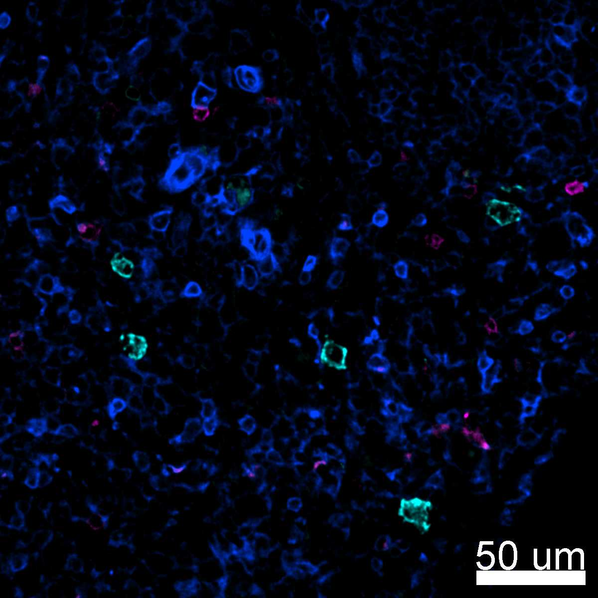
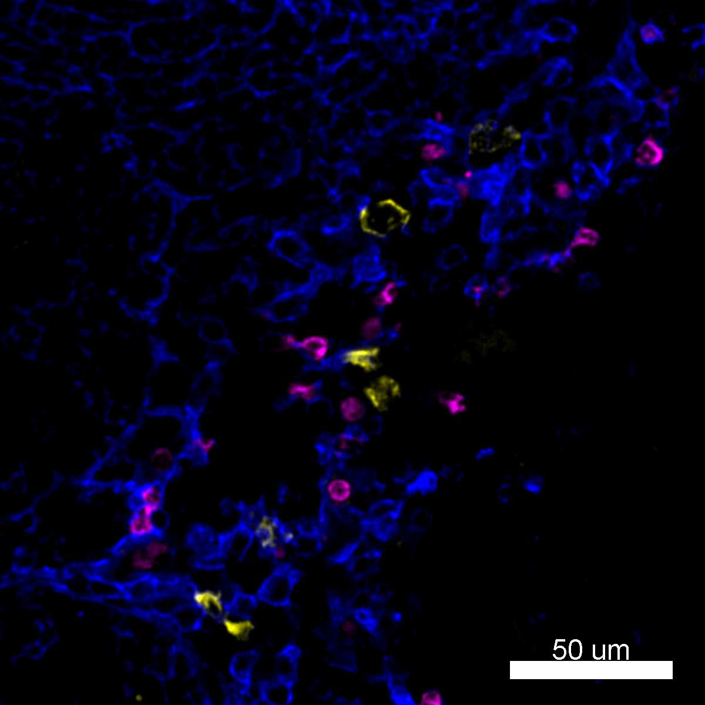

# Configurations

| UniProt Accession Number   | Reagent Type     | Target Name / Protein Biomarker   | Target Species   | Host Organism   | Isotype   | Clonality   | Vendor    |   Catalog Number | Conjugate   | RRID       | Availability   | Method        | Tissue Preservation               | Target Tissue   | Tissue State   | Detergent         | Antigen Retrieval Conditions   | Dye Inactivation Conditions   | Recommend   | Agree                                                        | Disagree   | Contributor         | Notes   |
|:---------------------------|:-----------------|:----------------------------------|:-----------------|:----------------|:----------|:------------|:----------|-----------------:|:------------|:-----------|:---------------|:--------------|:----------------------------------|:----------------|:---------------|:------------------|:-------------------------------|:------------------------------|:------------|:-------------------------------------------------------------|:-----------|:--------------------|:--------|
| P10721                     | Primary Antibody | CD117                             | Human            | Mouse           | IgG1      | 104D2       | BioLegend |           313234 | AF488       | AB_2566221 | Stock          | IBEX2D Manual | 1:4 Cytofix/Cytoperm Fixed Frozen | Lymph Node      | NA             | 0.3% Triton-X-100 | NA                             | 1 mg/ml LiBH4 15 minutes      | Yes         | [0000-0003-4379-8967](https://orcid.org/0000-0003-4379-8967) [[2](#publications), [1](#publications)] | NA         | [0000-0003-4379-8967](https://orcid.org/0000-0003-4379-8967) |         |

# Publications

1. A. J. Radtke et al., "IBEX: an iterative immunolabeling and chemical bleaching
 method for high-content imaging of diverse tissues", *Nat. Protoc.*, 17(2):378-401, 2022, [doi: 10.1038/s41596-021-00644-9](https://doi.org/10.1038/s41596-021-00644-9).

    A. J. Radtke et al., "Accompanying dataset for: IBEX: An iterative immunolabeling and chemical bleaching method for high-content imaging of diverse tissues", [doi: 10.5281/zenodo.5244550](https://doi.org/10.5281/zenodo.5244551).

2. A. J. Radtke et al., "IBEX: A versatile multiplex optical imaging approach for deep phenotyping and spatial analysis of cells in complex tissues", *Proc Natl Acad Sci*, 117(52):33455–33465, 2020, [doi:10.1073/pnas.2018488117](https://doi.org/10.1073/pnas.2018488117)

# Additional Notes

| Human lymph node: CD117 (cyan, catalog number 313234), CD39 (blue, catalog number 328208), and CD94 (magenta, catalog number 305506) |
|:-------:|
|  |

| Human lymph node: CD35 (blue, catalog number 333406), CD117 (yellow, catalog number 313234), and CD66b (magenta, catalog number 305110) |
|:-------:|
|  |
