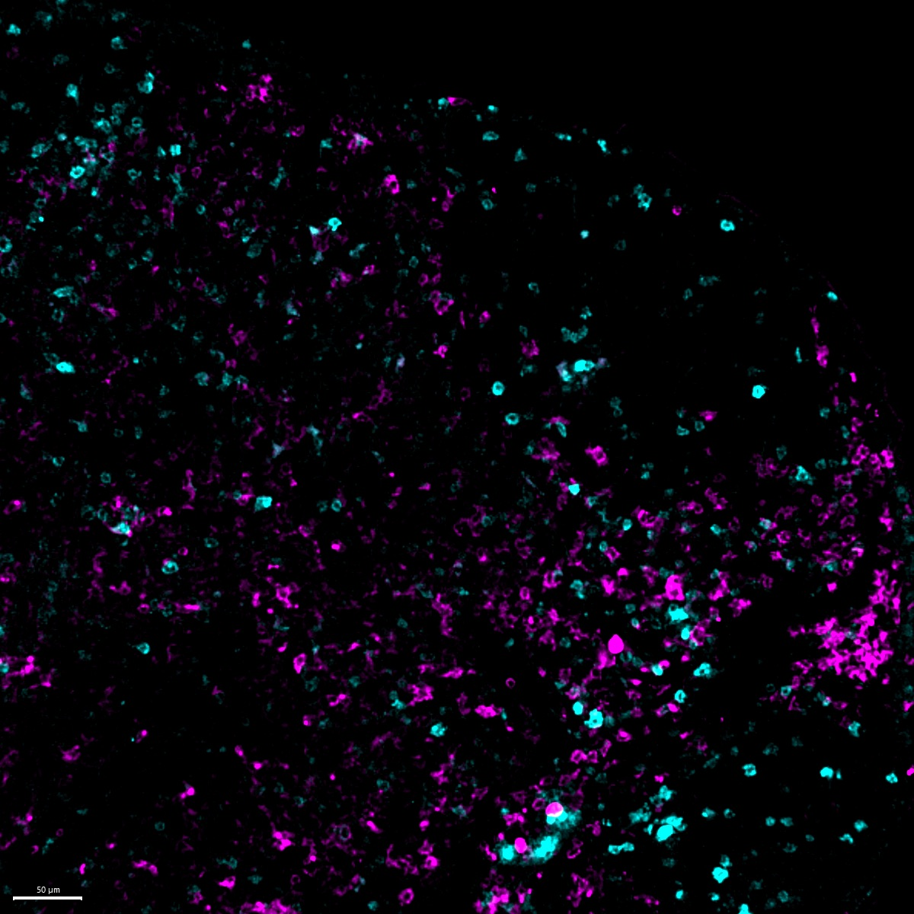

# Configurations

| UniProt Accession Number   | Reagent Type     | Target Name / Protein Biomarker   | Target Species   | Host Organism    | Isotype   | Clonality   | Vendor    |   Catalog Number | Conjugate   | RRID      | Availability   | Method        | Tissue Preservation               | Target Tissue   | Tissue State   | Detergent         | Antigen Retrieval Conditions   | Dye Inactivation Conditions   | Recommend   | Agree                                                        | Disagree   | Contributor                                                  | Notes   |
|:---------------------------|:-----------------|:----------------------------------|:-----------------|:-----------------|:----------|:------------|:----------|-----------------:|:------------|:----------|:---------------|:--------------|:----------------------------------|:----------------|:---------------|:------------------|:-------------------------------|:------------------------------|:------------|:-------------------------------------------------------------|:-----------|:-------------------------------------------------------------|:--------|
| Q9QXH4                     | Primary Antibody | CD11c                             | Mouse            | Armenian Hamster | IgG       | N418        | BioLegend |           117312 | AF647       | AB_389328 | Stock          | IBEX2D Manual | 1:4 Cytofix/Cytoperm Fixed Frozen | Lymph Node      | NA             | 0.3% Triton-X-100 | NA                             | 1 mg/ml LiBH4 15 minutes      | Yes         | [0000-0003-4379-8967](https://orcid.org/0000-0003-4379-8967); [0000-0003-1118-7432](https://orcid.org/0000-0003-1118-7432) | NA         | [0000-0003-4379-8967](https://orcid.org/0000-0003-4379-8967) |         |

# Publications

# Additional Notes

| Mouse lymph node: PD-1 (cyan, catalog number 135218) and CD11c (magenta, catalog number 117312) |
|:-------:|
|  |
