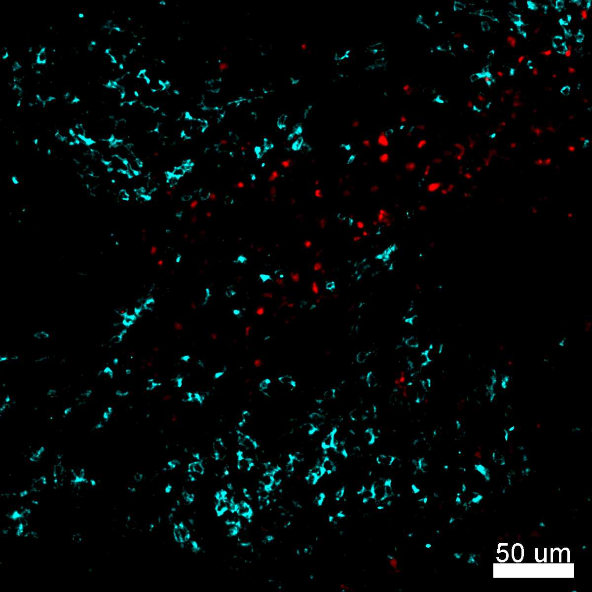
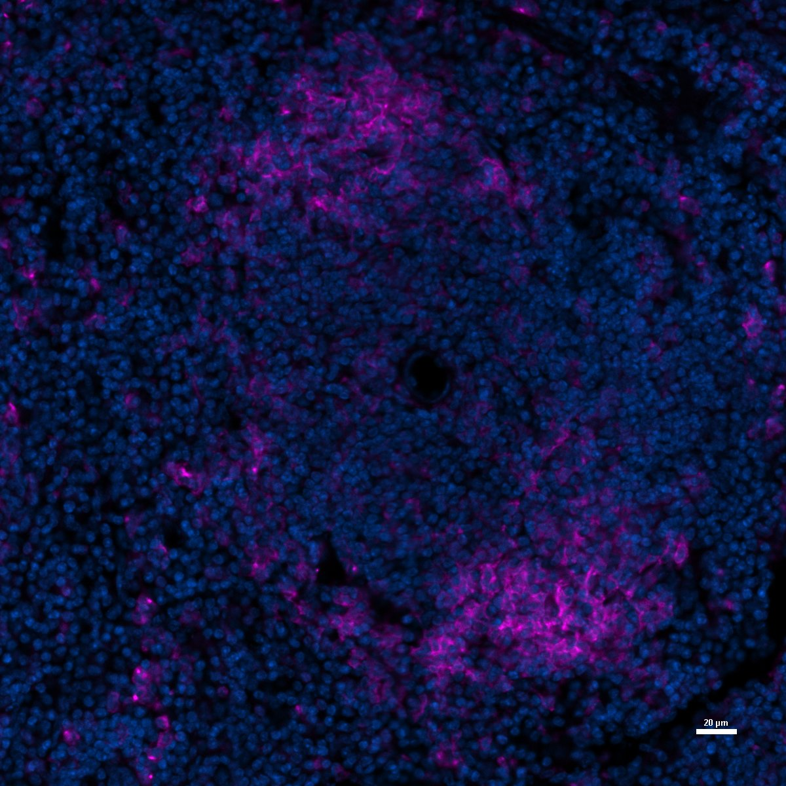
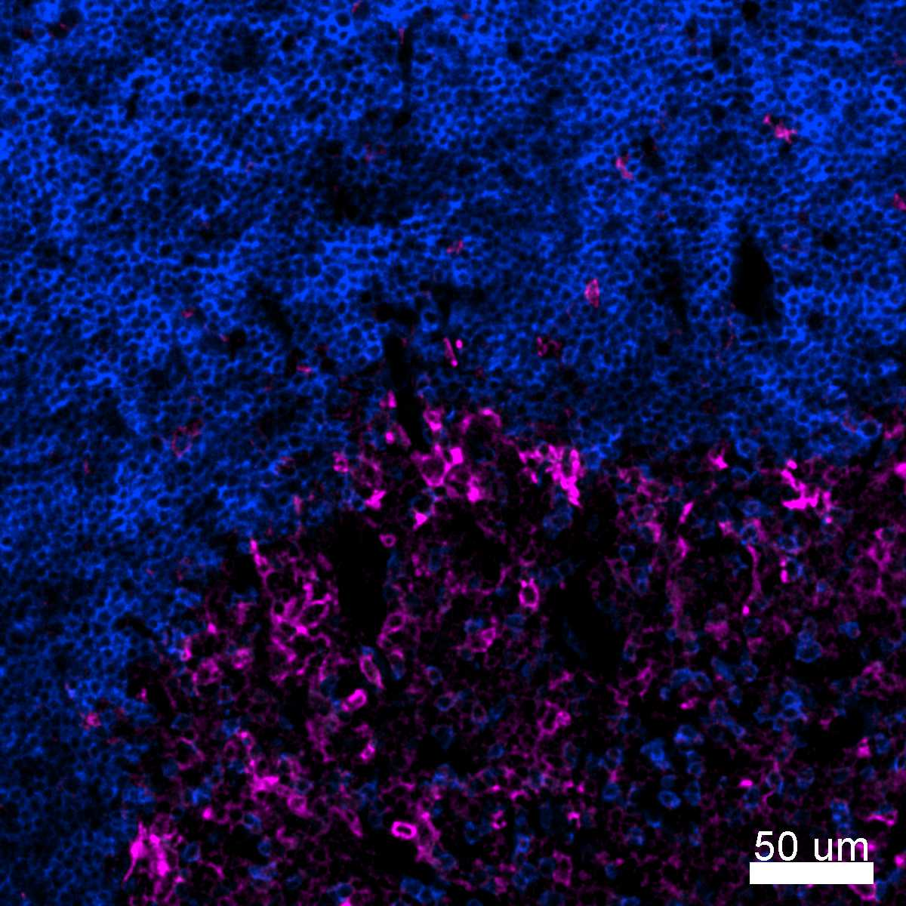
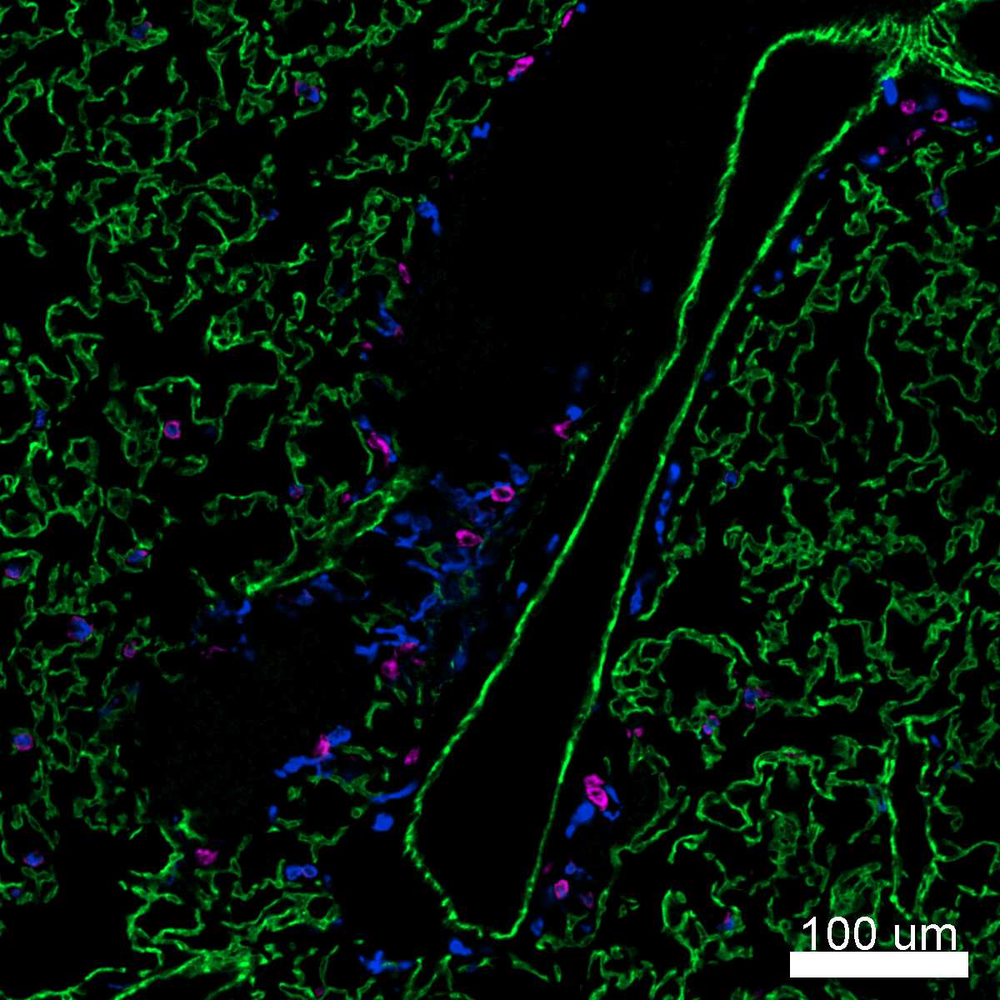
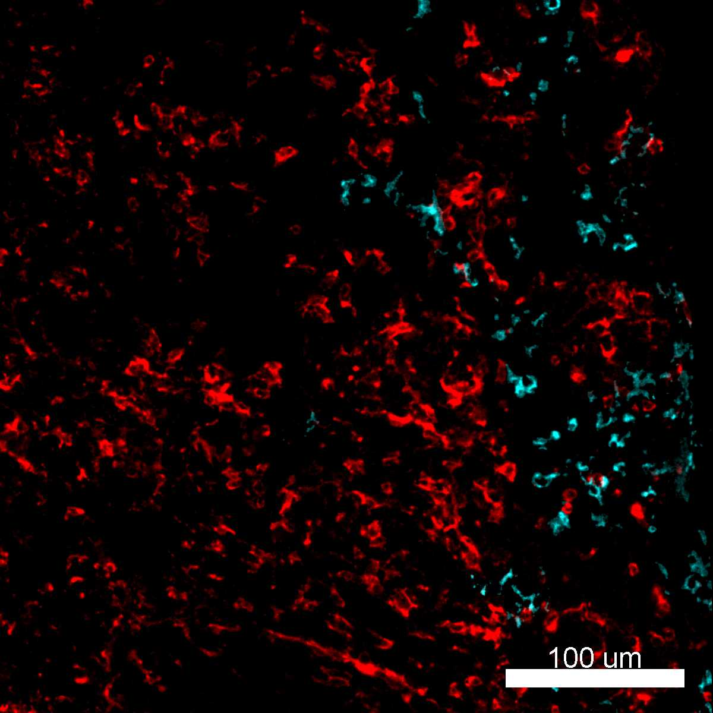

# Configurations

| UniProt Accession Number   | Reagent Type     | Target Name / Protein Biomarker   | Target Species   | Host Organism    | Isotype   | Clonality   | Vendor    |   Catalog Number | Conjugate   | RRID      | Availability   | Method        | Tissue Preservation               | Target Tissue   | Tissue State   | Detergent         | Antigen Retrieval Conditions   | Dye Inactivation Conditions   | Recommend   | Agree                                    | Disagree   | Contributor         | Notes       |
|:---------------------------|:-----------------|:----------------------------------|:-----------------|:-----------------|:----------|:------------|:----------|-----------------:|:------------|:----------|:---------------|:--------------|:----------------------------------|:----------------|:---------------|:------------------|:-------------------------------|:------------------------------|:------------|:-----------------------------------------|:-----------|:--------------------|:------------|
| Q9QXH4                     | Primary Antibody | CD11c                             | Mouse            | Armenian Hamster | IgG       | N418        | BioLegend |           117312 | AF647       | AB_389328 | Stock          | IBEX2D Manual | 1:4 Cytofix/Cytoperm Fixed Frozen | Spleen          | NA             | 0.3% Triton-X-100 | NA                             | 1 mg/ml LiBH4 15 minutes      | Yes         | [0000-0003-4379-8967](https://orcid.org/0000-0003-4379-8967) [[1](#publications)] | NA         | [0000-0003-4379-8967](https://orcid.org/0000-0003-4379-8967) | [1](#notes) |
| Q9QXH4                     | Primary Antibody | CD11c                             | Mouse            | Armenian Hamster | IgG       | N418        | BioLegend |           117312 | AF647       | AB_389328 | Stock          | IBEX2D Manual | 1:4 Cytofix/Cytoperm Fixed Frozen | Thymus          | NA             | 0.3% Triton-X-100 | NA                             | 1 mg/ml LiBH4 15 minutes      | Yes         | [0000-0003-4379-8967](https://orcid.org/0000-0003-4379-8967) [[1](#publications)] | NA         | [0000-0003-4379-8967](https://orcid.org/0000-0003-4379-8967) | [2](#notes) |
| Q9QXH4                     | Primary Antibody | CD11c                             | Mouse            | Armenian Hamster | IgG       | N418        | BioLegend |           117312 | AF647       | AB_389328 | Stock          | IBEX2D Manual | 1:4 Cytofix/Cytoperm Fixed Frozen | Lung            | NA             | 0.3% Triton-X-100 | NA                             | 1 mg/ml LiBH4 15 minutes      | Yes         | [0000-0003-4379-8967](https://orcid.org/0000-0003-4379-8967) [[1](#publications)] | NA         | [0000-0003-4379-8967](https://orcid.org/0000-0003-4379-8967) | [1](#notes) |
| Q9QXH4                     | Primary Antibody | CD11c                             | Mouse            | Armenian Hamster | IgG       | N418        | BioLegend |           117312 | AF647       | AB_389328 | Stock          | IBEX2D Manual | 1:4 Cytofix/Cytoperm Fixed Frozen | Small Intestine | NA             | 0.3% Triton-X-100 | NA                             | 1 mg/ml LiBH4 15 minutes      | Yes         | [0000-0003-4379-8967](https://orcid.org/0000-0003-4379-8967) [[1](#publications)] | NA         | [0000-0003-4379-8967](https://orcid.org/0000-0003-4379-8967) | [1](#notes) |
| Q9QXH4                     | Primary Antibody | CD11c                             | Mouse            | Armenian Hamster | IgG       | N418        | BioLegend |           117312 | AF647       | AB_389328 | Stock          | IBEX2D Manual | 1:4 Cytofix/Cytoperm Fixed Frozen | Lymph Node      | NA             | 0.3% Triton-X-100 | NA                             | 1 mg/ml LiBH4 15 minutes      | Yes         | [0000-0003-4379-8967](https://orcid.org/0000-0003-4379-8967) [[1](#publications)]; [0000-0003-1118-7432](https://orcid.org/0000-0003-1118-7432) | NA         | [0000-0003-4379-8967](https://orcid.org/0000-0003-4379-8967) | [2](#notes) |

# Publications

1. A. J. Radtke et al., "IBEX: A versatile multiplex optical imaging approach for deep phenotyping and spatial analysis of cells in complex tissues", *Proc Natl Acad Sci*, 117(52):33455–33465, 2020, [doi:10.1073/pnas.2018488117](https://doi.org/10.1073/pnas.2018488117)

# Additional Notes

1. Validated by Evelyn Kandov (No ORCID). This clone works best when conjugated to AF488 or AF647 and used at a 1:50 dilution. Other conjugates (AF594) do not yield as robust signal in our hands.
2. This clone works best when conjugated to AF488 or AF647 and used at a 1:50 dilution. Other conjugates (AF594) do not yield as robust signal in our hands.

| Mouse spleen: CD11c (cyan, catalog number 117312) and CD68 (red, catalog number 137017) |
|:-------:|
|  |

| Mouse Spleen Hochest (Blue) CD11c (Magenta Biolegend #117314) |
|:-------:|
|  |

| Mouse thymus: CD8 (blue, catalog number 100738) and CD11c (magenta, catalog number 117312) |
|:-------:|
|  |

| Mouse lung: CD11c (magenta, catalog number 117312), CD206 (blue, catalog number 141717), and CD31 (green, catalog number 102520) |
|:-------:|
|  |

| Mouse lymph node: CD11c (red, catalog number 117312) and CD64 (cyan, catalog number 139322) |
|:-------:|
|  |
