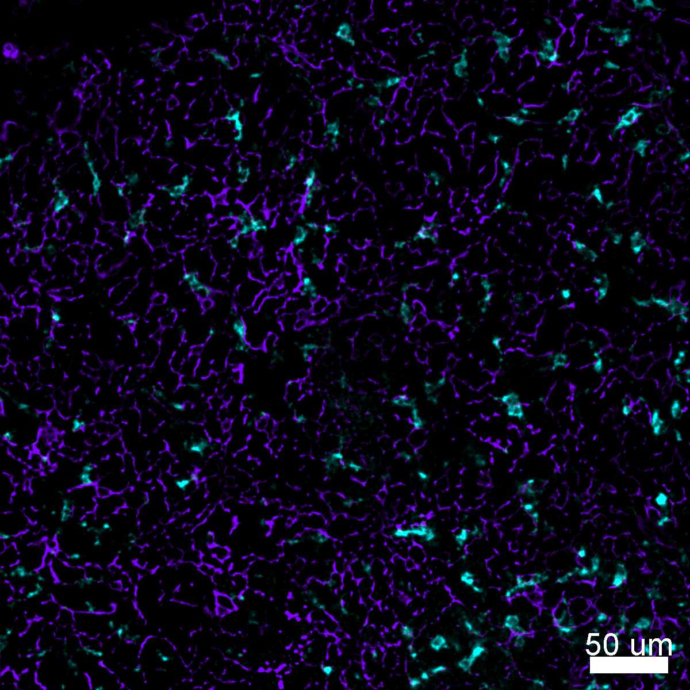

# Configurations

| UniProt Accession Number   | Reagent Type     | Target Name / Protein Biomarker   | Target Species   | Host Organism   | Isotype   | Clonality   | Vendor    |   Catalog Number | Conjugate   | RRID       | Availability   | Method        | Tissue Preservation               | Target Tissue   | Tissue State   | Detergent         | Antigen Retrieval Conditions   | Dye Inactivation Conditions      | Recommend   | Agree                                    | Disagree   | Contributor         | Notes       |
|:---------------------------|:-----------------|:----------------------------------|:-----------------|:----------------|:----------|:------------|:----------|-----------------:|:------------|:-----------|:---------------|:--------------|:----------------------------------|:----------------|:---------------|:------------------|:-------------------------------|:---------------------------------|:------------|:-----------------------------------------|:-----------|:--------------------|:------------|
| Q61830                     | Primary Antibody | CD206                             | Mouse            | Rat             | IgG2a     | C068C2      | BioLegend |           141717 | BV421       | AB_2562232 | Stock          | IBEX2D Manual | 1:4 Cytofix/Cytoperm Fixed Frozen | Thymus          | NA             | 0.3% Triton-X-100 | NA                             | 1 mg/ml LiBH4 15 minutes + light | Yes         | [0000-0003-4379-8967](https://orcid.org/0000-0003-4379-8967) [[1](#publications)] | NA         | [0000-0003-4379-8967](https://orcid.org/0000-0003-4379-8967) |             |
| Q61830                     | Primary Antibody | CD206                             | Mouse            | Rat             | IgG2a     | C068C2      | BioLegend |           141717 | BV421       | AB_2562232 | Stock          | IBEX2D Manual | 1:4 Cytofix/Cytoperm Fixed Frozen | Lung            | NA             | 0.3% Triton-X-100 | NA                             | 1 mg/ml LiBH4 15 minutes + light | Yes         | [0000-0003-4379-8967](https://orcid.org/0000-0003-4379-8967) [[1](#publications)] | NA         | [0000-0003-4379-8967](https://orcid.org/0000-0003-4379-8967) | [1](#notes) |
| Q61830                     | Primary Antibody | CD206                             | Mouse            | Rat             | IgG2a     | C068C2      | BioLegend |           141717 | BV421       | AB_2562232 | Stock          | IBEX2D Manual | 1:4 Cytofix/Cytoperm Fixed Frozen | Lymph Node      | NA             | 0.3% Triton-X-100 | NA                             | 1 mg/ml LiBH4 15 minutes + light | Yes         | [0000-0003-4379-8967](https://orcid.org/0000-0003-4379-8967) [[1](#publications)] | NA         | [0000-0003-4379-8967](https://orcid.org/0000-0003-4379-8967) | [1](#notes) |

# Publications

1. A. J. Radtke et al., "IBEX: A versatile multiplex optical imaging approach for deep phenotyping and spatial analysis of cells in complex tissues", *Proc Natl Acad Sci*, 117(52):33455–33465, 2020, [doi:10.1073/pnas.2018488117](https://doi.org/10.1073/pnas.2018488117)

# Additional Notes

1. Validated by Evelyn Kandov (No ORCID)

| Mouse thymus: CD206 (cyan, catalog number 141717) and Cytokeratin (purple, catalog number 628604) |
|:-------:|
|  |

| Mouse lung: CD11c (magenta, catalog number 117312), CD206 (blue, catalog number 141717), and CD31 (green, catalog number 102520) |
|:-------:|
|  |

| Mouse lymph node: CD206 (red, catalog number 141717) and CD106 (cyan, catalog number 105710) |
|:-------:|
|  |
