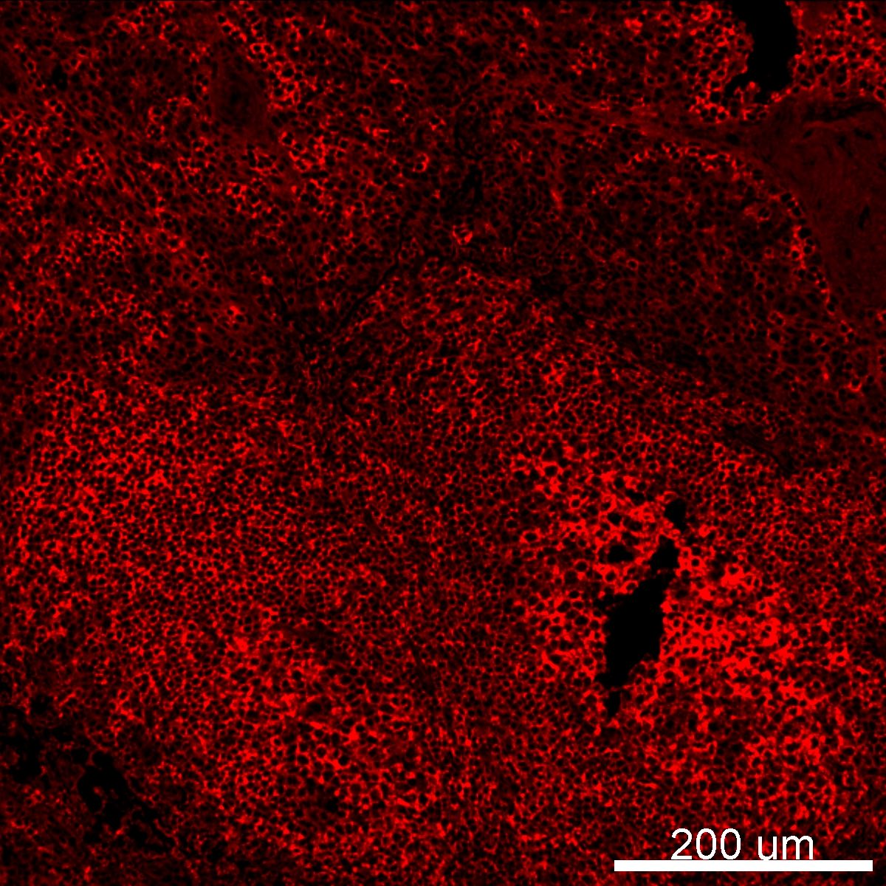

# Configurations

| UniProt Accession Number   | Reagent Type     | Target Name / Protein Biomarker   | Target Species   | Host Organism   | Isotype   | Clonality   | Vendor                   | Catalog Number   | Conjugate   | RRID        | Availability   | Method                 | Tissue Preservation   | Target Tissue   | Tissue State   | Detergent         | Antigen Retrieval Conditions                | Dye Inactivation Conditions   | Recommend   | Agree                                                        | Disagree   | Contributor                                                  | Notes   |
|:---------------------------|:-----------------|:----------------------------------|:-----------------|:----------------|:----------|:------------|:-------------------------|:-----------------|:------------|:------------|:---------------|:-----------------------|:----------------------|:----------------|:---------------|:------------------|:--------------------------------------------|:------------------------------|:------------|:-------------------------------------------------------------|:-----------|:-------------------------------------------------------------|:--------|
| P11836                     | Primary Antibody | CD20                              | Human            | Mouse           | IgG2a     | L26         | Thermo Fisher Scientific | 42-0202-82       | eF615       | AB_10853517 | Stock          | Multiplexed 2D Imaging | FFPE                  | Tonsil          | NA             | 0.3% Triton-X-100 | pH 6 (Sodium Citrate buffer) for 45 minutes | NA                            | Yes         | [0000-0002-6604-2065](https://orcid.org/0000-0002-6604-2065) | NA         | [0000-0002-6604-2065](https://orcid.org/0000-0002-6604-2065) |         |

# Publications

# Additional Notes

| Human tonsil FFPE: CD20 (red, catalog number 42-0202-82)  |
|:-------:|
|  |
