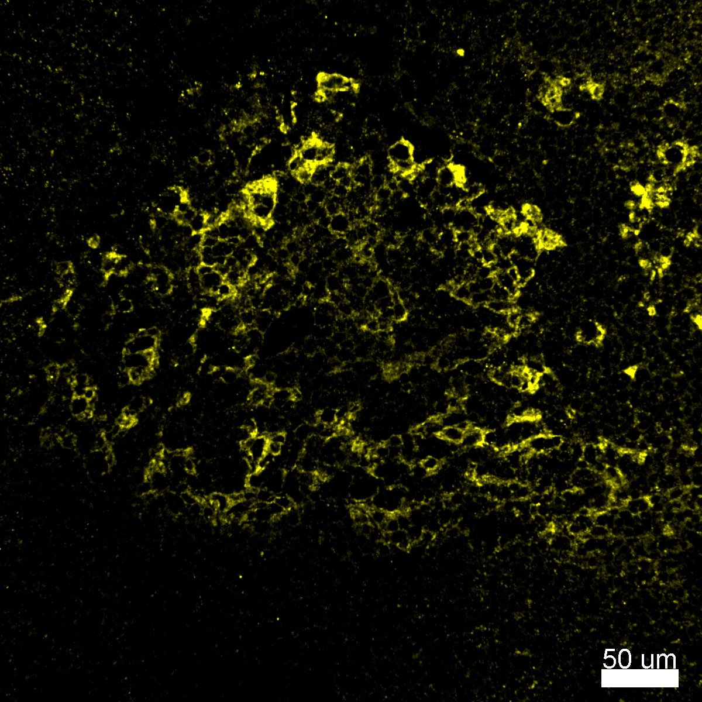
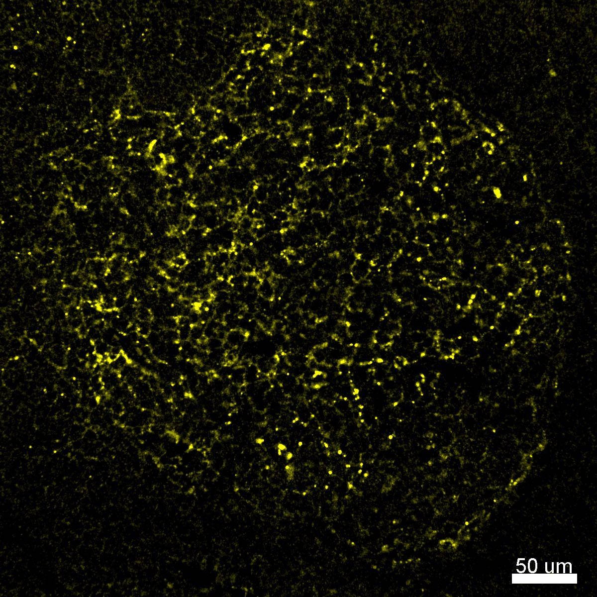
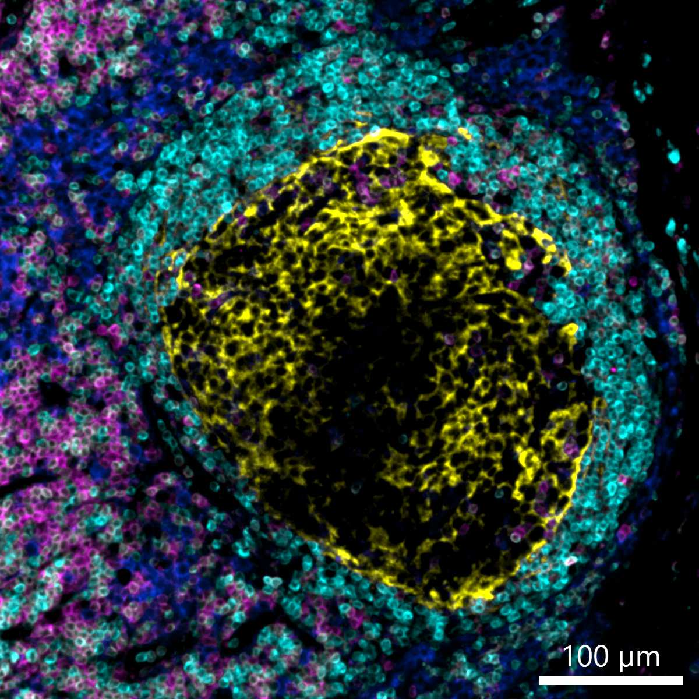

# Configurations

| UniProt Accession Number   | Reagent Type     | Target Name / Protein Biomarker   | Target Species   | Host Organism   | Isotype   | Clonality   | Vendor    | Catalog Number   | Conjugate   | RRID       | Availability   | Method         | Tissue Preservation               | Target Tissue   | Tissue State   | Detergent         | Antigen Retrieval Conditions                                                               | Dye Inactivation Conditions   | Recommend   | Agree                                                        | Disagree   | Contributor         | Notes       |
|:---------------------------|:-----------------|:----------------------------------|:-----------------|:----------------|:----------|:------------|:----------|:-----------------|:------------|:-----------|:---------------|:---------------|:----------------------------------|:----------------|:---------------|:------------------|:-------------------------------------------------------------------------------------------|:------------------------------|:------------|:-------------------------------------------------------------|:-----------|:--------------------|:------------|
| P20023                     | Primary Antibody | CD21                              | Human            | Mouse           | IgG1      | Bu32        | BioLegend | 354903           | PE          | AB_2561406 | Stock          | IBEX2D Manual  | 1:4 Cytofix/Cytoperm Fixed Frozen | Lymph Node      | NA             | 0.3% Triton-X-100 | NA                                                                                         | 1 mg/ml LiBH4 15 minutes      | Yes         | [0000-0003-4379-8967](https://orcid.org/0000-0003-4379-8967) [[2](#publications), [1](#publications)] | NA         | [0000-0003-4379-8967](https://orcid.org/0000-0003-4379-8967) | [1](#notes) |
| P20023                     | Primary Antibody | CD21                              | Human            | Rabbit          | IgG       | SP186       | Abcam     | ab306325         | PE          | NA         | Stock          | Cell DIVE-IBEX | FFPE                              | Lymph Node          | Follicular Lymphoma         | 0.3% Triton-X-100 | pH 6 for 30 minutes ER1 (AR9961) and pH 9 for 30 minutes ER2 (AR9640) using the Leica Bond | 1 mg/ml LiBH4 15 minutes      | Yes         | [0000-0003-4379-8967](https://orcid.org/0000-0003-4379-8967)                                          | NA         | [0000-0003-4379-8967](https://orcid.org/0000-0003-4379-8967) | [2](#notes) |
| P20023                     | Primary Antibody | CD21                              | Human            | Rabbit          | IgG       | SP186       | Abcam     | ab306325         | PE          | NA         | Stock          | Cell DIVE-IBEX | FFPE                              | Lymph Node       | Follicular Lymphoma       | 0.3% Triton-X-100 | pH 6 for 30 minutes ER1 (AR9961) using the Leica Bond                                      | 1 mg/ml LiBH4 15 minutes      | No          | [0000-0003-4379-8967](https://orcid.org/0000-0003-4379-8967)                                          | NA         | [0000-0003-4379-8967](https://orcid.org/0000-0003-4379-8967) | [2](#notes) |
| P20023                     | Primary Antibody | CD21                              | Human            | Rabbit          | IgG       | SP186       | Abcam    | ab306325         | PE          | NA     | Stock          | Cell DIVE-IBEX | FFPE                  | Lymph Node      | NA             | 0.3% Triton-X-100 | pH 6 for 30 minutes ER1 (AR9961) and pH 9 for 30 minutes ER2 (AR9640) using the Leica Bond | 1 mg/ml LiBH4 15 minutes      | Yes         | [0000-0003-4379-8967](https://orcid.org/0000-0003-4379-8967) [[3](#publications)] | NA         | [0000-0003-4379-8967](https://orcid.org/0000-0003-4379-8967) |         |

# Publications

1. A. J. Radtke et al., "IBEX: an iterative immunolabeling and chemical bleaching
 method for high-content imaging of diverse tissues", *Nat. Protoc.*, 17(2):378-401, 2022, [doi: 10.1038/s41596-021-00644-9](https://doi.org/10.1038/s41596-021-00644-9).

    A. J. Radtke et al., "Accompanying dataset for: IBEX: An iterative immunolabeling and chemical bleaching method for high-content imaging of diverse tissues", [doi: 10.5281/zenodo.5244550](https://doi.org/10.5281/zenodo.5244551).

2. A. J. Radtke et al., "IBEX: A versatile multiplex optical imaging approach for deep phenotyping and spatial analysis of cells in complex tissues", *Proc Natl Acad Sci*, 117(52):33455–33465, 2020, [doi:10.1073/pnas.2018488117](https://doi.org/10.1073/pnas.2018488117)

3. A. J. Radtke et al., "A Multi-scale, Multiomic Atlas of Human Normal and Follicular Lymphoma Lymph Nodes", *bioRxiv*, 2022, [doi: 10.1101/2022.06.03.494716](https://doi.org/10.1101/2022.06.03.494716).

# Additional Notes

1. Evaluated in human lymph nodes and shown to label follicular dendritic cells and B cells. Clone Bu32 has been shown to work in multiple conjugates for IBEX experiments (AF488 and AF532).
2. Clone SP186 labels follicular dendritic cells in FFPE samples following antigen retrieval with pH 6 and amplification with a secondary antibody. This direct conjugate gives beautiful labeling after dual antigen retrieval (pH 6 and pH 9) but a speckled, less robust labeling pattern with pH 6 alone (shown in the two images below).

    | Antigen retrieval, pH 6 and pH 9  |  Antigen retrieval, pH 6 |
    |:-------:|:-------:|
    |  |   |

| Human normal LN: BCL2 (cyan, catalog number ab236221 and A-31573), CD3 (magenta, catalog number ab208514), CD4 (blue, catalog number ab196372), CD21 (yellow, catalog number ab306325) |
|:-------:|
|  |
