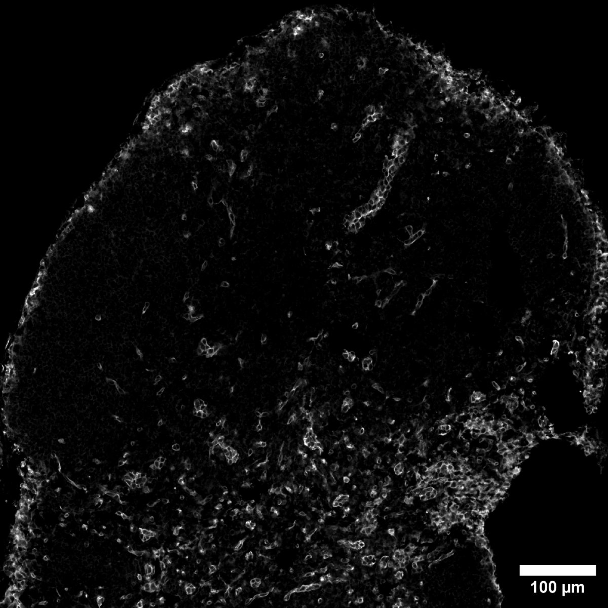

# Configurations

| UniProt Accession Number   | Reagent Type     | Target Name / Protein Biomarker   | Target Species   | Host Organism   | Isotype   | Clonality   | Vendor    |   Catalog Number | Conjugate   | RRID       | Availability   | Method        | Tissue Preservation               | Target Tissue   | Tissue State   | Detergent         | Antigen Retrieval Conditions   | Dye Inactivation Conditions             | Recommend   | Agree                                                        | Disagree   | Contributor                                                  | Notes   |
|:---------------------------|:-----------------|:----------------------------------|:-----------------|:----------------|:----------|:------------|:----------|-----------------:|:------------|:-----------|:---------------|:--------------|:----------------------------------|:----------------|:---------------|:------------------|:-------------------------------|:----------------------------------------|:------------|:-------------------------------------------------------------|:-----------|:-------------------------------------------------------------|:--------|
| Q08481                     | Primary Antibody | CD31                              | Mouse            | Rat             | IgG2a     | MEC13.3     | BioLegend |           102520 | AF594       | AB_2563319 | Stock          | IBEX2D Manual | 1:4 Cytofix/Cytoperm Fixed Frozen | Lymph Node      | NA             | 0.3% Triton-X-100 | NA                             | 1 mg/ml LiBH4 for more than 120 minutes | Yes         | [0000-0002-1461-0999](https://orcid.org/0000-0002-1461-0999) | NA         | [0000-0002-1461-0999](https://orcid.org/0000-0002-1461-0999) |         |

# Publications

# Additional Notes

| Mouse lymph node: CD31 (grey, catalog number 102520) |
|:-------:|
|  |
