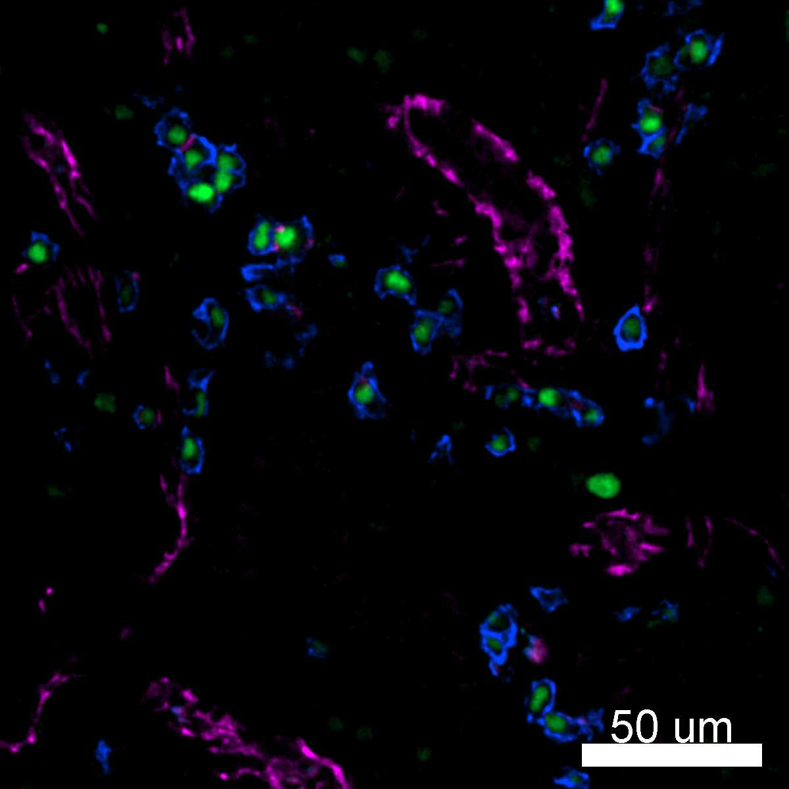

# Configurations

| UniProt Accession Number   | Reagent Type     | Target Name / Protein Biomarker   | Target Species   | Host Organism   | Isotype   | Clonality          | Vendor            | Catalog Number   | Conjugate   | RRID       | Availability   | Method                 | Tissue Preservation               | Target Tissue   | Tissue State        | Detergent         | Antigen Retrieval Conditions                                                               | Dye Inactivation Conditions   | Recommend   | Agree                                                        | Disagree   | Contributor         | Notes       |
|:---------------------------|:-----------------|:----------------------------------|:-----------------|:----------------|:----------|:-------------------|:------------------|:-----------------|:------------|:-----------|:---------------|:-----------------------|:----------------------------------|:----------------|:--------------------|:------------------|:-------------------------------------------------------------------------------------------|:------------------------------|:------------|:-------------------------------------------------------------|:-----------|:--------------------|:------------|
| P16284                     | Primary Antibody | CD31                              | Human            | Mouse           | IgG1      | WM59               | BioLegend         | 303133           | AF700       | AB_2566326 | Stock          | IBEX2D Manual          | 1:4 Cytofix/Cytoperm Fixed Frozen | Lymph Node      | NA                  | 0.3% Triton-X-100 | NA                                                                                         | 1 mg/ml LiBH4 15 minutes      | Yes         | [0000-0003-4379-8967](https://orcid.org/0000-0003-4379-8967) [[3](#publications), [1](#publications)] | NA         | [0000-0003-4379-8967](https://orcid.org/0000-0003-4379-8967) |             |
| P16284                     | Primary Antibody | CD31                              | Human            | Mouse           | IgG1      | C31.3+C31.7+C31.10 | Novus Biologicals | NBP2-47785AF700  | AF700       | NA         | Stock          | Multiplexed 2D Imaging | FFPE                              | Tonsil          | NA                  | 0.3% Triton-X-100 | pH 6 for 40 minutes at 95C (AR6 Akoya Biosciences AR600250ML)                              | NA                            | Yes         | [0000-0003-4379-8967](https://orcid.org/0000-0003-4379-8967)                                          | NA         | [0000-0003-4379-8967](https://orcid.org/0000-0003-4379-8967) | [1](#notes) |
| P16284                     | Primary Antibody | CD31                              | Human            | Mouse           | IgG1      | WM59               | BioLegend         | 303133           | AF700       | AB_2566326 | Stock          | IBEX2D Manual          | 1:4 Cytofix/Cytoperm Fixed Frozen | Lymph Node      | Follicular Lymphoma | 0.3% Triton-X-100 | NA                                                                                         | 1 mg/ml LiBH4 15 minutes      | Yes         | [0000-0003-4379-8967](https://orcid.org/0000-0003-4379-8967) [[2](#publications)]                     | NA         | [0000-0003-4379-8967](https://orcid.org/0000-0003-4379-8967) |             |
| P16284                     | Primary Antibody | CD31                              | Human            | Mouse           | IgG1      | C31.3+C31.7+C31.10 | Novus Biologicals | NBP2-47785AF700  | AF700       | NA         | Stock          | Multiplexed 2D Imaging | FFPE                              | Tonsil          | NA                  | 0.3% Triton-X-100 | pH 6 for 30 minutes ER1 (AR9961) and pH 9 for 30 minutes ER2 (AR9640) using the Leica Bond | NA                            | Yes         | [0000-0003-4379-8967](https://orcid.org/0000-0003-4379-8967)                                          | NA         | [0000-0003-4379-8967](https://orcid.org/0000-0003-4379-8967) | [2](#notes) |

# Publications

1. A. J. Radtke et al., "IBEX: an iterative immunolabeling and chemical bleaching
 method for high-content imaging of diverse tissues", *Nat. Protoc.*, 17(2):378-401, 2022, [doi: 10.1038/s41596-021-00644-9](https://doi.org/10.1038/s41596-021-00644-9).

    A. J. Radtke et al., "Accompanying dataset for: IBEX: An iterative immunolabeling and chemical bleaching method for high-content imaging of diverse tissues", [doi: 10.5281/zenodo.5244550](https://doi.org/10.5281/zenodo.5244551).

2. A. J. Radtke et al., "A Multi-scale, Multiomic Atlas of Human Normal and Follicular Lymphoma Lymph Nodes", *bioRxiv*, 2022, [doi: 10.1101/2022.06.03.494716](https://doi.org/10.1101/2022.06.03.494716).

3. A. J. Radtke et al., "IBEX: A versatile multiplex optical imaging approach for deep phenotyping and spatial analysis of cells in complex tissues", *Proc Natl Acad Sci*, 117(52):33455–33465, 2020, [doi:10.1073/pnas.2018488117](https://doi.org/10.1073/pnas.2018488117)

# Additional Notes

1. Labels endothelial cells in human FFPE tonsil samples based on patterning and spatial distribution in tissues. AF647 format is brighter but AF700 format can be used at a high concentration to label vessels.
2. Labels endothelial cells in human FFPE tonsil samples based on patterning and spatial distribution in tissues. AF647 format is brighter but AF700 format can be used at a high concentration to label vessels. Dual antigen retrieval (pH 6 and 9) yields a better signal than pH 6 alone.

| Human lymph node: CD31 (magenta, catalog number 303133), CD138 (blue, catalog number 356504), and IRF4 (green, catalog number 646404	) |
|:-------:|
|  |
