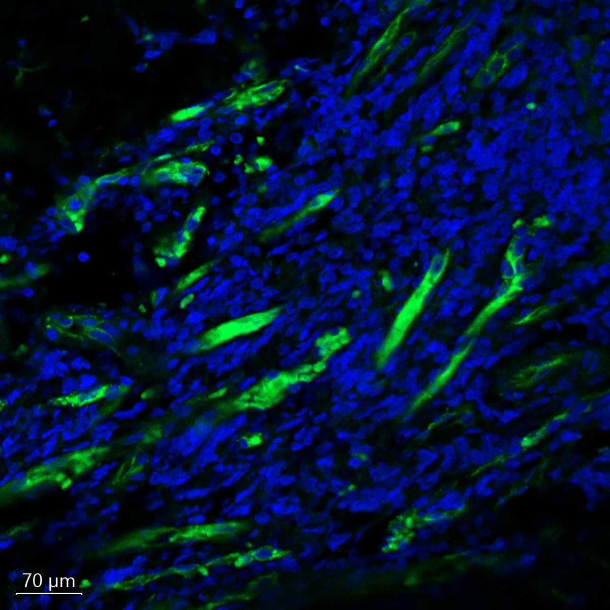

# Configurations

| UniProt Accession Number   | Reagent Type     | Target Name / Protein Biomarker   | Target Species   | Host Organism   | Isotype   | Clonality   | Vendor                   | Catalog Number   | Conjugate   | RRID        | Availability   | Method                 | Tissue Preservation   | Target Tissue   | Tissue State   | Detergent         | Antigen Retrieval Conditions                                                               | Dye Inactivation Conditions   | Recommend   | Agree                                                        | Disagree   | Contributor                                                  | Notes       |
|:---------------------------|:-----------------|:----------------------------------|:-----------------|:----------------|:----------|:------------|:-------------------------|:-----------------|:------------|:------------|:---------------|:-----------------------|:----------------------|:----------------|:---------------|:------------------|:-------------------------------------------------------------------------------------------|:------------------------------|:------------|:-------------------------------------------------------------|:-----------|:-------------------------------------------------------------|:------------|
| P28906                     | Primary Antibody | CD34                              | Human            | Mouse           | IgG1      | QBEND/10    | Thermo Fisher Scientific | MA1-10205        | PE          | AB_11152571 | Stock          | Multiplexed 2D Imaging | FFPE                  | Tonsil          | NA             | 0.3% Triton-X-100 | pH 6 for 30 minutes ER1 (AR9961) and pH 9 for 30 minutes ER2 (AR9640) using the Leica Bond | NA                            | Yes         | [0009-0006-9784-2694](https://orcid.org/0009-0006-9784-2694) | NA         | [0009-0006-9784-2694](https://orcid.org/0009-0006-9784-2694) | [1](#notes) |

# Publications

# Additional Notes

1. used AF546 preset setting to capture PE signal. RBCs are visible in the snapshot and difficult to differentiate.

| Human tonsil: Hoechst (blue, Biotium cat. no. 40046) and CD34 (green, Thermo Fisher Scientific cat. no. MA1-10205) |
|:-------:|
|  |
