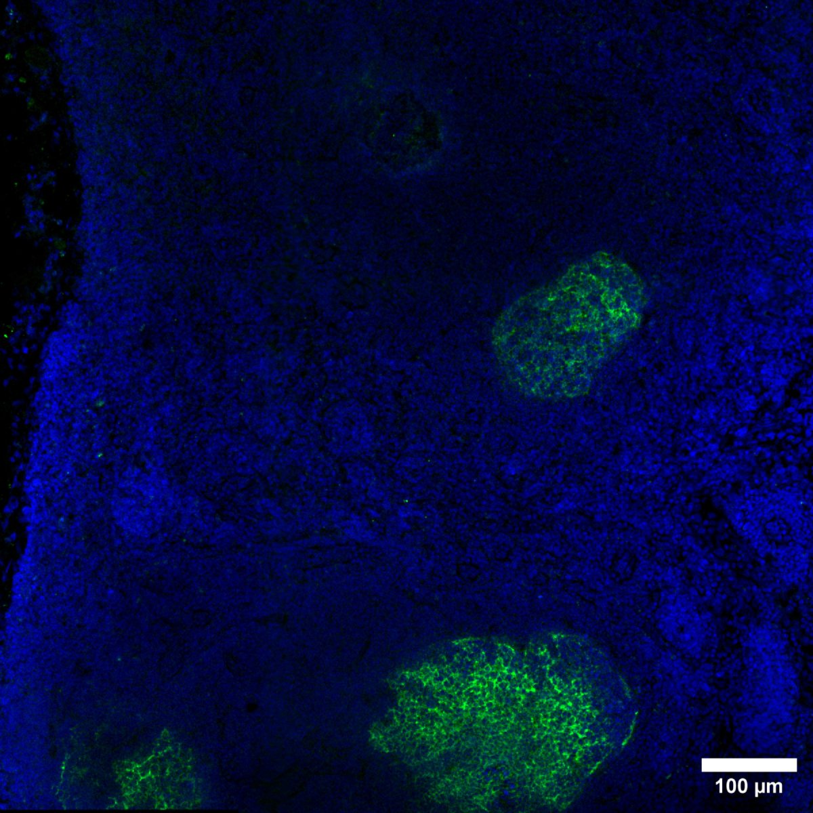

# Configurations

| UniProt Accession Number   | Reagent Type     | Target Name / Protein Biomarker   | Target Species   | Host Organism   | Isotype   | Clonality   | Vendor         |   Catalog Number | Conjugate   | RRID       | Availability   | Method        | Tissue Preservation               | Target Tissue   | Tissue State   | Detergent         | Antigen Retrieval Conditions   | Dye Inactivation Conditions      | Recommend   | Agree                                                        | Disagree   | Contributor                                                  | Notes   |
|:---------------------------|:-----------------|:----------------------------------|:-----------------|:----------------|:----------|:------------|:---------------|-----------------:|:------------|:-----------|:---------------|:--------------|:----------------------------------|:----------------|:---------------|:------------------|:-------------------------------|:---------------------------------|:------------|:-------------------------------------------------------------|:-----------|:-------------------------------------------------------------|:--------|
| NA                         | Primary Antibody | CD35                              | Mouse            | Rat             | IgG2a     | 8C12        | BD Biosciences |           740132 | BV510       | AB_2739889 | Stock          | IBEX2D Manual | 1:4 Cytofix/Cytoperm Fixed Frozen | Lymph Node      | NA             | 0.3% Triton-X-100 | NA                             | 1 mg/ml LiBH4 15 minutes + light | Yes         | [0000-0003-4379-8967](https://orcid.org/0000-0003-4379-8967); [0000-0003-1118-7432](https://orcid.org/0000-0003-1118-7432); [0000-0002-1461-0999](https://orcid.org/0000-0002-1461-0999)| NA         | [0000-0003-4379-8967](https://orcid.org/0000-0003-4379-8967) |         |

# Publications

# Additional Notes

| Mouse (immunized) lymph node: CD35 (green, catalog number 740132) and DAPI (blue, catalog number 62248) |
|:-------:|
|  |
