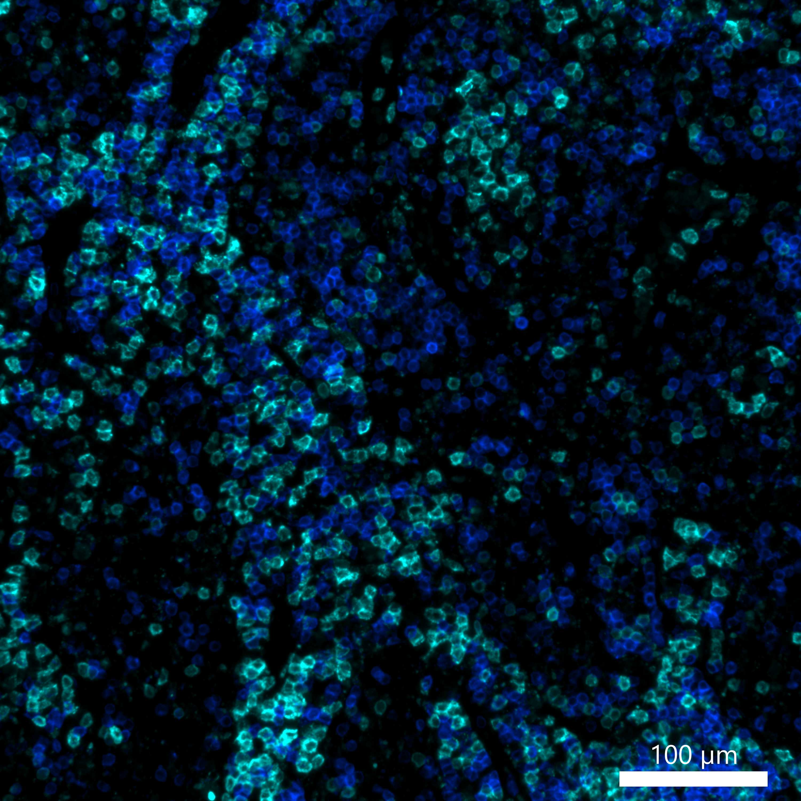
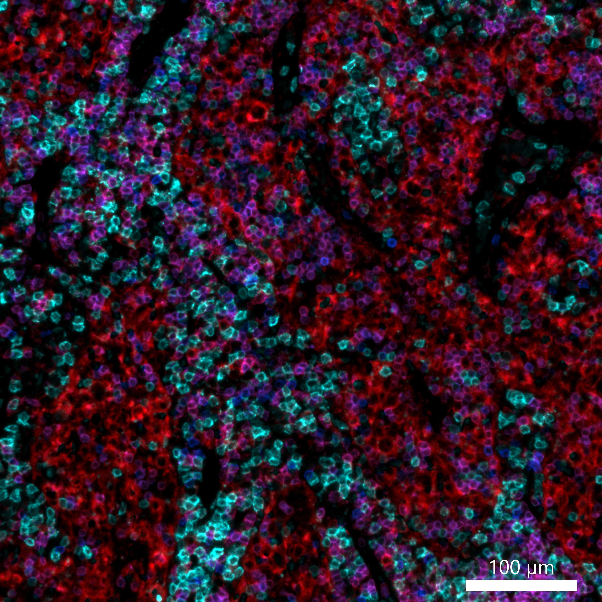

# Configurations

| UniProt Accession Number   | Reagent Type     | Target Name / Protein Biomarker   | Target Species   | Host Organism   | Isotype   | Clonality   | Vendor    | Catalog Number        | Conjugate   | RRID      | Availability   | Method                 | Tissue Preservation               | Target Tissue   | Tissue State   | Detergent         | Antigen Retrieval Conditions                                                               | Dye Inactivation Conditions   | Recommend   | Agree                                                        | Disagree   | Contributor         | Notes       |
|:---------------------------|:-----------------|:----------------------------------|:-----------------|:----------------|:----------|:------------|:----------|:----------------------|:------------|:----------|:---------------|:-----------------------|:----------------------------------|:----------------|:---------------|:------------------|:-------------------------------------------------------------------------------------------|:------------------------------|:------------|:-------------------------------------------------------------|:-----------|:--------------------|:------------|
| P07766                     | Primary Antibody | CD3                               | Human            | Mouse           | IgG1      | UCHT1       | BioLegend | 300402 (Unconjugated) | AF555       | NA        | Custom         | IBEX2D Manual          | 1:4 Cytofix/Cytoperm Fixed Frozen | Lymph Node      | NA             | 0.3% Triton-X-100 | NA                                                                                         | 1 mg/ml LiBH4 15 minutes      | Yes         | [0000-0003-4379-8967](https://orcid.org/0000-0003-4379-8967) [[2](#publications), [1](#publications)] | NA         | [0000-0003-4379-8967](https://orcid.org/0000-0003-4379-8967) | [1](#notes) |
| P07766                     | Primary Antibody | CD3                               | Human            | Rabbit          | IgG       | EP4426      | Abcam     | ab208514              | AF555       | AB_443425 | Stock          | IBEX2D Manual          | FFPE                              | Tonsil          | NA             | 0.3% Triton-X-100 | pH 6 for 40 minutes at 95C (AR6 Akoya Biosciences AR600250ML)                              | 1 mg/ml LiBH4 15 minutes      | Yes         | [0000-0003-4379-8967](https://orcid.org/0000-0003-4379-8967)                                          | NA         | [0000-0003-4379-8967](https://orcid.org/0000-0003-4379-8967) | [2](#notes) |
| P04234                     | Primary Antibody | CD3                               | Human            | Mouse           | IgG1      | UCHT1       | BioLegend | 300401 (Unconjugated) | AF555       | NA        | Custom         | IBEX2D Manual          | 1:4 Cytofix/Cytoperm Fixed Frozen | Lymph Node      | NA             | 0.3% Triton-X-100 | NA                                                                                         | NA                            | Yes         | [0000-0003-4379-8967](https://orcid.org/0000-0003-4379-8967)                                          | NA         | [0000-0003-4379-8967](https://orcid.org/0000-0003-4379-8967) | [3](#notes) |
| P07766                     | Primary Antibody | CD3                               | Human            | Rabbit          | IgG       | EP4426      | Abcam     | ab208514              | AF555       | AB_443425 | Stock          | Multiplexed 2D Imaging | FFPE                              | Tonsil          | NA             | 0.3% Triton-X-100 | pH 6 for 30 minutes ER1 (AR9961) and pH 9 for 30 minutes ER2 (AR9640) using the Leica Bond | NA                            | Yes         | [0000-0003-4379-8967](https://orcid.org/0000-0003-4379-8967), [0009-0006-9784-2694](https://orcid.org/0009-0006-9784-2694)                                          | NA         | [0000-0003-4379-8967](https://orcid.org/0000-0003-4379-8967) | [2](#notes) |
| P07766                     | Primary Antibody | CD3                               | Human            | Rabbit          | IgG       | EP4426      | Abcam     | ab208514              | AF555       | AB_443425 | Stock          | Cell DIVE-IBEX         | FFPE                              | Tonsil          | NA             | 0.3% Triton-X-100 | pH 6 for 30 minutes ER1 (AR9961) and pH 9 for 30 minutes ER2 (AR9640) using the Leica Bond | 1 mg/ml LiBH4 15 minutes      | Yes         | [0000-0003-4379-8967](https://orcid.org/0000-0003-4379-8967)                                          | NA         | [0000-0003-4379-8967](https://orcid.org/0000-0003-4379-8967) | [4](#notes) |
| P07766                     | Primary Antibody | CD3                               | Human            | Rabbit          | IgG       | EP4426      | Abcam     | ab208514              | AF555       | AB_443425 | Stock          | Cell DIVE-IBEX         | FFPE                              | Lung            | Cancer         | 0.3% Triton-X-100 | pH 6 for 30 minutes ER1 (AR9961) and pH 9 for 30 minutes ER2 (AR9640) using the Leica Bond | 1 mg/ml LiBH4 15 minutes      | Yes         | [0000-0003-4379-8967](https://orcid.org/0000-0003-4379-8967)                                          | NA         | [0000-0003-4379-8967](https://orcid.org/0000-0003-4379-8967) | [5](#notes) |
| P07766                     | Primary Antibody | CD3                               | Human            | Rabbit          | IgG       | EP4426      | Abcam    | ab208514         | AF555       | AB_443425 | Stock          | Cell DIVE-IBEX | FFPE                  | Lymph Node      | Follicular Lymphoma | 0.3% Triton-X-100 | pH 6 for 30 minutes ER1 (AR9961) and pH 9 for 30 minutes ER2 (AR9640) using the Leica Bond | 1 mg/ml LiBH4 15 minutes      | Yes         | [0000-0003-4379-8967](https://orcid.org/0000-0003-4379-8967) [[3](#publications)] | NA         | [0000-0003-4379-8967](https://orcid.org/0000-0003-4379-8967) |         |
| P07766                     | Primary Antibody | CD3                               | Human            | Rabbit          | IgG       | EP4426      | Abcam    | ab208514         | AF555       | AB_443425 | Stock          | Cell DIVE-IBEX | FFPE                  | Lymph Node      | NA                  | 0.3% Triton-X-100 | pH 6 for 30 minutes ER1 (AR9961) and pH 9 for 30 minutes ER2 (AR9640) using the Leica Bond | 1 mg/ml LiBH4 15 minutes      | Yes         | [0000-0003-4379-8967](https://orcid.org/0000-0003-4379-8967) [[3](#publications)] | NA         | [0000-0003-4379-8967](https://orcid.org/0000-0003-4379-8967) |         |
| P07766                     | Primary Antibody | CD3                               | Human            | Rabbit          | IgG       | EP4426      | Abcam    | ab208514         | AF555       | AB_443425 | Stock          | Cell DIVE-IBEX | FFPE                  | Lymph Node      | Healthy        | 0.3% Triton-X-100 | pH 6 for 30 minutes ER1 (AR9961) and pH 9 for 30 minutes ER2 (AR9640) using the Leica Bond | 1 mg/ml LiBH4 15 minutes      | Yes         | [0000-0003-4379-8967](https://orcid.org/0000-0003-4379-8967) [[4](#publications), [5](#publications)] | NA         | [0000-0003-4379-8967](https://orcid.org/0000-0003-4379-8967) | [6](#notes) |

# Publications

1. A. J. Radtke et al., "IBEX: an iterative immunolabeling and chemical bleaching
 method for high-content imaging of diverse tissues", *Nat. Protoc.*, 17(2):378-401, 2022, [doi: 10.1038/s41596-021-00644-9](https://doi.org/10.1038/s41596-021-00644-9).

    A. J. Radtke et al., "Accompanying dataset for: IBEX: An iterative immunolabeling and chemical bleaching method for high-content imaging of diverse tissues", [doi: 10.5281/zenodo.5244550](https://doi.org/10.5281/zenodo.5244551).

2. A. J. Radtke et al., "IBEX: A versatile multiplex optical imaging approach for deep phenotyping and spatial analysis of cells in complex tissues", *Proc Natl Acad Sci*, 117(52):33455–33465, 2020, [doi:10.1073/pnas.2018488117](https://doi.org/10.1073/pnas.2018488117)

3. A. J. Radtke et al., "A Multi-scale, Multiomic Atlas of Human Normal and Follicular Lymphoma Lymph Nodes", *bioRxiv*, 2022, [doi: 10.1101/2022.06.03.494716](https://doi.org/10.1101/2022.06.03.494716).

4. A. J. Radtke et al., "Multi-omic profiling of follicular lymphoma reveals changes in tissue architecture and enhanced stromal remodeling in high-risk patients", Cancer Cell, 42(3):444-463, 2024, [doi: 10.1016/j.ccell.2024.02.001](https://doi.org/10.1016/j.ccell.2024.02.001).

5. A. J. Radtke, "OMAP-18: Organ Mapping Antibody Panel (OMAP) for Multiplexed Antibody-Based Imaging of Human Lymph Node with Cell DIVE-IBEX", *Human Reference Atlas*, 2024, [doi: 10.48539/HBM356.HGHM.686](https://doi.org/10.48539/HBM356.HGHM.686).

# Additional Notes

1. Clone UCHT1 labels T cells in fixed frozen human tissues. Several conjugates are suitable for Multiplexed 2D Imaging; however, we recommend the following conjugates for IBEX experiments: AF488, AF555, PE, iF594, and AF647. Custom conjugation from BioLegend.
2. Evaluated in human tonsil FFPE samples with CD20 (clone L26) and Hoechst (nuclear marker). Antibody labels T cells. Preferred clone for FFPE samples.
3. Custom conjugate by BioLegend. Labels T cells in diverse tissues.
4. Antibody labels T cells. Preferred clone for FFPE samples. Works beautifully on Cell DIVE imager with IBEX dye inactivation protocol.
5. Labels T cells in lung. Great signal and works very well on Cell DIVE imager with IBEX dye inactivation protocol.
6. CD3 AF555 (Abcam ab208514) was used at a 1:50 dilution. Works great!

| Human normal LN: BCL2 (cyan, catalog number ab236221 and A-31573), CD3 (magenta, catalog number ab208514), CD4 (blue, catalog number ab196372), CD21 (yellow, catalog number ab306325) |
|:-------:|
|  |

| Human FL LN: BCL2 (cyan, catalog number ab236221 and A-31573), CD3 (magenta, catalog number ab208514), CD4 (blue, catalog number ab196372), CD21 (yellow, catalog number ab306325) |
|:-------:|
|  |

| Human normal LN: CD3 (blue, catalog number ab208514) and CD8 (cyan, catalog number 372906) |
|:-------:|
|  |

| Human normal LN: CD3 (blue, catalog number ab208514), CD8 (cyan, catalog number 372906), and CD4 (red, catalog number ab196372) |
|:-------:|
|  |

| Human normal LN: CD3 (blue, catalog number ab208514) and IRF4 (magenta, catalog number NB200-356 and A-21121) |
|:-------:|
|  |