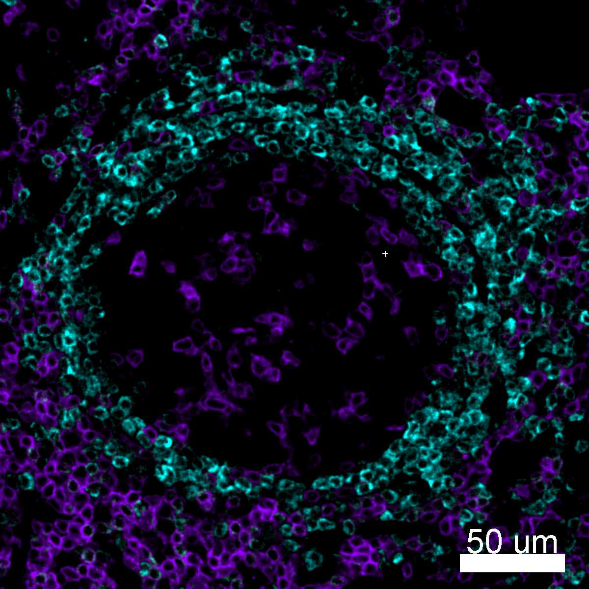

# Configurations

| UniProt Accession Number   | Reagent Type     | Target Name / Protein Biomarker   | Target Species   | Host Organism   | Isotype   | Clonality   | Vendor    |   Catalog Number | Conjugate   | RRID       | Availability   | Method        | Tissue Preservation               | Target Tissue   | Tissue State        | Detergent         | Antigen Retrieval Conditions   | Dye Inactivation Conditions             | Recommend   | Agree                                                        | Disagree   | Contributor         | Notes       |
|:---------------------------|:-----------------|:----------------------------------|:-----------------|:----------------|:----------|:------------|:----------|-----------------:|:------------|:-----------|:---------------|:--------------|:----------------------------------|:----------------|:--------------------|:------------------|:-------------------------------|:----------------------------------------|:------------|:-------------------------------------------------------------|:-----------|:--------------------|:------------|
| P07766                     | Primary Antibody | CD3                               | Human            | Mouse           | IgG1      | UCHT1       | BioLegend |           300446 | AF594       | AB_2563236 | Stock          | IBEX2D Manual | 1:4 Cytofix/Cytoperm Fixed Frozen | Lymph Node      | NA                  | 0.3% Triton-X-100 | NA                             | 1 mg/ml LiBH4 for more than 120 minutes | Yes         | [0000-0003-4379-8967](https://orcid.org/0000-0003-4379-8967) [[3](#publications), [1](#publications)] | NA         | [0000-0003-4379-8967](https://orcid.org/0000-0003-4379-8967) | [1](#notes) |
| P22646                     | Primary Antibody | CD3                               | Mouse            | Rat             | IgG2b     | 17A2        | BioLegend |           100240 | AF594       | AB_2563427 | Stock          | IBEX2D Manual | 1:4 Cytofix/Cytoperm Fixed Frozen | Thymus          | NA                  | 0.3% Triton-X-100 | NA                             | 1 mg/ml LiBH4 for more than 120 minutes | Yes         | [0000-0003-4379-8967](https://orcid.org/0000-0003-4379-8967) [[3](#publications)]                     | NA         | [0000-0003-4379-8967](https://orcid.org/0000-0003-4379-8967) | [1](#notes) |
| P22646                     | Primary Antibody | CD3                               | Mouse            | Rat             | IgG2b     | 17A2        | BioLegend |           100240 | AF594       | AB_2563427 | Stock          | IBEX2D Manual | 1:4 Cytofix/Cytoperm Fixed Frozen | Lymph Node      | NA                  | 0.3% Triton-X-100 | NA                             | 1 mg/ml LiBH4 for more than 120 minutes | Yes         | [0000-0003-4379-8967](https://orcid.org/0000-0003-4379-8967) [[3](#publications)]; [0000-0003-1118-7432](https://orcid.org/0000-0003-1118-7432)                     | NA         | [0000-0003-4379-8967](https://orcid.org/0000-0003-4379-8967) | [1](#notes) |
| P07766                     | Primary Antibody | CD3                               | Human            | Mouse           | IgG1      | UCHT1       | BioLegend |           300446 | AF594       | AB_2563236 | Stock          | IBEX2D Manual | 1:4 Cytofix/Cytoperm Fixed Frozen | Lymph Node      | Follicular Lymphoma | 0.3% Triton-X-100 | NA                             | 1 mg/ml LiBH4 for more than 120 minutes | Yes         | [0000-0003-4379-8967](https://orcid.org/0000-0003-4379-8967) [[2](#publications)]                     | NA         | [0000-0003-4379-8967](https://orcid.org/0000-0003-4379-8967) | [1](#notes) |

# Publications

1. A. J. Radtke et al., "IBEX: an iterative immunolabeling and chemical bleaching
 method for high-content imaging of diverse tissues", *Nat. Protoc.*, 17(2):378-401, 2022, [doi: 10.1038/s41596-021-00644-9](https://doi.org/10.1038/s41596-021-00644-9).

    A. J. Radtke et al., "Accompanying dataset for: IBEX: An iterative immunolabeling and chemical bleaching method for high-content imaging of diverse tissues", [doi: 10.5281/zenodo.5244550](https://doi.org/10.5281/zenodo.5244551).

2. A. J. Radtke et al., "A Multi-scale, Multiomic Atlas of Human Normal and Follicular Lymphoma Lymph Nodes", *bioRxiv*, 2022, [doi: 10.1101/2022.06.03.494716](https://doi.org/10.1101/2022.06.03.494716).

3. A. J. Radtke et al., "IBEX: A versatile multiplex optical imaging approach for deep phenotyping and spatial analysis of cells in complex tissues", *Proc Natl Acad Sci*, 117(52):33455–33465, 2020, [doi:10.1073/pnas.2018488117](https://doi.org/10.1073/pnas.2018488117)

# Additional Notes

1. Conjugate requires extended treatment with 1 mg/ml LiBH4 (120 minutes or more) to extinguish signal. Use in the last cycle or as a fiducial for IBEX experiments.

| Human lymph node: BCL2 (cyan, catalog number 658705) and CD3 (purple, catalog number 300446) |
|:-------:|
|  |

| Human lymph node: CD3 (purple, catalog number 300446) and DC-SIGN (cyan, catalog number 330112) |
|:-------:|
|  |

| Mouse thymus: CD3 (catalog number 100240) |
|:-------:|
|  |

| Mouse lymph node: CD3 (cyan, catalog number 100240) and MHCII (blue, catalog number 107631) |
|:-------:|
|  |
