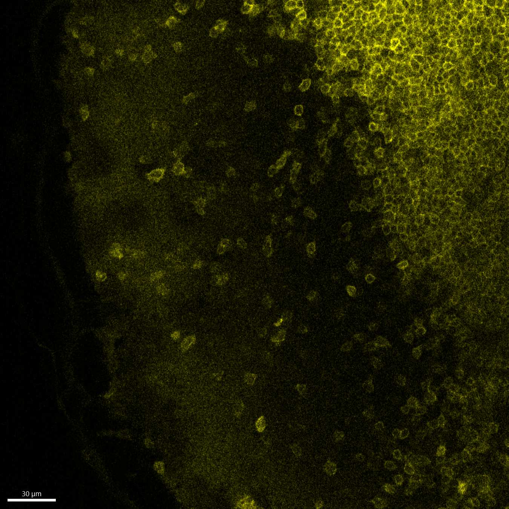

# Configurations

| UniProt Accession Number   | Reagent Type     | Target Name / Protein Biomarker   | Target Species   | Host Organism   | Isotype   | Clonality   | Vendor         |   Catalog Number | Conjugate   | RRID       | Availability   | Method                 | Tissue Preservation               | Target Tissue   | Tissue State   | Detergent             | Antigen Retrieval Conditions   | Dye Inactivation Conditions   | Recommend   | Agree                                                        | Disagree   | Contributor                                                  | Notes       |
|:---------------------------|:-----------------|:----------------------------------|:-----------------|:----------------|:----------|:------------|:---------------|-----------------:|:------------|:-----------|:---------------|:-----------------------|:----------------------------------|:----------------|:---------------|:----------------------|:-------------------------------|:------------------------------|:------------|:-------------------------------------------------------------|:-----------|:-------------------------------------------------------------|:------------|
| P22646                     | Primary Antibody | CD3                               | Mouse            | Rat             | IgG2b     | 17A2        | BD Biosciences |           571224 | RY610       | AB_3686342 | Stock          | Multiplexed 2D Imaging | 1:4 Cytofix/Cytoperm Fixed Frozen | Lymph Node      | NA             | 1X BD PermWash Buffer | NA                             | NA                            | Yes         | [0000-0002-6863-1461](https://orcid.org/0000-0002-6863-1461) | NA         | [0000-0002-6863-1461](https://orcid.org/0000-0002-6863-1461) | [1](#notes) |
| P22646                     | Primary Antibody | CD3                               | Mouse            | Rat             | IgG2b     | 17A2        | BD Biosciences |           571224 | RY610       | AB_3686342 | Stock          | IBEX2D Manual         | 1:4 Cytofix/Cytoperm Fixed Frozen | Lymph Node      | NA             | 1X BD PermWash Buffer | NA                             | 1 mg/ml LiBH4 15 minutes      | Yes         | [0000-0002-6863-1461](https://orcid.org/0000-0002-6863-1461) | NA         | [0000-0002-6863-1461](https://orcid.org/0000-0002-6863-1461) | [2](#notes) |
| P22646                     | Primary Antibody | CD3                               | Mouse            | Rat             | IgG2b     | 17A2        | BD Biosciences |           571224 | RY610       | AB_3686342 | Stock          | Ce3D                   | 1:4 Cytofix/Cytoperm Fixed Frozen | Lymph Node      | NA             | 1X BD PermWash Buffer | NA                             | NA                            | Yes         | [0000-0002-6863-1461](https://orcid.org/0000-0002-6863-1461) | NA         | [0000-0002-6863-1461](https://orcid.org/0000-0002-6863-1461) | [3](#notes) |

# Publications

# Additional Notes

1. Immunized draining lymph node. Stain was in 1X Perm Wash Buffer. Antibody concentration ~1/150, stained overnight at 4C.
2. Immunized draining lymph node. Stain was in 1X Perm Wash Buffer. Antibody concentration ~1/150, stained overnight at 4C. Dye inactivation was performed using 1mg/mL LiBH4 for 15 minutes.
3. Immunized draining lymph node. Stain was in 1X Perm Wash Buffer. Antibody concentration 1/50, stained 3-4 days at RT on shaker. Did not post-fix. Cleared in Ce3D overnight.

| Immunized mouse lymph node |
|:-------:|
|  |

| Immunized mouse lymph node: dye-inactivated section imaged using pre-inactivation microscope settings (laser power, gain) but with signal maximally increased in Imaris to display the completeness of signal loss with dye inactivation. |
|:-------:|
|  |

| Immunized mouse lymph node: dye-inactivated section imaged maximized microscope settings (laser power, gain) and optimal Imaris setting for visualization to evaluate potential residual non-inactivated signal which might interfere with subsequent imaging cycles, especially of dim markers. |
|:-------:|
|  |

| Immunized mouse lymph node: 2D slice at the edge of a ~250um-thick 3D image |
|:-------:|
|  |

| Immunized mouse lymph node: 2D slice at the centre of a ~250um-thick 3D image |
|:-------:|
|  |