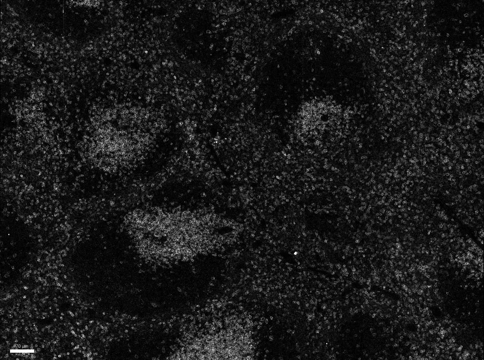

# Configurations

| UniProt Accession Number   | Reagent Type     | Target Name / Protein Biomarker   | Target Species   | Host Organism   | Isotype   | Clonality   | Vendor    |   Catalog Number | Conjugate     | RRID       | Availability   | Method        | Tissue Preservation               | Target Tissue   | Tissue State   | Detergent         | Antigen Retrieval Conditions   | Dye Inactivation Conditions   | Recommend   | Agree               | Disagree   | Contributor         | Notes       |
|:---------------------------|:-----------------|:----------------------------------|:-----------------|:----------------|:----------|:------------|:----------|-----------------:|:--------------|:-----------|:---------------|:--------------|:----------------------------------|:----------------|:---------------|:------------------|:-------------------------------|:------------------------------|:------------|:--------------------|:-----------|:--------------------|:------------|
| P22646                     | Primary Antibody | CD3                               | Mouse            | Rat             | IgG2b     | 17A2        | BioLegend |           100281 | Spark Red 718 | AB_2924440 | Stock          | Multiplexed 2D Imaging | 1:4 Cytofix/Cytoperm Fixed Frozen | Spleen      | NA             | 0.3% Triton-X-100 | NA                             | NA      | Yes         | [0000-0003-1130-1899](https://orcid.org/0000-0003-1130-1899) | NA         | [0000-0003-1130-1899](https://orcid.org/0000-0003-1130-1899) | [1, 2, 3](#notes) |

# Publications

# Additional Notes

1. Experimented also reduced fixation time (4h) before putting into sucrose and sectionning it with a cryostat. Longer fixation yields better results. 

2. This conjugate is a better alternative than AF700. 

3. The staining was done for 1h at RT using a concentration of 1:50. 

| Mouse Spleen: CD3e (white, catalog number 100281) |
|:-------:|
|  |
