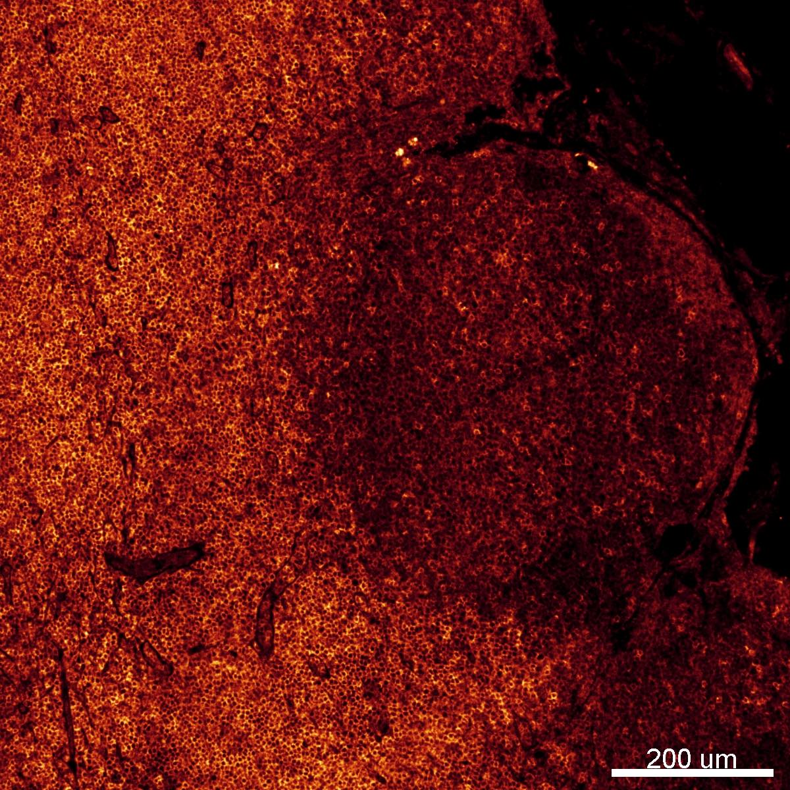

# Configurations

| UniProt Accession Number   | Reagent Type     | Target Name / Protein Biomarker   | Target Species   | Host Organism   | Isotype   | Clonality   | Vendor   | Catalog Number   | Conjugate    | RRID      | Availability   | Method                 | Tissue Preservation   | Target Tissue   | Tissue State   | Detergent         | Antigen Retrieval Conditions                                                               | Dye Inactivation Conditions   | Recommend   | Agree                                                        | Disagree   | Contributor                                                  | Notes       |
|:---------------------------|:-----------------|:----------------------------------|:-----------------|:----------------|:----------|:------------|:---------|:-----------------|:-------------|:----------|:---------------|:-----------------------|:----------------------|:----------------|:---------------|:------------------|:-------------------------------------------------------------------------------------------|:------------------------------|:------------|:-------------------------------------------------------------|:-----------|:-------------------------------------------------------------|:------------|
| P27597                     | Primary Antibody | CD3                               | Canine           | Rabbit          | IgG       | SP7         | Abcam    | ab16669          | Unconjugated | AB_443425 | Stock          | Multiplexed 2D Imaging | FFPE                  | Lymph Node      | NA             | 0.3% Triton-X-100 | pH 6 for 30 minutes ER1 (AR9961) and pH 9 for 30 minutes ER2 (AR9640) using the Leica Bond | NA                            | Yes         | [0000-0001-5088-7808](https://orcid.org/0000-0001-5088-7808) | NA         | [0000-0001-5088-7808](https://orcid.org/0000-0001-5088-7808) | [1](#notes) |

# Publications

# Additional Notes

1. Example: Labels T cells in the T cell zone of the lymph node. Used at a dilution of 1:10 to see signal. High background with donkey anti-goat AF555 secondary (A21432). Consider amplifying with opal dyes or TSA-based system or background subtraction with [channel arithmetics](https://github.com/niaid/imaris_extensions).

| Canine lymph node FFPE: CD3 (orange, catalog number ab16669 and A21432) |
|:-------:|
|  |
