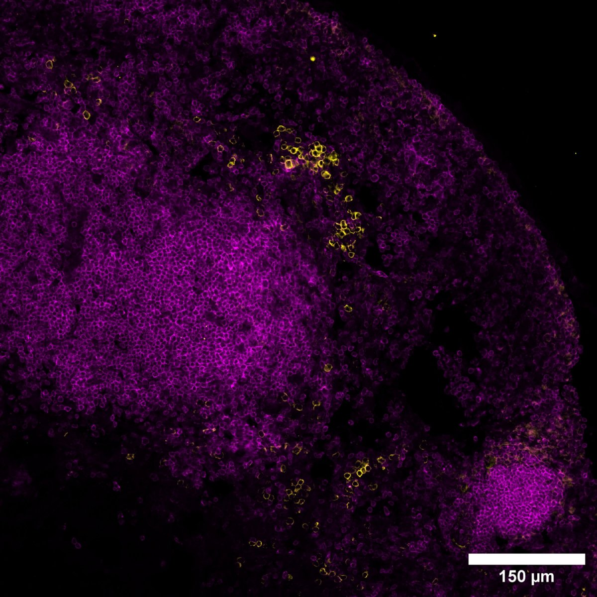

# Configurations

| UniProt Accession Number   | Reagent Type     | Target Name / Protein Biomarker   | Target Species   | Host Organism   | Isotype   | Clonality   | Vendor    |   Catalog Number | Conjugate   | RRID      | Availability   | Method        | Tissue Preservation               | Target Tissue   | Tissue State   | Detergent         | Antigen Retrieval Conditions   | Dye Inactivation Conditions   | Recommend   | Agree                                                        | Disagree   | Contributor                                                  | Notes   |
|:---------------------------|:-----------------|:----------------------------------|:-----------------|:----------------|:----------|:------------|:----------|-----------------:|:------------|:----------|:---------------|:--------------|:----------------------------------|:----------------|:---------------|:------------------|:-------------------------------|:------------------------------|:------------|:-------------------------------------------------------------|:-----------|:-------------------------------------------------------------|:--------|
| NA                         | Primary Antibody | CD45.1                            | Mouse            | Mouse           | IgG2a     | A20         | BioLegend |           110718 | AF488       | AB_492862 | Stock          | IBEX2D Manual | 1:4 Cytofix/Cytoperm Fixed Frozen | Lymph Node      | NA             | 0.3% Triton-X-100 | NA                             | 1 mg/ml LiBH4 15 minutes      | Yes         | [0000-0002-8909-5039](https://orcid.org/0000-0002-8909-5039) | NA         | [0000-0002-8909-5039](https://orcid.org/0000-0002-8909-5039) |         |

# Publications

# Additional Notes

| Mouse (immunized) lymph node: CD45.1 (yellow, catalog number 110718) and CD138 (magenta, catalog number 142526) |
|:-------:|
|  |
