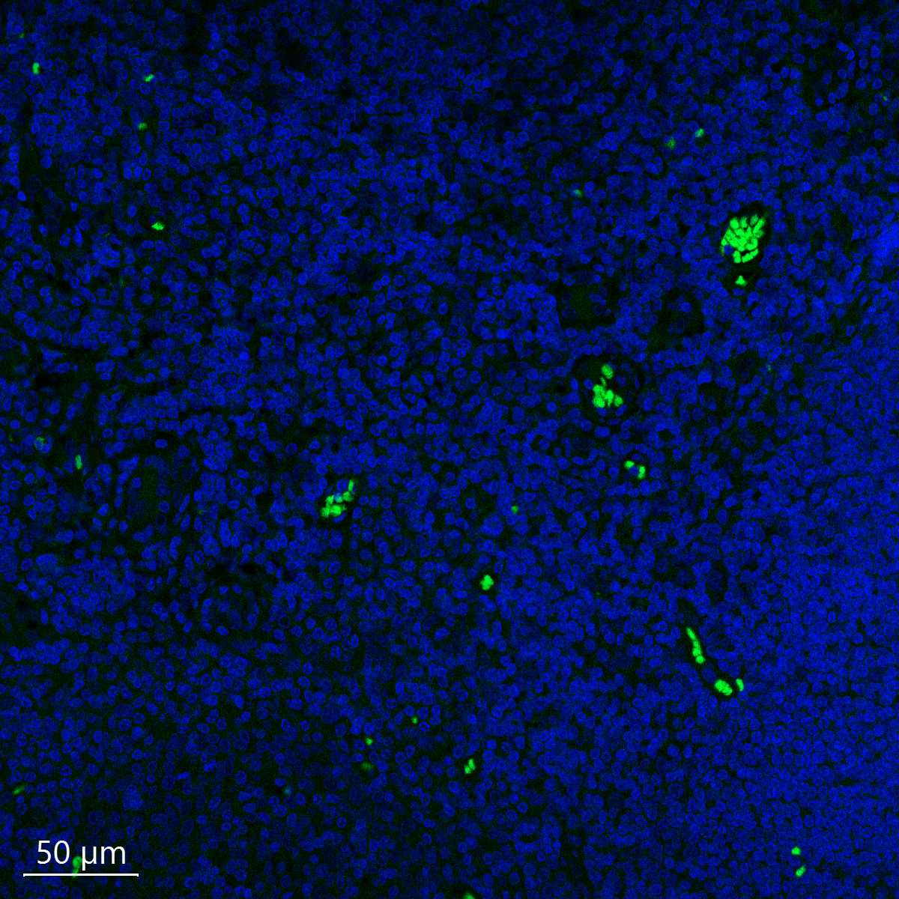

# Configurations

| UniProt Accession Number   | Reagent Type     | Target Name / Protein Biomarker   | Target Species   | Host Organism   | Isotype   | Clonality   | Vendor            | Catalog Number   | Conjugate   | RRID   | Availability   | Method                 | Tissue Preservation   | Target Tissue   | Tissue State   | Detergent         | Antigen Retrieval Conditions                                                               | Dye Inactivation Conditions   | Recommend   | Agree                                                        | Disagree   | Contributor                                                  | Notes       |
|:---------------------------|:-----------------|:----------------------------------|:-----------------|:----------------|:----------|:------------|:------------------|:-----------------|:------------|:-------|:---------------|:-----------------------|:----------------------|:----------------|:---------------|:------------------|:-------------------------------------------------------------------------------------------|:------------------------------|:------------|:-------------------------------------------------------------|:-----------|:-------------------------------------------------------------|:------------|
| P08575                     | Primary Antibody | CD45                              | Human            | Mouse           | IgG1      | 2B11+PD7/26 | Novus Biologicals | NBP2-34528AF488  | AF488       | NA     | Stock          | Multiplexed 2D Imaging | FFPE                  | Tonsil          | NA             | 0.3% Triton-X-100 | pH 6 for 30 minutes ER1 (AR9961) and pH 9 for 30 minutes ER2 (AR9640) using the Leica Bond | NA                            | No          | [0009-0006-9784-2694](https://orcid.org/0009-0006-9784-2694) | NA         | [0009-0006-9784-2694](https://orcid.org/0009-0006-9784-2694) | [1](#notes) |

# Publications

# Additional Notes

1. No specific signal seen, only background and autofluorescent RBCs visible.

| Human tonsil: Hoechst (blue, Biotium cat. no. 40046) and CD45 (green, Novus Biologicals cat. no. NBP2-34528AF488) |
|:-------:|
|  |
