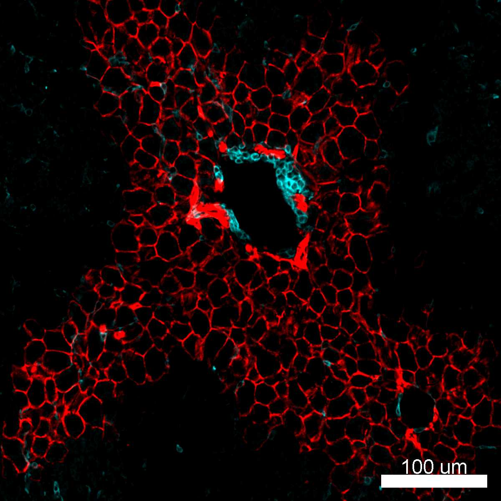

# Configurations

| UniProt Accession Number   | Reagent Type     | Target Name / Protein Biomarker   | Target Species   | Host Organism   | Isotype   | Clonality   | Vendor    |   Catalog Number | Conjugate   | RRID      | Availability   | Method        | Tissue Preservation               | Target Tissue   | Tissue State   | Detergent   | Antigen Retrieval Conditions   | Dye Inactivation Conditions   | Recommend   | Agree                                                        | Disagree   | Contributor         | Notes       |
|:---------------------------|:-----------------|:----------------------------------|:-----------------|:----------------|:----------|:------------|:----------|-----------------:|:------------|:----------|:---------------|:--------------|:----------------------------------|:----------------|:---------------|:------------|:-------------------------------|:------------------------------|:------------|:-------------------------------------------------------------|:-----------|:--------------------|:------------|
| P06800                     | Primary Antibody | CD45                              | Mouse            | Rat             | IgG2b     | 30-F11      | BioLegend |           103128 | AF700       | AB_493715 | Stock          | IBEX2D Manual | 1:4 Cytofix/Cytoperm Fixed Frozen | Liver           | NA             | NA          | NA                             | 1 mg/ml LiBH4 15 minutes      | Yes         | [0000-0003-1431-1398](https://orcid.org/0000-0003-1431-1398) [[1](#publications), [2](#publications)] | NA         | [0000-0003-1431-1398](https://orcid.org/0000-0003-1431-1398) | [1](#notes) |

# Publications

1. A. Gola et al., "Commensal-driven immune zonation of the liver promotes host defence", *Nature*, 589(7840):131-136, 2021, [doi:10.1038/s41586-020-2977-2](https://doi.org/10.1038/s41586-020-2977-2).

2. A. J. Radtke et al., "IBEX: A versatile multiplex optical imaging approach for deep phenotyping and spatial analysis of cells in complex tissues", *Proc Natl Acad Sci*, 117(52):33455–33465, 2020, [doi:10.1073/pnas.2018488117](https://doi.org/10.1073/pnas.2018488117)

# Additional Notes

1. For additional details on how to prepare samples (perfusion, no detergent) see [[Gola et al. 2020](https://doi.org/10.1038/s41586-020-2977-2)].

| Mouse liver: E-Cadherin (red, catalog number 147308), and CD45 (cyan, catalog number 103128) |
|:-------:|
|  |
