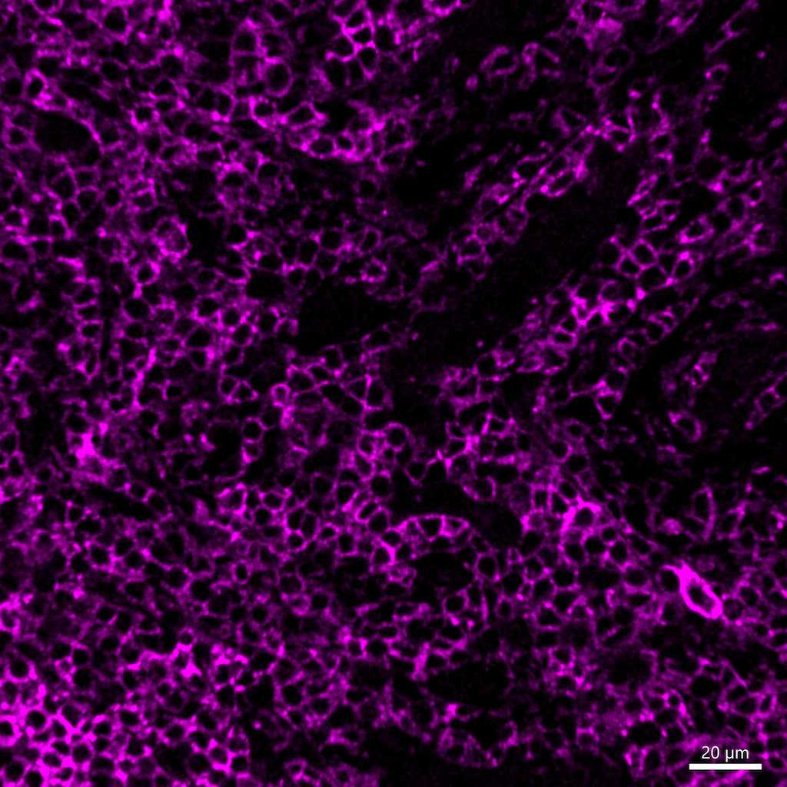

# Configurations

| UniProt Accession Number   | Reagent Type     | Target Name / Protein Biomarker   | Target Species   | Host Organism   | Isotype   | Clonality   | Vendor            | Catalog Number   | Conjugate   | RRID      | Availability   | Method                 | Tissue Preservation               | Target Tissue   | Tissue State   | Detergent         | Antigen Retrieval Conditions                                                               | Dye Inactivation Conditions   | Recommend   | Agree                                    | Disagree   | Contributor         | Notes       |
|:---------------------------|:-----------------|:----------------------------------|:-----------------|:----------------|:----------|:------------|:------------------|:-----------------|:------------|:----------|:---------------|:-----------------------|:----------------------------------|:----------------|:---------------|:------------------|:-------------------------------------------------------------------------------------------|:------------------------------|:------------|:-----------------------------------------|:-----------|:--------------------|:------------|
| P06800                     | Primary Antibody | CD45                              | Mouse            | Rat             | IgG2b     | 30-F11      | BioLegend         | 103128           | AF700       | AB_493715 | Stock          | IBEX2D Manual          | 1:4 Cytofix/Cytoperm Fixed Frozen | Thymus          | NA             | 0.3% Triton-X-100 | NA                                                                                         | 1 mg/ml LiBH4 15 minutes      | Yes         | [0000-0003-4379-8967](https://orcid.org/0000-0003-4379-8967) [[1](#publications)] | NA         | [0000-0003-4379-8967](https://orcid.org/0000-0003-4379-8967) |             |
| P08575                     | Primary Antibody | CD45                              | Human            | Mouse           | IgG1      | 2B11+PD7/26 | Novus Biologicals | NBP2-34528AF700  | AF700       | NA        | Stock          | Multiplexed 2D Imaging | FFPE                              | Tonsil          | NA             | 0.3% Triton-X-100 | pH 6 for 30 minutes ER1 (AR9961) and pH 9 for 30 minutes ER2 (AR9640) using the Leica Bond | NA                            | Yes         | [0000-0003-4379-8967](https://orcid.org/0000-0003-4379-8967)                      | NA         | [0000-0003-4379-8967](https://orcid.org/0000-0003-4379-8967) | [1](#notes) |
| P08575                     | Primary Antibody | CD45                              | Human            | Mouse           | IgG1      | 2B11 + PD7/26 | Novus Biologicals | NBP2-34528AF700  | AF700       | NA     | Stock          | Multiplexed 2D Imaging | FFPE                  | Lymph Node      | Follicular Lymphoma | 0.3% Triton-X-100 | pH 6 for 30 minutes ER1 (AR9961) and pH 9 for 30 minutes ER2 (AR9640) using the Leica Bond | NA                            | Yes         | [0000-0003-4379-8967](https://orcid.org/0000-0003-4379-8967) | NA         | [0000-0003-4379-8967](https://orcid.org/0000-0003-4379-8967) | [2](#notes) |

# Publications

1. A. J. Radtke et al., "IBEX: A versatile multiplex optical imaging approach for deep phenotyping and spatial analysis of cells in complex tissues", *Proc Natl Acad Sci*, 117(52):33455–33465, 2020, [doi:10.1073/pnas.2018488117](https://doi.org/10.1073/pnas.2018488117)

# Additional Notes

1. Labels immune cells. Beautiful signal in a difficult conjugate. Use at a 1:25 dilution.
2. Antibody labels membranes of immune cells in FFPE tissues. Strong signal in a difficult conjugate (AF700).  Multi-clonal (2B11 + PD7/26) works in many FFPE tissues and conjugates.

| Human follicular lymphoma FFPE: CD45 (magenta, catalog number NBP2-34528AF700) |
|:-------:|
|  |