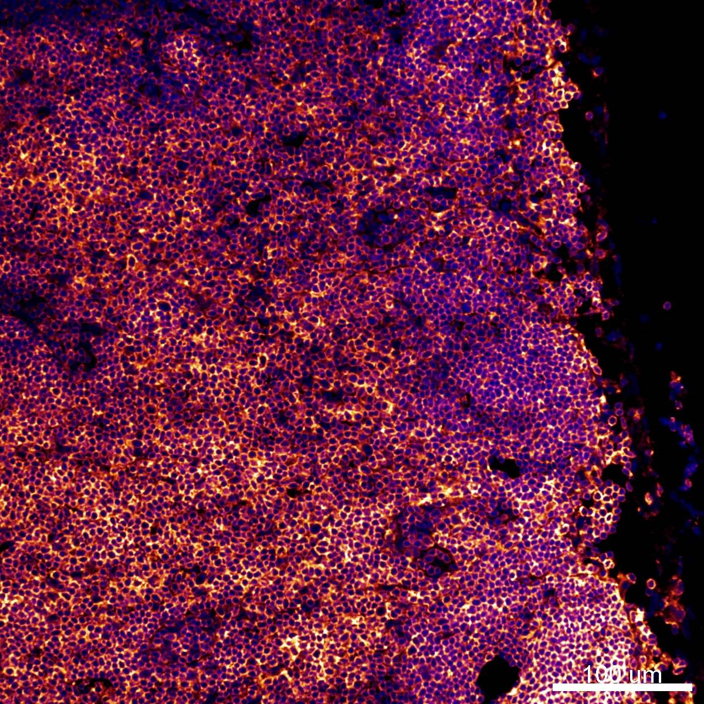

# Configurations

| UniProt Accession Number   | Reagent Type     | Target Name / Protein Biomarker   | Target Species   | Host Organism   | Isotype   | Clonality   | Vendor    |   Catalog Number | Conjugate    | RRID       | Availability   | Method        | Tissue Preservation               | Target Tissue   | Tissue State   | Detergent         | Antigen Retrieval Conditions   | Dye Inactivation Conditions                                  | Recommend   | Agree                                                        | Disagree   | Contributor                                                  | Notes       |
|:---------------------------|:-----------------|:----------------------------------|:-----------------|:----------------|:----------|:------------|:----------|-----------------:|:-------------|:-----------|:---------------|:--------------|:----------------------------------|:----------------|:---------------|:------------------|:-------------------------------|:-------------------------------------------------------------|:------------|:-------------------------------------------------------------|:-----------|:-------------------------------------------------------------|:------------|
| P06800                     | Primary Antibody | CD45                              | Mouse            | Rat             | IgG2b     | 30-F11      | BioLegend |           103172 | Spark YG 570 | AB_2860598 | Stock          | IBEX2D Manual | 1:4 Cytofix/Cytoperm Fixed Frozen | Lymph Node      | NA             | 0.3% Triton-X-100 | NA                             | Does not bleach within 15 minutes of 1 mg/ml LiBH4 treatment | Yes         | [0000-0003-4379-8967](https://orcid.org/0000-0003-4379-8967) | NA         | [0000-0003-4379-8967](https://orcid.org/0000-0003-4379-8967) | [1](#notes) |

# Publications

# Additional Notes

1. Does not bleach within 15 minutes of 1 mg/ml LiBH4. Place in the last cycle or keep as a fiducial.

| Mouse LN: CD45 (orange, catalog number 103172) and Hoechst (blue, catalog number 40046) |
|:-------:|
|  |
