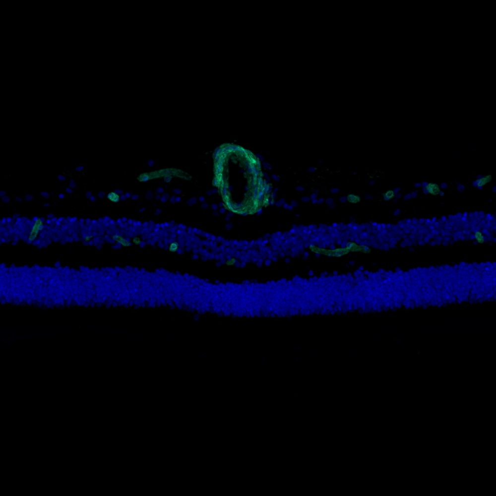

# Configurations

| UniProt Accession Number   | Reagent Type     | Target Name / Protein Biomarker   | Target Species   | Host Organism   | Isotype   | Clonality   | Vendor    |   Catalog Number | Conjugate   | RRID       | Availability   | Method        | Tissue Preservation               | Target Tissue   | Tissue State   | Detergent    | Antigen Retrieval Conditions   | Dye Inactivation Conditions   | Recommend   | Agree                                                        | Disagree   | Contributor                                                  | Notes       |
|:---------------------------|:-----------------|:----------------------------------|:-----------------|:----------------|:----------|:------------|:----------|-----------------:|:------------|:-----------|:---------------|:--------------|:----------------------------------|:----------------|:---------------|:-------------|:-------------------------------|:------------------------------|:------------|:-------------------------------------------------------------|:-----------|:-------------------------------------------------------------|:------------|
| P56199                     | Primary Antibody | CD49a                             | Human            | Mouse           | IgG1      | TS2/7       | BioLegend |           328310 | AF647       | AB_2129242 | Stock          | IBEX2D Manual | 1:4 Cytofix/Cytoperm Fixed Frozen | Retina          | NA             | 0.1% Saponin | NA                             | 1 mg/ml LiBH4 15 minutes      | Yes         | [0000-0003-2088-8310](https://orcid.org/0000-0003-2088-8310) | NA         | [0000-0003-2088-8310](https://orcid.org/0000-0003-2088-8310) | [1](#notes) |

# Publications

# Additional Notes

1. Multiple cell lineages. Stains vasculature in the retina.

| Human retina: CD49a (sea green, catalog number 328310) and Hoechst (blue, catalog number 40046) |
|:-------:|
|  |
