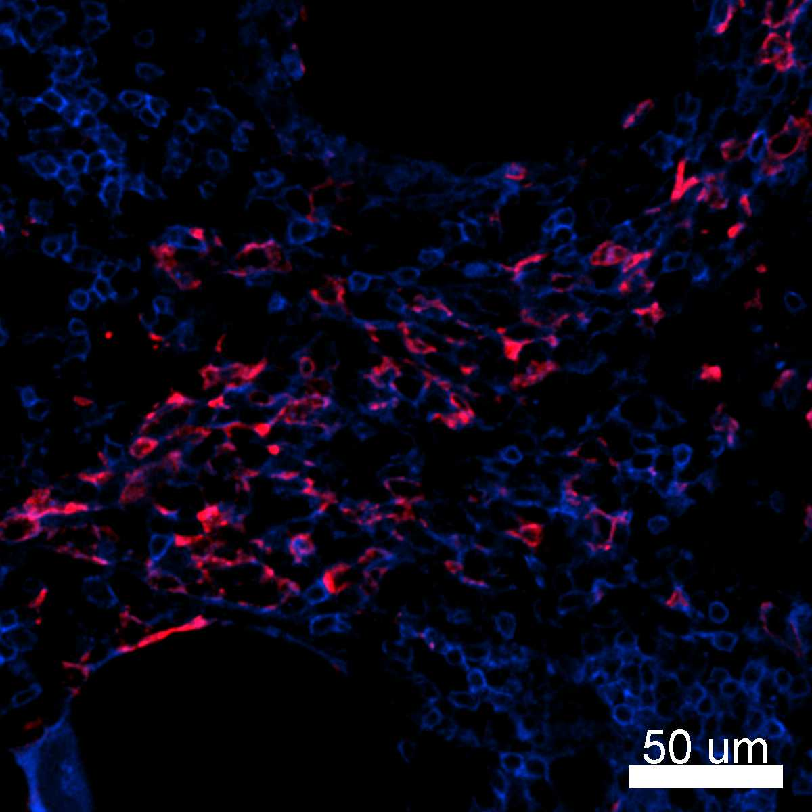

# Configurations

| UniProt Accession Number   | Reagent Type     | Target Name / Protein Biomarker   | Target Species   | Host Organism   | Isotype   | Clonality   | Vendor         | Catalog Number   | Conjugate   | RRID       | Availability   | Method                 | Tissue Preservation               | Target Tissue   | Tissue State   | Detergent         | Antigen Retrieval Conditions                                                               | Dye Inactivation Conditions   | Recommend   | Agree                                                        | Disagree   | Contributor         | Notes       |
|:---------------------------|:-----------------|:----------------------------------|:-----------------|:----------------|:----------|:------------|:---------------|:-----------------|:------------|:-----------|:---------------|:-----------------------|:----------------------------------|:----------------|:---------------|:------------------|:-------------------------------------------------------------------------------------------|:------------------------------|:------------|:-------------------------------------------------------------|:-----------|:--------------------|:------------|
| P01730                     | Primary Antibody | CD4                               | Human            | Mouse           | IgG1      | RPA-T4      | BioLegend      | 300519           | AF488       | AB_389311  | Stock          | IBEX2D Manual          | 1:4 Cytofix/Cytoperm Fixed Frozen | Lymph Node      | NA             | 0.3% Triton-X-100 | NA                                                                                         | 1 mg/ml LiBH4 15 minutes      | Yes         | [0000-0003-4379-8967](https://orcid.org/0000-0003-4379-8967) [[2](#publications), [1](#publications)] | NA         | [0000-0003-4379-8967](https://orcid.org/0000-0003-4379-8967) |             |
| P06332                     | Primary Antibody | CD4                               | Mouse            | Rat             | IgG2a     | RM4-5       | BD Biosciences | 557667           | AF488       | AB_396779  | Stock          | IBEX2D Manual          | 1:4 Cytofix/Cytoperm Fixed Frozen | Lymph Node      | NA             | 0.3% Triton-X-100 | NA                                                                                         | 1 mg/ml LiBH4 15 minutes      | Yes         | [0000-0003-4379-8967](https://orcid.org/0000-0003-4379-8967) [[2](#publications)]                     | NA         | [0000-0003-4379-8967](https://orcid.org/0000-0003-4379-8967) |             |
| P01730                     | Primary Antibody | CD4                               | Human            | Rabbit          | IgG       | EPR6855     | Abcam          | ab196372         | AF488       | AB_2889191 | Stock          | Multiplexed 2D Imaging | FFPE                              | Tonsil          | NA             | 0.3% Triton-X-100 | pH 6 for 30 minutes ER1 (AR9961) and pH 9 for 30 minutes ER2 (AR9640) using the Leica Bond | NA                            | Yes         | [0000-0003-4379-8967](https://orcid.org/0000-0003-4379-8967)                                          | NA         | [0000-0003-4379-8967](https://orcid.org/0000-0003-4379-8967) | [1](#notes) |
| P01730                     | Primary Antibody | CD4                               | Human            | Rabbit          | IgG       | EPR6855     | Abcam          | ab196372         | AF488       | AB_2889191 | Stock          | Cell DIVE-IBEX         | FFPE                              | Tonsil          | NA             | 0.3% Triton-X-100 | pH 6 for 30 minutes ER1 (AR9961) and pH 9 for 30 minutes ER2 (AR9640) using the Leica Bond | 1 mg/ml LiBH4 15 minutes      | Yes         | [0000-0003-4379-8967](https://orcid.org/0000-0003-4379-8967)                                          | NA         | [0000-0003-4379-8967](https://orcid.org/0000-0003-4379-8967) | [2](#notes) |

# Publications

1. A. J. Radtke et al., "IBEX: an iterative immunolabeling and chemical bleaching
 method for high-content imaging of diverse tissues", *Nat. Protoc.*, 17(2):378-401, 2022, [doi: 10.1038/s41596-021-00644-9](https://doi.org/10.1038/s41596-021-00644-9).

    A. J. Radtke et al., "Accompanying dataset for: IBEX: An iterative immunolabeling and chemical bleaching method for high-content imaging of diverse tissues", [doi: 10.5281/zenodo.5244550](https://doi.org/10.5281/zenodo.5244551).

2. A. J. Radtke et al., "IBEX: A versatile multiplex optical imaging approach for deep phenotyping and spatial analysis of cells in complex tissues", *Proc Natl Acad Sci*, 117(52):33455–33465, 2020, [doi:10.1073/pnas.2018488117](https://doi.org/10.1073/pnas.2018488117)

# Additional Notes

1. Antibody labels T helper cells and macrophages if used at a high concentration (1:25). Dual antigen retrieval (pH 6 and 9) is required for this antibody.
2. Antibody labels T helper cells and macrophages if used at a high concentration (1:25). Dual antigen retrieval (pH 6 and 9) is required for this antibody. Works beautifully on Cell DIVE imager with IBEX dye inactivation protocol.

| Human lymph node: CD163 (red, catalog number 333620) and CD4 (blue, catalog number 300519) |
|:-------:|
|  |
