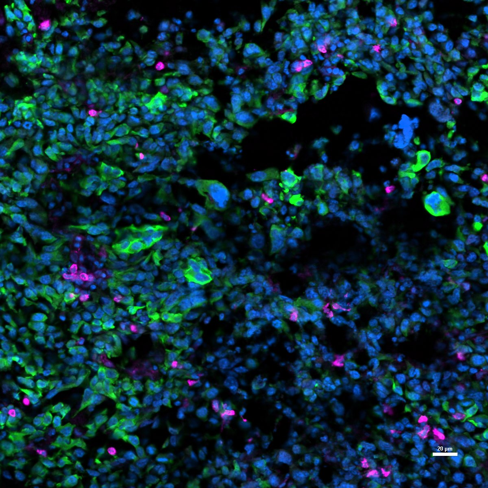
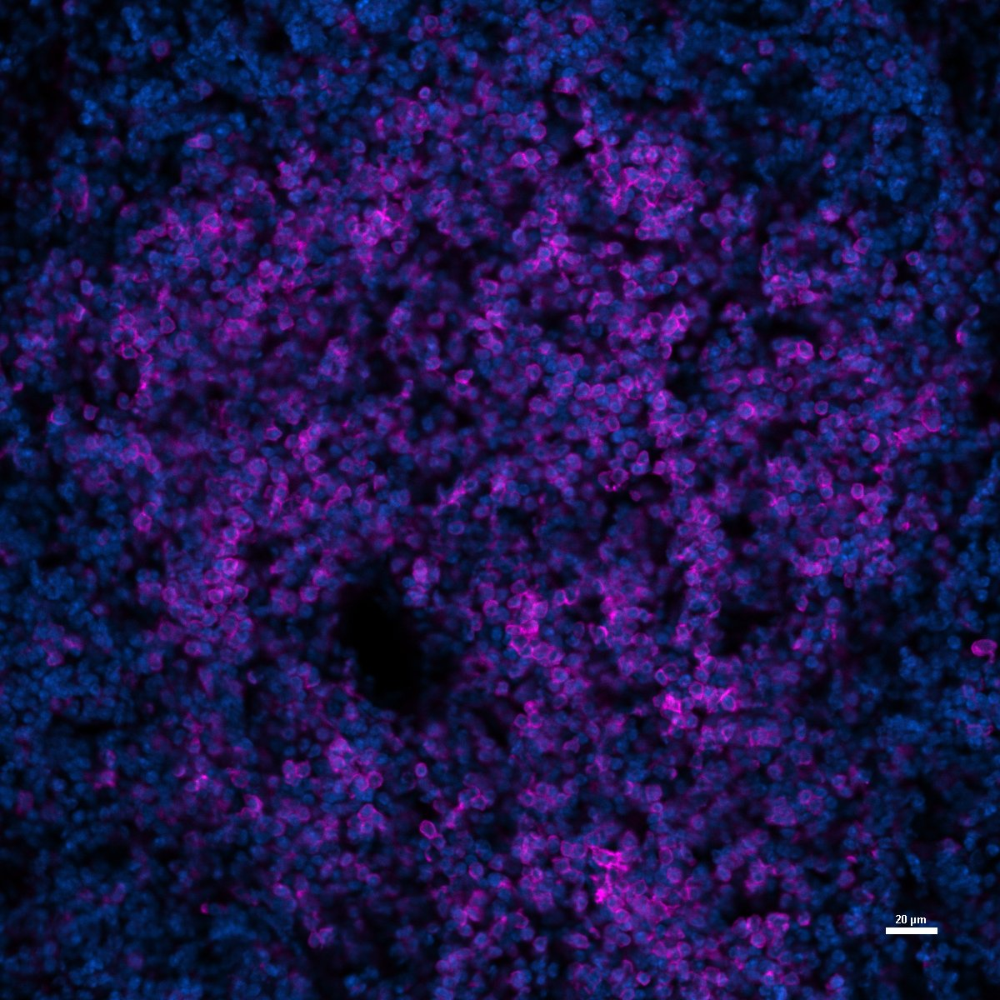

# Configurations

| UniProt Accession Number   | Reagent Type     | Target Name / Protein Biomarker   | Target Species   | Host Organism   | Isotype   | Clonality   | Vendor    |   Catalog Number | Conjugate   | RRID      | Availability   | Method                 | Tissue Preservation   | Target Tissue   | Tissue State   | Detergent          | Antigen Retrieval Conditions   | Dye Inactivation Conditions   | Recommend   | Agree                                                        | Disagree   | Contributor                                                  | Notes       |
|:---------------------------|:-----------------|:----------------------------------|:-----------------|:----------------|:----------|:------------|:----------|-----------------:|:------------|:----------|:---------------|:-----------------------|:----------------------|:----------------|:---------------|:-------------------|:-------------------------------|:------------------------------|:------------|:-------------------------------------------------------------|:-----------|:-------------------------------------------------------------|:------------|
| P06332                     | Primary Antibody | CD4                               | Mouse            | Rat             | IgG2a     | RM4-5       | BioLegend |           100533 | AF647       | AB_493372 | Stock          | Multiplexed 2D Imaging | 4% PFA Fixed Frozen   | Brain           | Tumor          | 0.3% Triton-X-100 | NA                             | NA                            | Yes         | [0000-0002-6944-6997](https://orcid.org/0000-0002-6944-6997) | NA         | [0000-0002-6944-6997](https://orcid.org/0000-0002-6944-6997) | [1](#notes) |
| P06332                     | Primary Antibody | CD4                               | Mouse            | Rat             | IgG2a     | RM4-5       | BioLegend |           100533 | AF647       | AB_493372 | Stock          | Multiplexed 2D Imaging | 4% PFA Fixed Frozen   | Spleen          | Healthy        | 0.3% Triton-X-100 | NA                             | NA                            | Yes         | [0000-0002-6944-6997](https://orcid.org/0000-0002-6944-6997) | NA         | [0000-0002-6944-6997](https://orcid.org/0000-0002-6944-6997) | [1](#notes) |

# Publications

# Additional Notes

1. Dilution 1:50.

| Mouse Brain Tumor Hochest (Blue) mCherry (green, Novus #NBP2-25158 ) CD4 (Magenta, Biolegend #100533) |
|:-------:|
|  |

| Mouse Spleen Hochest (Blue) CD4 (Magenta Biolegend #100533) |
|:-------:|
|  |
