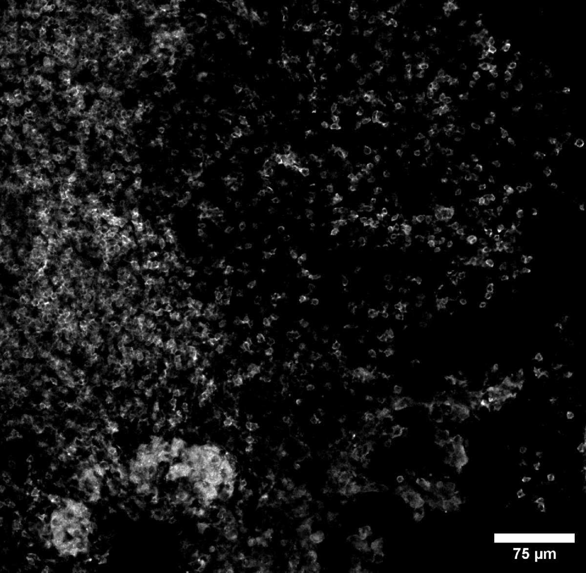

# Configurations

| UniProt Accession Number   | Reagent Type     | Target Name / Protein Biomarker   | Target Species   | Host Organism   | Isotype   | Clonality   | Vendor    |   Catalog Number | Conjugate   | RRID       | Availability   | Method        | Tissue Preservation               | Target Tissue   | Tissue State   | Detergent         | Antigen Retrieval Conditions   | Dye Inactivation Conditions      | Recommend   | Agree                                                        | Disagree   | Contributor                                                  | Notes   |
|:---------------------------|:-----------------|:----------------------------------|:-----------------|:----------------|:----------|:------------|:----------|-----------------:|:------------|:-----------|:---------------|:--------------|:----------------------------------|:----------------|:---------------|:------------------|:-------------------------------|:---------------------------------|:------------|:-------------------------------------------------------------|:-----------|:-------------------------------------------------------------|:--------|
| P06332                     | Primary Antibody | CD4                               | Mouse            | Rat             | IgG2b     | GK1.5       | BioLegend |           100449 | BV510       | AB_2564587 | Stock          | IBEX2D Manual | 1:4 Cytofix/Cytoperm Fixed Frozen | Lymph Node      | NA             | 0.3% Triton-X-100 | NA                             | 1 mg/ml LiBH4 15 minutes + light | Yes         | [0000-0003-4379-8967](https://orcid.org/0000-0003-4379-8967) | [0000-0002-1461-0999](https://orcid.org/0000-0002-1461-0999)         | [0000-0003-4379-8967](https://orcid.org/0000-0003-4379-8967) |   [1](#notes)      |

# Publications

# Additional Notes

| Mouse lymph node: CD4 (grey, catalog number 100443) |
|:-------:|
|  |

1. The large cells with cytosolic signal in the bottom left of the image do not have the morphology of a CD4+ T cell. This is likely autofluorescence, and it seems to interfere with many dimmer stains on BV510.