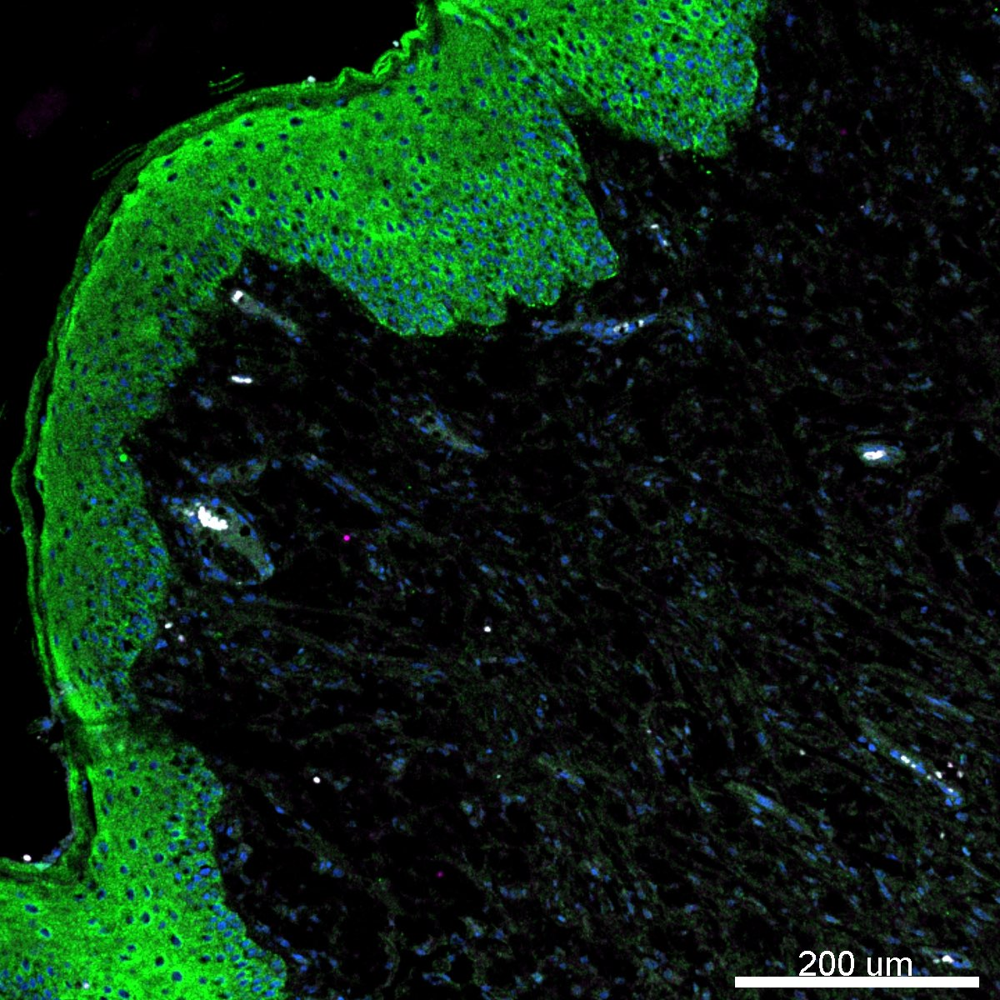

# Configurations

| UniProt Accession Number   | Reagent Type     | Target Name / Protein Biomarker   | Target Species   | Host Organism   | Isotype   | Clonality   | Vendor                  |   Catalog Number | Conjugate   | RRID       | Availability   | Method                 | Tissue Preservation   | Target Tissue   | Tissue State   | Detergent         | Antigen Retrieval Conditions                                                               | Dye Inactivation Conditions   | Recommend   | Agree                                                        | Disagree   | Contributor                                                  | Notes       |
|:---------------------------|:-----------------|:----------------------------------|:-----------------|:----------------|:----------|:------------|:------------------------|-----------------:|:------------|:-----------|:---------------|:-----------------------|:----------------------|:----------------|:---------------|:------------------|:-------------------------------------------------------------------------------------------|:------------------------------|:------------|:-------------------------------------------------------------|:-----------|:-------------------------------------------------------------|:------------|
| A0A8C0Q9Z4                 | Primary Antibody | CD68                              | Canine           | Mouse           | IgG1      | KP1         | Caprico Biotechnologies |          1064135 | iF594       | AB_2892745 | Stock          | Multiplexed 2D Imaging | FFPE                  | Skin            | Melanoma       | 0.3% Triton-X-100 | pH 6 for 30 minutes ER1 (AR9961) and pH 9 for 30 minutes ER2 (AR9640) using the Leica Bond | NA                            | No          | [0000-0001-5088-7808](https://orcid.org/0000-0001-5088-7808) | NA         | [0000-0001-5088-7808](https://orcid.org/0000-0001-5088-7808) | [1](#notes) |

# Publications

# Additional Notes

1. Evaluated in canine melanoma skin samples using a 1:50 dilution. Antibody should label skin-resident macrophages but no signal was observed. Samples may have been overfixed (48 hours to 1 week+ in 10% formalin). Intense antigen retrieval (pH 6 and pH 9) was needed for well established antibodies (pan-cytokeratin, clone AE1/AE3). Pan-cytokeratin used at 1:300 dilution in image below. Better results obtained with 1:50 dilution.

| Canine melanoma skin FFPE: CD68 (magenta but no signal, catalog number 1064136), pan-cytokeratin (green, catalog number 53-9003-80), and Hoechst (blue, catalog number 40046) |
|:-------:|
|  |
