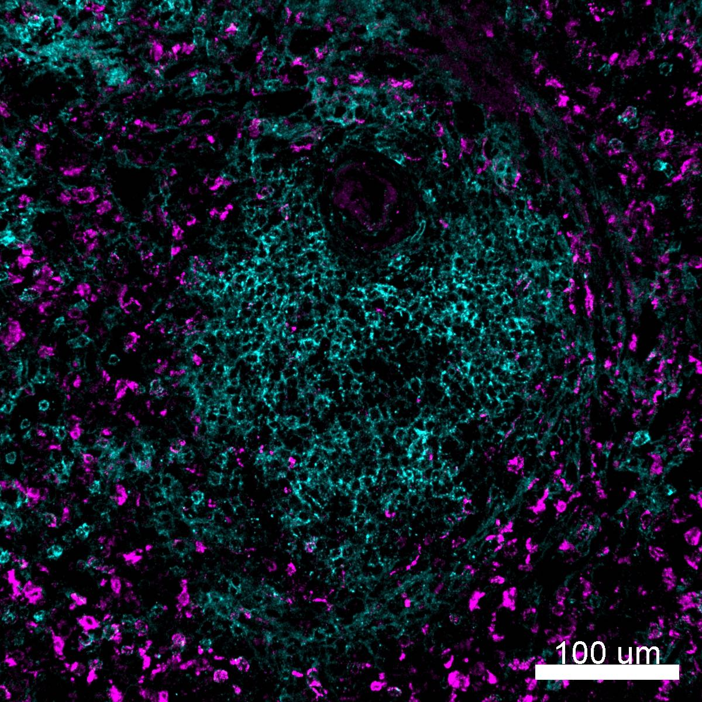

# Configurations

| UniProt Accession Number   | Reagent Type     | Target Name / Protein Biomarker   | Target Species   | Host Organism   | Isotype   | Clonality   | Vendor                  |   Catalog Number | Conjugate   | RRID       | Availability   | Method                 | Tissue Preservation               | Target Tissue   | Tissue State        | Detergent         | Antigen Retrieval Conditions                                  | Dye Inactivation Conditions                                            | Recommend   | Agree                                                        | Disagree   | Contributor         | Notes   |
|:---------------------------|:-----------------|:----------------------------------|:-----------------|:----------------|:----------|:------------|:------------------------|-----------------:|:------------|:-----------|:---------------|:-----------------------|:----------------------------------|:----------------|:--------------------|:------------------|:--------------------------------------------------------------|:-----------------------------------------------------------------------|:------------|:-------------------------------------------------------------|:-----------|:--------------------|:--------|
| P34810                     | Primary Antibody | CD68                              | Human            | Mouse           | IgG1      | KP1         | Caprico Biotechnologies |          1064135 | iF594       | AB_2892745 | Stock          | IBEX2D Automated       | 1:4 Cytofix/Cytoperm Fixed Frozen | Jejunum         | NA                  | 0.3% Triton-X-100 | NA                                                            | 0.5 mg/ml LiBH4 10 minutes continuous exchange with automated protocol | Yes         | [0000-0003-4379-8967](https://orcid.org/0000-0003-4379-8967) [[2](#publications)]                     | NA         | [0000-0003-4379-8967](https://orcid.org/0000-0003-4379-8967) |         |
| P34810                     | Primary Antibody | CD68                              | Human            | Mouse           | IgG1      | KP1         | Caprico Biotechnologies |          1064135 | iF594       | AB_2892745 | Stock          | IBEX2D Manual          | 1:4 Cytofix/Cytoperm Fixed Frozen | Liver           | NA                  | 0.3% Triton-X-100 | NA                                                            | 1 mg/ml LiBH4 15 minutes                                               | Yes         | [0000-0003-4379-8967](https://orcid.org/0000-0003-4379-8967) [[4](#publications), [2](#publications)] | NA         | [0000-0003-4379-8967](https://orcid.org/0000-0003-4379-8967) |         |
| P34810                     | Primary Antibody | CD68                              | Human            | Mouse           | IgG1      | KP1         | Caprico Biotechnologies |          1064135 | iF594       | AB_2892745 | Stock          | IBEX2D Automated       | 1:4 Cytofix/Cytoperm Fixed Frozen | Lymph Node      | NA                  | 0.3% Triton-X-100 | NA                                                            | 0.5 mg/ml LiBH4 10 minutes continuous exchange with automated protocol | Yes         | [0000-0003-4379-8967](https://orcid.org/0000-0003-4379-8967) [[2](#publications)]                     | NA         | [0000-0003-4379-8967](https://orcid.org/0000-0003-4379-8967) |         |
| P34810                     | Primary Antibody | CD68                              | Human            | Mouse           | IgG1      | KP1         | Caprico Biotechnologies |          1064135 | iF594       | AB_2892745 | Stock          | IBEX2D Automated       | 1:4 Cytofix/Cytoperm Fixed Frozen | Skin            | NA                  | 0.3% Triton-X-100 | NA                                                            | 0.5 mg/ml LiBH4 10 minutes continuous exchange with automated protocol | Yes         | [0000-0003-4379-8967](https://orcid.org/0000-0003-4379-8967) [[2](#publications)]                     | NA         | [0000-0003-4379-8967](https://orcid.org/0000-0003-4379-8967) |         |
| P34810                     | Primary Antibody | CD68                              | Human            | Mouse           | IgG1      | KP1         | Caprico Biotechnologies |          1064135 | iF594       | AB_2892745 | Stock          | IBEX2D Manual          | 1:4 Cytofix/Cytoperm Fixed Frozen | Spleen          | NA                  | 0.3% Triton-X-100 | NA                                                            | 1 mg/ml LiBH4 15 minutes                                               | Yes         | [0000-0003-4379-8967](https://orcid.org/0000-0003-4379-8967) [[4](#publications), [2](#publications)] | NA         | [0000-0003-4379-8967](https://orcid.org/0000-0003-4379-8967) |         |
| P34810                     | Primary Antibody | CD68                              | Human            | Mouse           | IgG1      | KP1         | Caprico Biotechnologies |          1064135 | iF594       | AB_2892745 | Stock          | Multiplexed 2D Imaging | FFPE                              | Tonsil          | NA                  | 0.3% Triton-X-100 | pH 6 for 40 minutes at 95C (AR6 Akoya Biosciences AR600250ML) | NA                                                                     | Yes         | [0000-0003-4379-8967](https://orcid.org/0000-0003-4379-8967) [[1](#publications)]                     | NA         | [0000-0003-4379-8967](https://orcid.org/0000-0003-4379-8967) |         |
| P34810                     | Primary Antibody | CD68                              | Human            | Mouse           | IgG1      | KP1         | Caprico Biotechnologies |          1064135 | iF594       | AB_2892745 | Stock          | Multiplexed 2D Imaging | FFPE                              | Lymph Node      | Follicular Lymphoma | 0.3% Triton-X-100 | pH 6 for 40 minutes at 95C (AR6 Akoya Biosciences AR600250ML) | NA                                                                     | Yes         | [0000-0003-4379-8967](https://orcid.org/0000-0003-4379-8967) [[3](#publications)]                     | NA         | [0000-0003-4379-8967](https://orcid.org/0000-0003-4379-8967) |         |

# Publications

1. Q. Xu et al., "Adaptive immune responses to SARS-CoV-2 persist in the pharyngeal lymphoid tissue of children", *Nat. Nat Immunol.*, , [doi: 10.1038/s41590-022-01367-z](https://doi.org/10.1038/s41590-022-01367-z).

2. A. J. Radtke et al., "IBEX: an iterative immunolabeling and chemical bleaching
 method for high-content imaging of diverse tissues", *Nat. Protoc.*, 17(2):378-401, 2022, [doi: 10.1038/s41596-021-00644-9](https://doi.org/10.1038/s41596-021-00644-9).

    A. J. Radtke et al., "Accompanying dataset for: IBEX: An iterative immunolabeling and chemical bleaching method for high-content imaging of diverse tissues", [doi: 10.5281/zenodo.5244550](https://doi.org/10.5281/zenodo.5244551).

3. A. J. Radtke et al., "A Multi-scale, Multiomic Atlas of Human Normal and Follicular Lymphoma Lymph Nodes", *bioRxiv*, 2022, [doi: 10.1101/2022.06.03.494716](https://doi.org/10.1101/2022.06.03.494716).

4. A. J. Radtke et al., "IBEX: A versatile multiplex optical imaging approach for deep phenotyping and spatial analysis of cells in complex tissues", *Proc Natl Acad Sci*, 117(52):33455–33465, 2020, [doi:10.1073/pnas.2018488117](https://doi.org/10.1073/pnas.2018488117)

# Additional Notes

| Human spleen: CD44 (cyan, catalog number X) and CD68 (magenta, catalog number 1064135) |
|:-------:|
|  |
