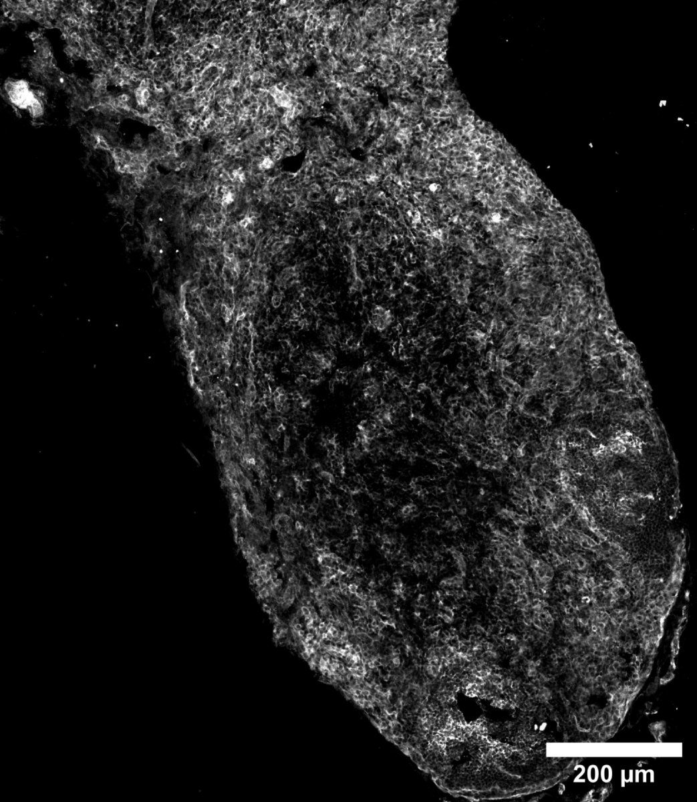

# Configurations

| UniProt Accession Number   | Reagent Type     | Target Name / Protein Biomarker   | Target Species   | Host Organism    | Isotype   | Clonality   | Vendor    |   Catalog Number | Conjugate   | RRID       | Availability   | Method        | Tissue Preservation               | Target Tissue   | Tissue State   | Detergent         | Antigen Retrieval Conditions   | Dye Inactivation Conditions   | Recommend   | Agree                                                        | Disagree   | Contributor                                                  | Notes   |
|:---------------------------|:-----------------|:----------------------------------|:-----------------|:-----------------|:----------|:------------|:----------|-----------------:|:------------|:-----------|:---------------|:--------------|:----------------------------------|:----------------|:---------------|:------------------|:-------------------------------|:------------------------------|:------------|:-------------------------------------------------------------|:-----------|:-------------------------------------------------------------|:--------|
| P35762                     | Primary Antibody | CD81                              | Mouse/Rat        | Armenian Hamster | IgG1      | Eat-2       | BioLegend |           104905 | PE          | AB_2076267 | Stock          | IBEX2D Manual | 1:4 Cytofix/Cytoperm Fixed Frozen | Lymph Node      | NA             | 0.3% Triton-X-100 | NA                             | 1 mg/ml LiBH4 15 minutes      | Yes         | [0000-0002-8909-5039](https://orcid.org/0000-0002-8909-5039) | NA         | [0000-0002-8909-5039](https://orcid.org/0000-0002-8909-5039) |         |

# Publications

# Additional Notes

| Mouse lymph node: CD3 (grey, catalog number 104905) |
|:-------:|
|  |
