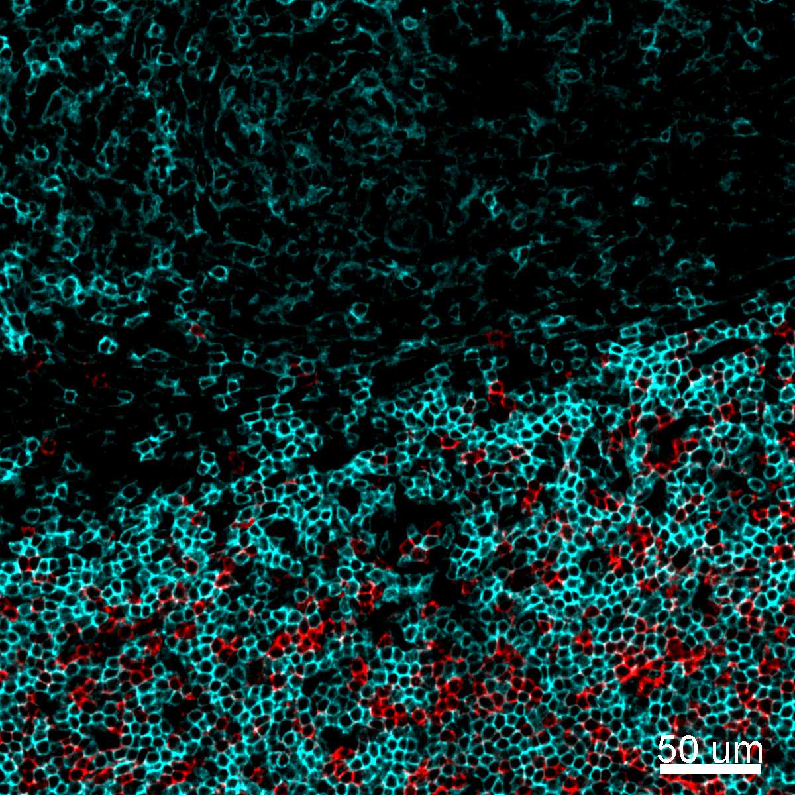

# Configurations

| UniProt Accession Number   | Reagent Type     | Target Name / Protein Biomarker   | Target Species   | Host Organism   | Isotype   | Clonality   | Vendor    |   Catalog Number | Conjugate   | RRID        | Availability   | Method           | Tissue Preservation               | Target Tissue   | Tissue State        | Detergent         | Antigen Retrieval Conditions   | Dye Inactivation Conditions                                            | Recommend   | Agree                                                        | Disagree   | Contributor         | Notes   |
|:---------------------------|:-----------------|:----------------------------------|:-----------------|:----------------|:----------|:------------|:----------|-----------------:|:------------|:------------|:---------------|:-----------------|:----------------------------------|:----------------|:--------------------|:------------------|:-------------------------------|:-----------------------------------------------------------------------|:------------|:-------------------------------------------------------------|:-----------|:--------------------|:--------|
| P01732                     | Primary Antibody | CD8                               | Human            | Mouse           | IgG1      | SK1         | BioLegend |           344716 | AF488       | AB_10549301 | Stock          | IBEX2D Automated | 1:4 Cytofix/Cytoperm Fixed Frozen | Jejunum         | NA                  | 0.3% Triton-X-100 | NA                             | 0.5 mg/ml LiBH4 10 minutes continuous exchange with automated protocol | Yes         | [0000-0003-4379-8967](https://orcid.org/0000-0003-4379-8967) [[1](#publications)]                     | NA         | [0000-0003-4379-8967](https://orcid.org/0000-0003-4379-8967) |         |
| P01732                     | Primary Antibody | CD8                               | Human            | Mouse           | IgG1      | SK1         | BioLegend |           344716 | AF488       | AB_10549301 | Stock          | IBEX2D Manual    | 1:4 Cytofix/Cytoperm Fixed Frozen | Liver           | NA                  | 0.3% Triton-X-100 | NA                             | 1 mg/ml LiBH4 15 minutes                                               | Yes         | [0000-0003-4379-8967](https://orcid.org/0000-0003-4379-8967) [[3](#publications), [1](#publications)] | NA         | [0000-0003-4379-8967](https://orcid.org/0000-0003-4379-8967) |         |
| P01732                     | Primary Antibody | CD8                               | Human            | Mouse           | IgG1      | SK1         | BioLegend |           344716 | AF488       | AB_10549301 | Stock          | IBEX2D Automated | 1:4 Cytofix/Cytoperm Fixed Frozen | Lymph Node      | Metastatic                  | 0.3% Triton-X-100 | NA                             | 0.5 mg/ml LiBH4 10 minutes continuous exchange with automated protocol | Yes         | [0000-0003-4379-8967](https://orcid.org/0000-0003-4379-8967) [[1](#publications)]                     | NA         | [0000-0003-4379-8967](https://orcid.org/0000-0003-4379-8967) |         |
| P01732                     | Primary Antibody | CD8                               | Human            | Mouse           | IgG1      | SK1         | BioLegend |           344716 | AF488       | AB_10549301 | Stock          | IBEX2D Manual    | 1:4 Cytofix/Cytoperm Fixed Frozen | Lymph Node      | NA                  | 0.3% Triton-X-100 | NA                             | 1 mg/ml LiBH4 15 minutes                                               | Yes         | [0000-0003-4379-8967](https://orcid.org/0000-0003-4379-8967) [[3](#publications), [1](#publications)] | NA         | [0000-0003-4379-8967](https://orcid.org/0000-0003-4379-8967) |         |
| P01732                     | Primary Antibody | CD8                               | Human            | Mouse           | IgG1      | SK1         | BioLegend |           344716 | AF488       | AB_10549301 | Stock          | IBEX2D Manual    | 1:4 Cytofix/Cytoperm Fixed Frozen | Spleen          | NA                  | 0.3% Triton-X-100 | NA                             | 1 mg/ml LiBH4 15 minutes                                               | Yes         | [0000-0003-4379-8967](https://orcid.org/0000-0003-4379-8967) [[3](#publications), [1](#publications)] | NA         | [0000-0003-4379-8967](https://orcid.org/0000-0003-4379-8967) |         |
| P01731                     | Primary Antibody | CD8                               | Mouse            | Rat             | IgG2a     | 53-6.7      | BioLegend |           100723 | AF488       | AB_389304   | Stock          | IBEX2D Manual    | 1:4 Cytofix/Cytoperm Fixed Frozen | Lymph Node      | NA                  | 0.3% Triton-X-100 | NA                             | 1 mg/ml LiBH4 15 minutes                                               | Yes         | [0000-0003-4379-8967](https://orcid.org/0000-0003-4379-8967) [[3](#publications)]                     | NA         | [0000-0003-4379-8967](https://orcid.org/0000-0003-4379-8967) |         |
| P01732                     | Primary Antibody | CD8                               | Human            | Mouse           | IgG1      | SK1         | BioLegend |           344716 | AF488       | AB_10549301 | Stock          | IBEX2D Manual    | 1:4 Cytofix/Cytoperm Fixed Frozen | Lymph Node      | Follicular Lymphoma | 0.3% Triton-X-100 | NA                             | 1 mg/ml LiBH4 15 minutes                                               | Yes         | [0000-0003-4379-8967](https://orcid.org/0000-0003-4379-8967) [[2](#publications)]                     | NA         | [0000-0003-4379-8967](https://orcid.org/0000-0003-4379-8967) |         |

# Publications

1. A. J. Radtke et al., "IBEX: an iterative immunolabeling and chemical bleaching
 method for high-content imaging of diverse tissues", *Nat. Protoc.*, 17(2):378-401, 2022, [doi: 10.1038/s41596-021-00644-9](https://doi.org/10.1038/s41596-021-00644-9).

    A. J. Radtke et al., "Accompanying dataset for: IBEX: An iterative immunolabeling and chemical bleaching method for high-content imaging of diverse tissues", [doi: 10.5281/zenodo.5244550](https://doi.org/10.5281/zenodo.5244551).

2. A. J. Radtke et al., "A Multi-scale, Multiomic Atlas of Human Normal and Follicular Lymphoma Lymph Nodes", *bioRxiv*, 2022, [doi: 10.1101/2022.06.03.494716](https://doi.org/10.1101/2022.06.03.494716).

3. A. J. Radtke et al., "IBEX: A versatile multiplex optical imaging approach for deep phenotyping and spatial analysis of cells in complex tissues", *Proc Natl Acad Sci*, 117(52):33455–33465, 2020, [doi:10.1073/pnas.2018488117](https://doi.org/10.1073/pnas.2018488117)

# Additional Notes

| Human lymph node: CD1c (red, catalog number 331506), CD8 (blue, catalog number 344716), and CD25 (yellow, catalog number 356128) |
|:-------:|
|  |

| Human lymph node metastatic: CD8 (green, catalog number 344716) and CD138 (blue, catalog number 356524) |
|:-------:|
|  |

| Human lymph node: CD4 (cyan, catalog number 58-0049-42) and CD8 (red, catalog number 561525)  |
|:-------:|
|  |

| Human spleen: CD8 (cyan, catalog number 344716) and CD3 (red, catalog number 1053135) |
|:-------:|
|  |
