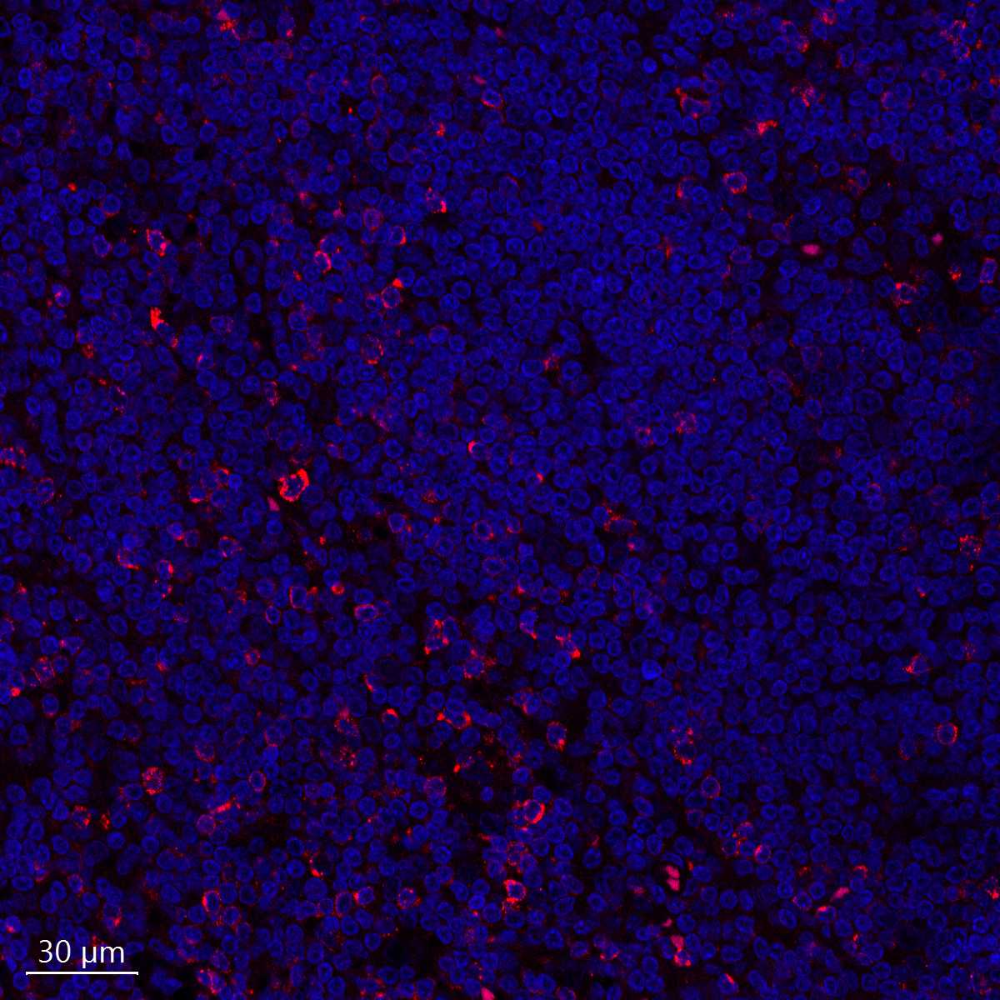

# Configurations

| UniProt Accession Number   | Reagent Type     | Target Name / Protein Biomarker   | Target Species   | Host Organism   | Isotype   | Clonality   | Vendor   | Catalog Number   | Conjugate   | RRID   | Availability   | Method                 | Tissue Preservation   | Target Tissue   | Tissue State   | Detergent         | Antigen Retrieval Conditions                                                               | Dye Inactivation Conditions   | Recommend   | Agree                                                        | Disagree   | Contributor                                                  | Notes   |
|:---------------------------|:-----------------|:----------------------------------|:-----------------|:----------------|:----------|:------------|:---------|:-----------------|:------------|:-------|:---------------|:-----------------------|:----------------------|:----------------|:---------------|:------------------|:-------------------------------------------------------------------------------------------|:------------------------------|:------------|:-------------------------------------------------------------|:-----------|:-------------------------------------------------------------|:--------|
| P16410                     | Primary Antibody | CTLA4                             | Human            | Rabbit          | IgG       | CAL49       | Abcam    | ab270127         | AF647       | NA     | Stock          | Multiplexed 2D Imaging | FFPE                  | Tonsil          | NA             | 0.3% Triton-X-100 | pH 6 for 30 minutes ER1 (AR9961) and pH 9 for 30 minutes ER2 (AR9640) using the Leica Bond | NA                            | Yes         | [0009-0006-9784-2694](https://orcid.org/0009-0006-9784-2694) | NA         | [0009-0006-9784-2694](https://orcid.org/0009-0006-9784-2694) |         |

# Publications

# Additional Notes

| Human tonsil: Hoechst (blue, Biotium cat. no. 40046) and CTLA4 (red, Abcam cat. no. ab270127) |
|:-------:|
|  |
