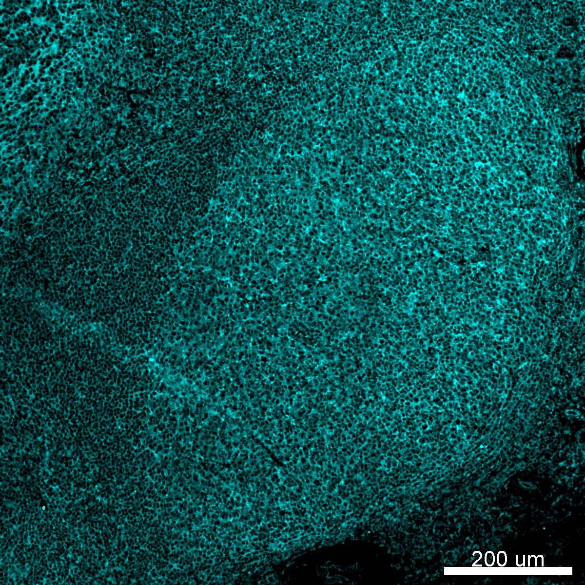
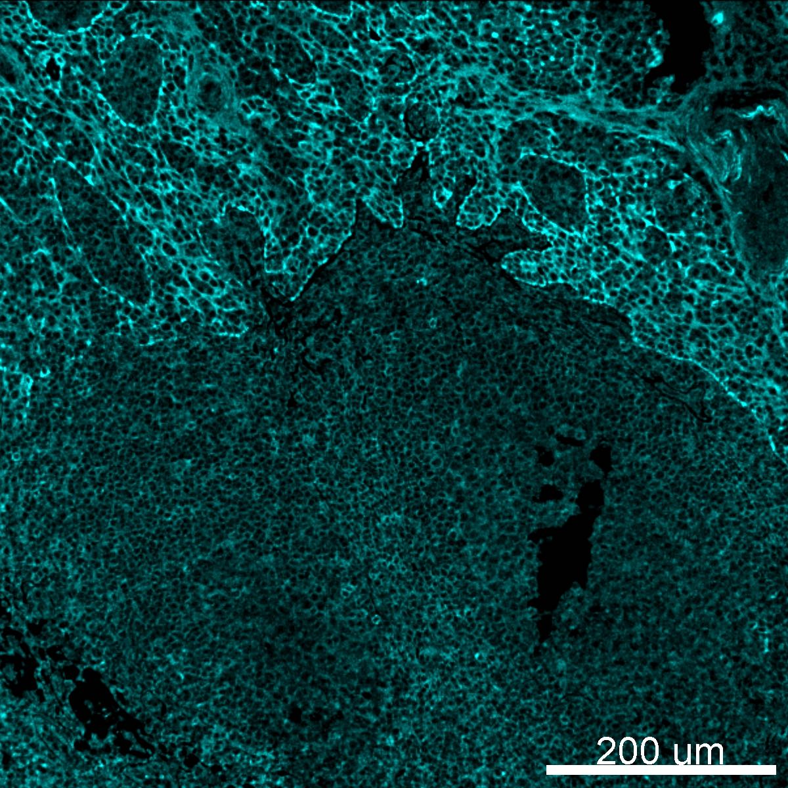

# Configurations

| UniProt Accession Number   | Reagent Type     | Target Name / Protein Biomarker   | Target Species   | Host Organism   | Isotype   | Clonality   | Vendor         | Catalog Number   | Conjugate   | RRID        | Availability   | Method                 | Tissue Preservation   | Target Tissue   | Tissue State   | Detergent         | Antigen Retrieval Conditions                | Dye Inactivation Conditions   | Recommend   | Agree                                                        | Disagree   | Contributor                                                  | Notes       |
|:---------------------------|:-----------------|:----------------------------------|:-----------------|:----------------|:----------|:------------|:---------------|:-----------------|:------------|:------------|:---------------|:-----------------------|:----------------------|:----------------|:---------------|:------------------|:--------------------------------------------|:------------------------------|:------------|:-------------------------------------------------------------|:-----------|:-------------------------------------------------------------|:------------|
| P49682                     | Primary Antibody | CXCR3                             | Human            | Mouse           | IgG1      | 1C6/CXCR3   | BD Biosciences | 561320           | AF700       | AB_10611719 | Stock          | Multiplexed 2D Imaging | FFPE                  | Tonsil          | NA             | 0.3% Triton-X-100 | pH 6 (Sodium Citrate buffer) for 45 minutes | NA                            | No          | [0000-0002-6604-2065](https://orcid.org/0000-0002-6604-2065) | NA         | [0000-0002-6604-2065](https://orcid.org/0000-0002-6604-2065) | [1](#notes) |
| P49682                     | Primary Antibody | CXCR3                             | Human            | Mouse           | IgG1      | 49801       | R&D Systems    | FAB160N          | AF700       | NA          | Stock          | Multiplexed 2D Imaging | FFPE                  | Tonsil          | NA             | 0.3% Triton-X-100 | pH 6 (Sodium Citrate buffer) for 45 minutes | NA                            | No          | [0000-0002-6604-2065](https://orcid.org/0000-0002-6604-2065) | NA         | [0000-0002-6604-2065](https://orcid.org/0000-0002-6604-2065) | [2](#notes) |

# Publications

# Additional Notes

1. Non-specific signal. Labels all cells in the tonsil.
2. Uncertain about labeling pattern in tonsil. Appears to label epithelial cells and all immune cells. Non-specific signal.

| Human tonsil FFPE: CXCR3 (cyan, catalog number 561320)  |
|:-------:|
|  |

| Human tonsil FFPE: CXCR3 (cyan, catalog number FAB160N)  |
|:-------:|
|  |
