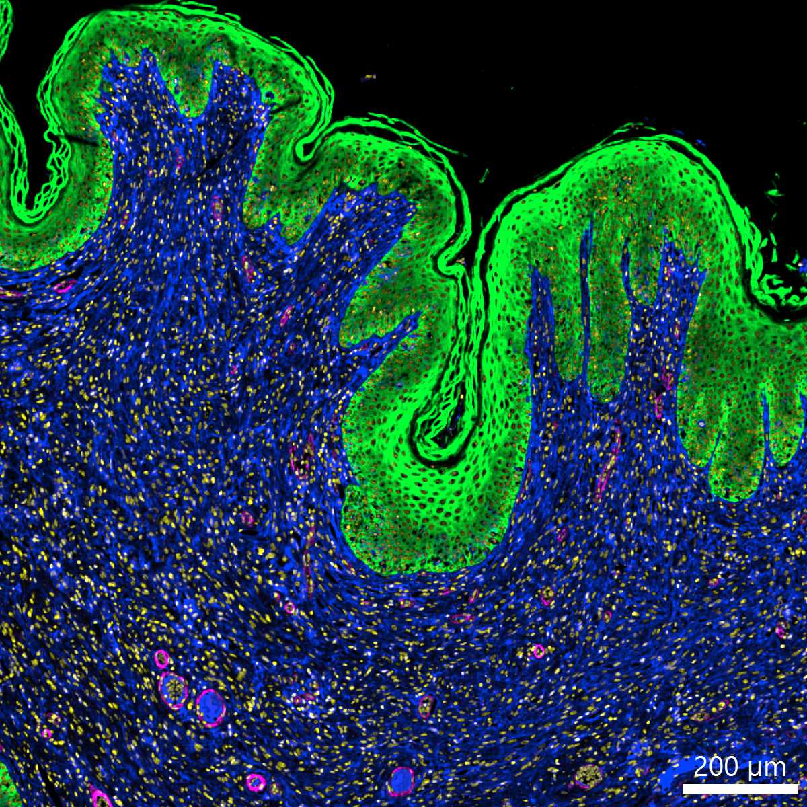

# Configurations

| UniProt Accession Number   | Reagent Type     | Target Name / Protein Biomarker   | Target Species   | Host Organism   | Isotype   | Clonality   | Vendor                   | Catalog Number   | Conjugate   | RRID       | Availability   | Method                 | Tissue Preservation   | Target Tissue   | Tissue State   | Detergent         | Antigen Retrieval Conditions                                                               | Dye Inactivation Conditions   | Recommend   | Agree                                                        | Disagree   | Contributor                                                  | Notes       |
|:---------------------------|:-----------------|:----------------------------------|:-----------------|:----------------|:----------|:------------|:-------------------------|:-----------------|:------------|:-----------|:---------------|:-----------------------|:----------------------|:----------------|:---------------|:------------------|:-------------------------------------------------------------------------------------------|:------------------------------|:------------|:-------------------------------------------------------------|:-----------|:-------------------------------------------------------------|:------------|
| NA                         | Primary Antibody | Cytokeratin (Pan)                 | Canine           | Mouse           | IgG1      | AE1/AE3     | Thermo Fisher Scientific | 53-9003-82       | AF488       | AB_2574301 | Stock          | Multiplexed 2D Imaging | FFPE                  | Skin            | Melanoma       | 0.3% Triton-X-100 | pH 6 for 30 minutes ER1 (AR9961) and pH 9 for 30 minutes ER2 (AR9640) using the Leica Bond | NA                            | Yes         | [0000-0001-5088-7808](https://orcid.org/0000-0001-5088-7808) | NA         | [0000-0001-5088-7808](https://orcid.org/0000-0001-5088-7808) | [1](#notes) |

# Publications

# Additional Notes

1. Heavily fixed samples. Used at 1:50 dilution.

| Canine melanoma skin FFPE: Lumican (blue, catalog number AF2846 and A-21447), a-SMA (magenta, catalog number 41-9760-82), pan-cytokeratin (green, catalog number 53-9003-80), and Hoechst (yellow, catalog number 40046) |
|:-------:|
|  |
