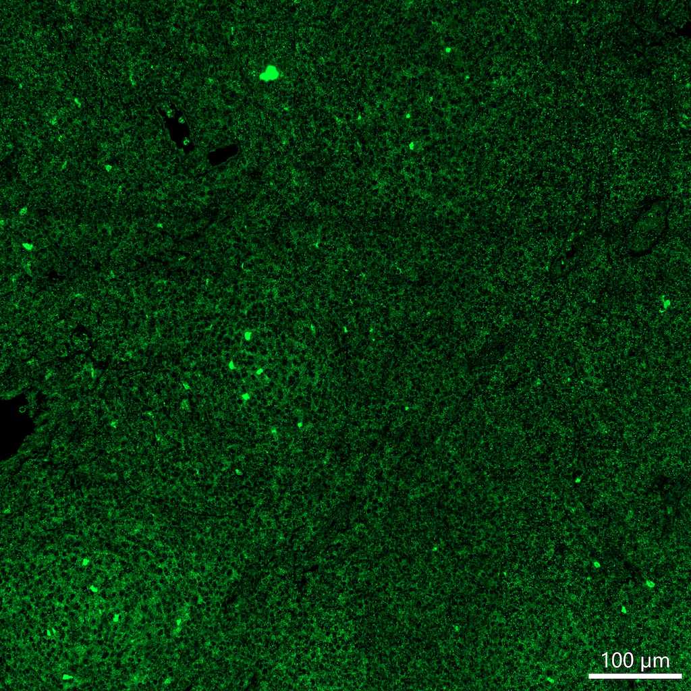

# Configurations

| UniProt Accession Number   | Reagent Type     | Target Name / Protein Biomarker   | Target Species   | Host Organism   | Isotype   | Clonality   | Vendor      | Catalog Number   | Conjugate    | RRID      | Availability   | Method                 | Tissue Preservation   | Target Tissue   | Tissue State        | Detergent         | Antigen Retrieval Conditions                                                               | Dye Inactivation Conditions   | Recommend   | Agree                                                        | Disagree   | Contributor                                                  | Notes       |
|:---------------------------|:-----------------|:----------------------------------|:-----------------|:----------------|:----------|:------------|:------------|:-----------------|:-------------|:----------|:---------------|:-----------------------|:----------------------|:----------------|:--------------------|:------------------|:-------------------------------------------------------------------------------------------|:------------------------------|:------------|:-------------------------------------------------------------|:-----------|:-------------------------------------------------------------|:------------|
| Q16832                     | Primary Antibody | DDR2                              | Human            | Goat            | IgG       | Polyclonal  | R&D Systems | AF2538           | Unconjugated | AB_416613 | Stock          | Multiplexed 2D Imaging | FFPE                  | Lymph Node      | Follicular Lymphoma | 0.3% Triton-X-100 | pH 6 for 30 minutes ER1 (AR9961) and pH 9 for 30 minutes ER2 (AR9640) using the Leica Bond | NA                            | No          | [0000-0003-4379-8967](https://orcid.org/0000-0003-4379-8967) | NA         | [0000-0003-4379-8967](https://orcid.org/0000-0003-4379-8967) | [1](#notes) |

# Publications

# Additional Notes

1. Antibody labels most cells in a follicular lymphoma FFPE tissue section. Used at a dilution of 1:50 with an anti-goat AF555 secondary antibody (Thermo Fisher Scientific catalog number A-21432).

| Human follicular lymphoma FFPE: DDR2 (green, catalog number AF2538) |
|:-------:|
|  |
