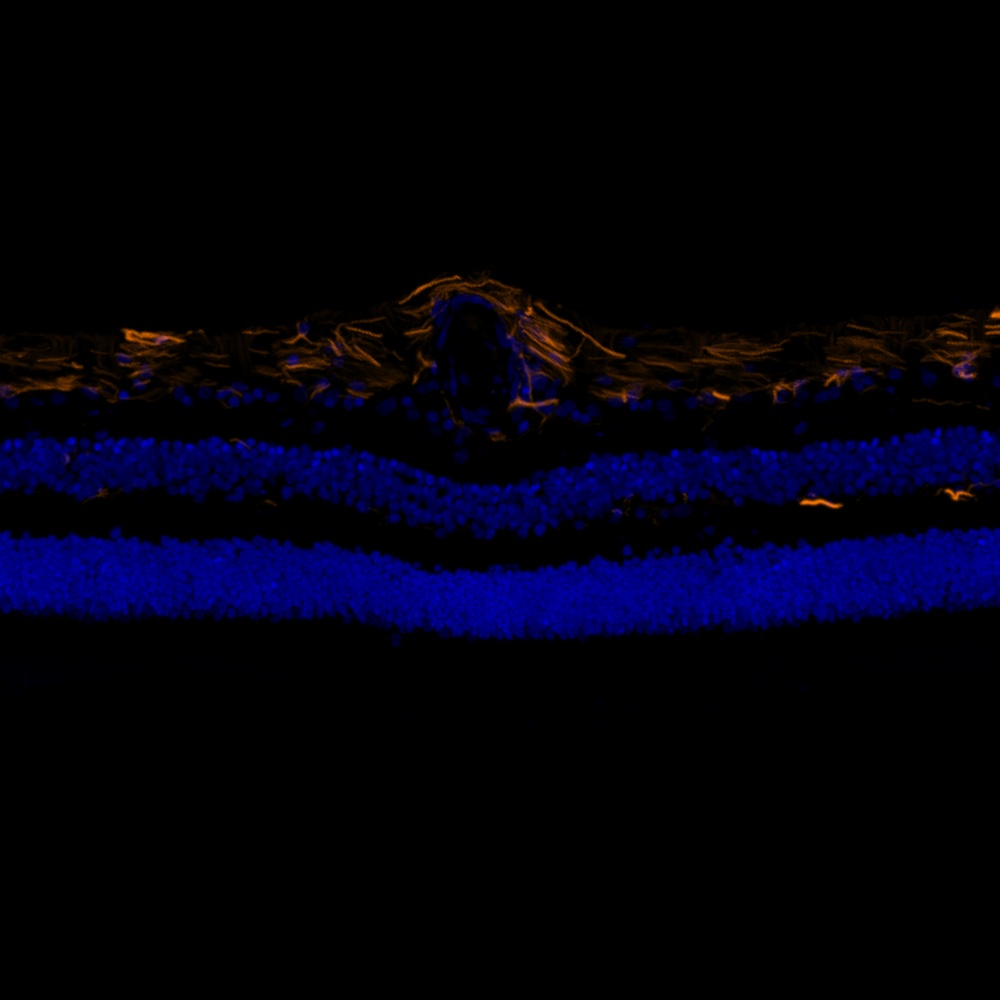

# Configurations

| UniProt Accession Number   | Reagent Type     | Target Name / Protein Biomarker   | Target Species   | Host Organism   | Isotype   | Clonality   | Vendor   | Catalog Number   | Conjugate   | RRID       | Availability   | Method        | Tissue Preservation               | Target Tissue   | Tissue State   | Detergent    | Antigen Retrieval Conditions   | Dye Inactivation Conditions   | Recommend   | Agree                                                        | Disagree   | Contributor                                                  | Notes       |
|:---------------------------|:-----------------|:----------------------------------|:-----------------|:----------------|:----------|:------------|:---------|:-----------------|:------------|:-----------|:---------------|:--------------|:----------------------------------|:----------------|:---------------|:-------------|:-------------------------------|:------------------------------|:------------|:-------------------------------------------------------------|:-----------|:-------------------------------------------------------------|:------------|
| P17661                     | Primary Antibody | Desmin                            | Human            | Rabbit          | IgG       | Y66         | Abcam    | ab185033         | AF488       | AB_2892748 | Stock          | IBEX2D Manual | 1:4 Cytofix/Cytoperm Fixed Frozen | Retina          | NA             | 0.1% Saponin | NA                             | 1 mg/ml LiBH4 15 minutes      | Yes         | [0000-0003-2088-8310](https://orcid.org/0000-0003-2088-8310) | NA         | [0000-0003-2088-8310](https://orcid.org/0000-0003-2088-8310) | [1](#notes) |

# Publications

# Additional Notes

1. Multiple cell lineages including pericytes and astrocytes in the human retina.

| Human retina: Desmin (orange, catalog number ab185033) and Hoechst (blue, catalog number 40046) |
|:-------:|
|  |
