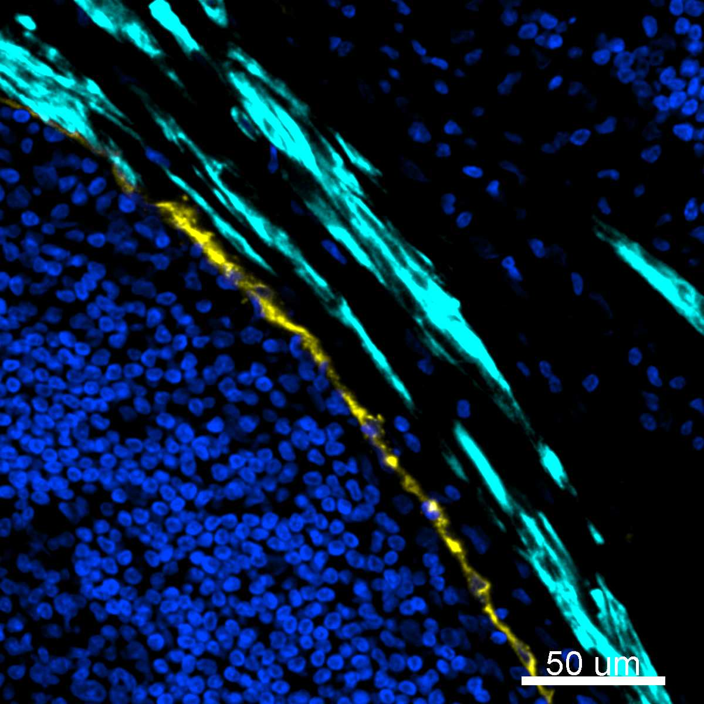

# Configurations

| UniProt Accession Number   | Reagent Type     | Target Name / Protein Biomarker   | Target Species   | Host Organism   | Isotype   | Clonality   | Vendor   | Catalog Number   | Conjugate   | RRID       | Availability   | Method                 | Tissue Preservation               | Target Tissue   | Tissue State        | Detergent         | Antigen Retrieval Conditions                                                               | Dye Inactivation Conditions                                            | Recommend   | Agree                                    | Disagree   | Contributor         | Notes       |
|:---------------------------|:-----------------|:----------------------------------|:-----------------|:----------------|:----------|:------------|:---------|:-----------------|:------------|:-----------|:---------------|:-----------------------|:----------------------------------|:----------------|:--------------------|:------------------|:-------------------------------------------------------------------------------------------|:-----------------------------------------------------------------------|:------------|:-----------------------------------------|:-----------|:--------------------|:------------|
| P17661                     | Primary Antibody | Desmin                            | Human            | Rabbit          | IgG       | Y66         | Abcam    | ab185033         | AF488       | AB_2892748 | Stock          | IBEX2D Automated       | 1:4 Cytofix/Cytoperm Fixed Frozen | Lymph Node      | NA                  | 0.3% Triton-X-100 | NA                                                                                         | 0.5 mg/ml LiBH4 10 minutes continuous exchange with automated protocol | Yes         | [0000-0003-4379-8967](https://orcid.org/0000-0003-4379-8967) [[1](#publications)] | NA         | [0000-0003-4379-8967](https://orcid.org/0000-0003-4379-8967) |             |
| P17661                     | Primary Antibody | Desmin                            | Human            | Rabbit          | IgG       | Y66         | Abcam    | ab185033         | AF488       | AB_2892748 | Stock          | Multiplexed 2D Imaging | FFPE                              | Lymph Node      | Follicular Lymphoma | 0.3% Triton-X-100 | pH 6 for 40 minutes at 95C (AR6 Akoya Biosciences AR600250ML)                              | NA                                                                     | Yes         | [0000-0003-4379-8967](https://orcid.org/0000-0003-4379-8967) [[2](#publications)] | NA         | [0000-0003-4379-8967](https://orcid.org/0000-0003-4379-8967) |             |
| P17661                     | Primary Antibody | Desmin                            | Human            | Rabbit          | IgG       | Y66         | Abcam    | ab185033         | AF488       | AB_2892748 | Stock          | IBEX2D Manual          | 1:4 Cytofix/Cytoperm Fixed Frozen | Lymph Node      | Follicular Lymphoma | 0.3% Triton-X-100 | NA                                                                                         | 1 mg/ml LiBH4 15 minutes                                               | Yes         | [0000-0003-4379-8967](https://orcid.org/0000-0003-4379-8967) [[2](#publications)] | NA         | [0000-0003-4379-8967](https://orcid.org/0000-0003-4379-8967) |             |
| P17661                     | Primary Antibody | Desmin                            | Human            | Rabbit          | IgG       | Y66         | Abcam    | ab185033         | AF488       | AB_2892748 | Stock          | Cell DIVE-IBEX         | FFPE                              | Tonsil          | NA                  | 0.3% Triton-X-100 | pH 6 for 30 minutes ER1 (AR9961) and pH 9 for 30 minutes ER2 (AR9640) using the Leica Bond | 1 mg/ml LiBH4 15 minutes                                               | No          | [0000-0003-4379-8967](https://orcid.org/0000-0003-4379-8967)                      | NA         | [0000-0003-4379-8967](https://orcid.org/0000-0003-4379-8967) | [1](#notes) |

# Publications

1. A. J. Radtke et al., "IBEX: an iterative immunolabeling and chemical bleaching
 method for high-content imaging of diverse tissues", *Nat. Protoc.*, 17(2):378-401, 2022, [doi: 10.1038/s41596-021-00644-9](https://doi.org/10.1038/s41596-021-00644-9).

    A. J. Radtke et al., "Accompanying dataset for: IBEX: An iterative immunolabeling and chemical bleaching method for high-content imaging of diverse tissues", [doi: 10.5281/zenodo.5244550](https://doi.org/10.5281/zenodo.5244551).

2. A. J. Radtke et al., "A Multi-scale, Multiomic Atlas of Human Normal and Follicular Lymphoma Lymph Nodes", *bioRxiv*, 2022, [doi: 10.1101/2022.06.03.494716](https://doi.org/10.1101/2022.06.03.494716).

# Additional Notes

1. Signal is very dim and needs to be amplified with a secondary antibody if imaged with the Cell DIVE.

| Human lymph node: LYVE-1 (yellow, catalog number AF2089), Desmin (cyan, catalog number ab185033), and Hoechst (blue, catalog number 40046) |
|:-------:|
|  |
