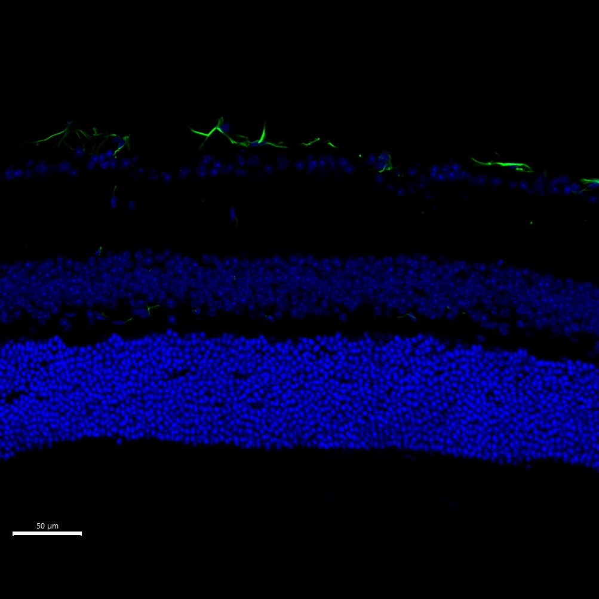

# Configurations

| UniProt Accession Number   | Reagent Type     | Target Name / Protein Biomarker   | Target Species   | Host Organism   | Isotype   | Clonality   | Vendor   | Catalog Number   | Conjugate   | RRID       | Availability   | Method        | Tissue Preservation               | Target Tissue   | Tissue State   | Detergent   | Antigen Retrieval Conditions   | Dye Inactivation Conditions      | Recommend   | Agree                                                        | Disagree   | Contributor                                                  | Notes   |
|:---------------------------|:-----------------|:----------------------------------|:-----------------|:----------------|:----------|:------------|:---------|:-----------------|:------------|:-----------|:---------------|:--------------|:----------------------------------|:----------------|:---------------|:------------|:-------------------------------|:---------------------------------|:------------|:-------------------------------------------------------------|:-----------|:-------------------------------------------------------------|:--------|
| P31001                     | Primary Antibody | Desmin                            | Mouse            | Rabbit          | IgG       | Y66         | Abcam    | Ab185033         | AF488       | AB_2892748 | Stock          | IBEX2D Manual | 1:4 Cytofix/Cytoperm Fixed Frozen | Retina          | Healthy        | 0.1% Tween  | NA                             | 1 mg/ml LiBH4 15 minutes + light | Yes         | [0009-0003-0776-2163](https://orcid.org/0009-0003-0776-2163) | NA         | [0009-0003-0776-2163](https://orcid.org/0009-0003-0776-2163) |         |

# Publications

# Additional Notes

| Mouse retina: Desmin (green, catalogue number Ab185033) and DAPI (blue, catalogue number D9542-1MG) |
|:-------:|
|  |