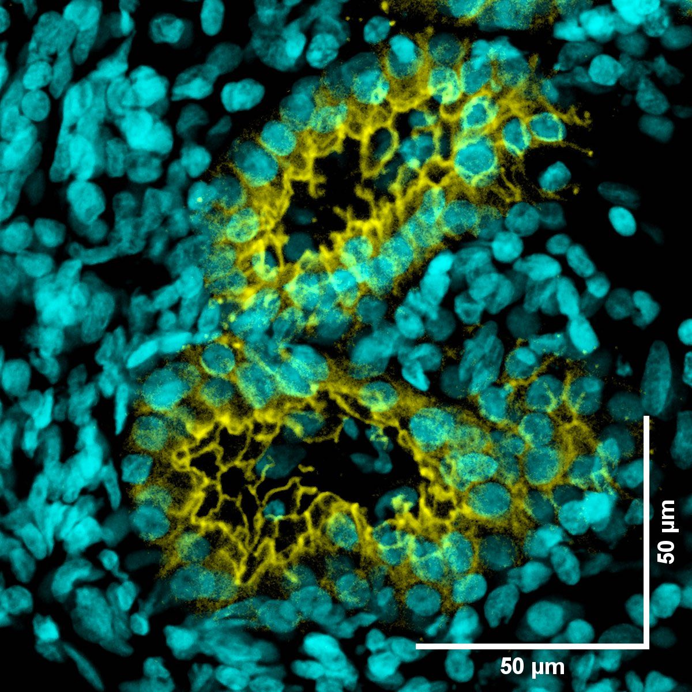
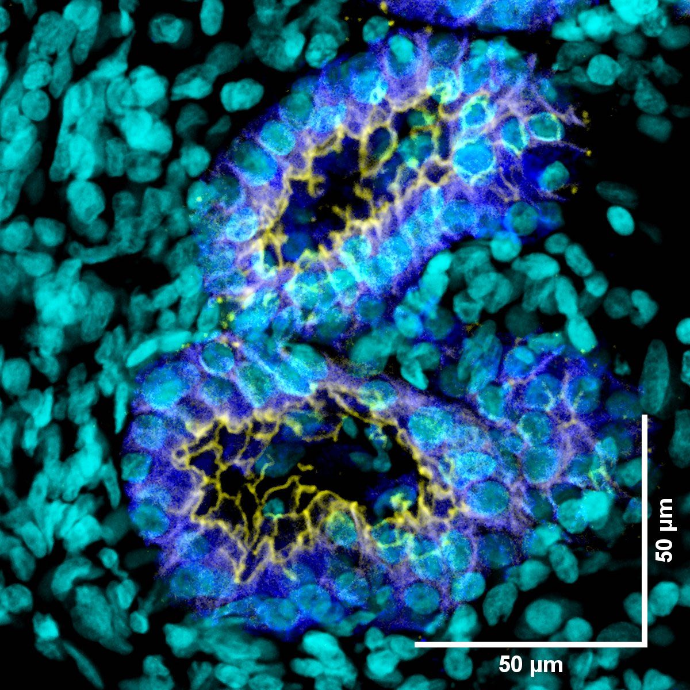

# Configurations

| UniProt Accession Number   | Reagent Type     | Target Name / Protein Biomarker   | Target Species   | Host Organism   | Isotype   | Clonality   | Vendor    |   Catalog Number | Conjugate   | RRID       | Availability   | Method        | Tissue Preservation               | Target Tissue   | Tissue State   | Detergent   | Antigen Retrieval Conditions   | Dye Inactivation Conditions   | Recommend   | Agree               | Disagree   | Contributor         | Notes       |
|:---------------------------|:-----------------|:----------------------------------|:-----------------|:----------------|:----------|:------------|:----------|-----------------:|:------------|:-----------|:---------------|:--------------|:----------------------------------|:----------------|:---------------|:------------|:-------------------------------|:------------------------------|:------------|:-------------------------------------------------------------|:-----------|:--------------------|:------------|
| P12830                     | Primary Antibody | E-cadherin                        | Human            | Rat             | IgG1      | DECMA-1     | BioLegend |           147307 | AF647       | AB_2563954 | Stock          | IBEX2D Manual | 1:4 Cytofix/Cytoperm Fixed Frozen | Nasal Polyp           | NA             | 0.3% Triton-X-100          | NA                             | 1 mg/ml LiBH4 15 minutes      | Yes         | [0009-0004-8162-409X](https://orcid.org/0009-0004-8162-409X)         | NA         | [0009-0004-8162-409X](https://orcid.org/0009-0004-8162-409X) | [1](#notes) |

# Publications

# Additional Notes

| Human Nasal Polyp: E-Cadherin (yellow, catalog number 147307), and DAPI (cyan) |
|:-------:|
|  |

| Human Nasal Polyp: E-Cadherin (yellow, catalog number 147307), EpCAM (blue, catalog number 324228) and DAPI (cyan) |
|:-------:|
|  |
