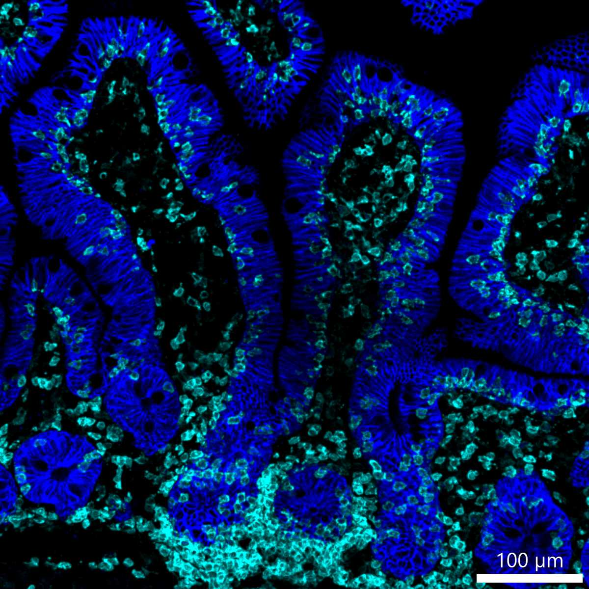

# Configurations

| UniProt Accession Number   | Reagent Type     | Target Name / Protein Biomarker   | Target Species   | Host Organism   | Isotype   | Clonality   | Vendor    |   Catalog Number | Conjugate   | RRID       | Availability   | Method        | Tissue Preservation               | Target Tissue   | Tissue State   | Detergent         | Antigen Retrieval Conditions   | Dye Inactivation Conditions             | Recommend   | Agree                                                        | Disagree   | Contributor         | Notes       |
|:---------------------------|:-----------------|:----------------------------------|:-----------------|:----------------|:----------|:------------|:----------|-----------------:|:------------|:-----------|:---------------|:--------------|:----------------------------------|:----------------|:---------------|:------------------|:-------------------------------|:----------------------------------------|:------------|:-------------------------------------------------------------|:-----------|:--------------------|:------------|
| Q99JW5                     | Primary Antibody | EpCAM                             | Mouse            | Rat             | IgG2a     | G8.8        | BioLegend |           118222 | AF594       | AB_2563322 | Stock          | IBEX2D Manual | 1:4 Cytofix/Cytoperm Fixed Frozen | Small Intestine | NA             | 0.3% Triton-X-100 | NA                             | 1 mg/ml LiBH4 for more than 120 minutes | Yes         | [0000-0003-4379-8967](https://orcid.org/0000-0003-4379-8967) [[2](#publications)]                     | NA         | [0000-0003-4379-8967](https://orcid.org/0000-0003-4379-8967) | [1](#notes) |
| P16422                     | Primary Antibody | EpCAM                             | Human            | Mouse           | IgG2b     | 9C4         | BioLegend |           324228 | AF594       | AB_2563209 | Stock          | IBEX2D Manual | 1:4 Cytofix/Cytoperm Fixed Frozen | Lymph Node      | Metastatic     | 0.3% Triton-X-100 | NA                             | 1 mg/ml LiBH4 for more than 120 minutes | Yes         | [0000-0003-4379-8967](https://orcid.org/0000-0003-4379-8967) [[2](#publications), [1](#publications)] | NA         | [0000-0003-4379-8967](https://orcid.org/0000-0003-4379-8967) | [1](#notes) |
| P16422                     | Primary Antibody | EpCAM                             | Human            | Mouse           | IgG2b     | 9C4         | BioLegend |           324228 | AF594       | AB_2563209 | Stock          | Multiplexed 2D Imaging | 1:4 Cytofix/Cytoperm Fixed Frozen | Jejunum         | NA             | 0.3% Triton-X-100 | NA                             | NA                            | Yes         | [0000-0003-4379-8967](https://orcid.org/0000-0003-4379-8967) | NA         | [0000-0003-4379-8967](https://orcid.org/0000-0003-4379-8967) |         |

# Publications

1. A. J. Radtke et al., "IBEX: an iterative immunolabeling and chemical bleaching
 method for high-content imaging of diverse tissues", *Nat. Protoc.*, 17(2):378-401, 2022, [doi: 10.1038/s41596-021-00644-9](https://doi.org/10.1038/s41596-021-00644-9).

    A. J. Radtke et al., "Accompanying dataset for: IBEX: An iterative immunolabeling and chemical bleaching method for high-content imaging of diverse tissues", [doi: 10.5281/zenodo.5244550](https://doi.org/10.5281/zenodo.5244551).

2. A. J. Radtke et al., "IBEX: A versatile multiplex optical imaging approach for deep phenotyping and spatial analysis of cells in complex tissues", *Proc Natl Acad Sci*, 117(52):33455–33465, 2020, [doi:10.1073/pnas.2018488117](https://doi.org/10.1073/pnas.2018488117)

# Additional Notes

1. Conjugate requires extended treatment with 1 mg/ml LiBH4 (120 minutes or more) to extinguish signal. Use in the last cycle or as a fiducial for IBEX experiments.

| Mouse gut: EpCAM (magenta, catalog number 118222), CD8 (blue, catalog number 100738), and CD31 (green, catalog number 102516) |
|:-------:|
|  |

| Mouse gut: EpCAM (blue, catalog number 118222), IgD (red, catalog number 405730), and CD11c (cyan, catalog number 117312) |
|:-------:|
|  |

| Mouse gut: EpCAM (cyan, catalog number 118222), B220 (purple, catalog number 103248), and CD117 (yellow, catalog number 105827) |
|:-------:|
|  |

| Mouse gut: EpCAM (blue, catalog number 118222), CD31 (magenta, catalog number 102516), and MHCII (green, catalog number 107622) |
|:-------:|
|  |

| Human lymph node metastatic: CD4 (blue, catalog number 300526) and EpCAM (red, catalog number 324228) |
|:-------:|
|  |

| Human jejunum: CD45 (cyan, catalog number 58-0459-41) and EpCAM (blue, catalog number 324228) |
|:-------:|
|  |
