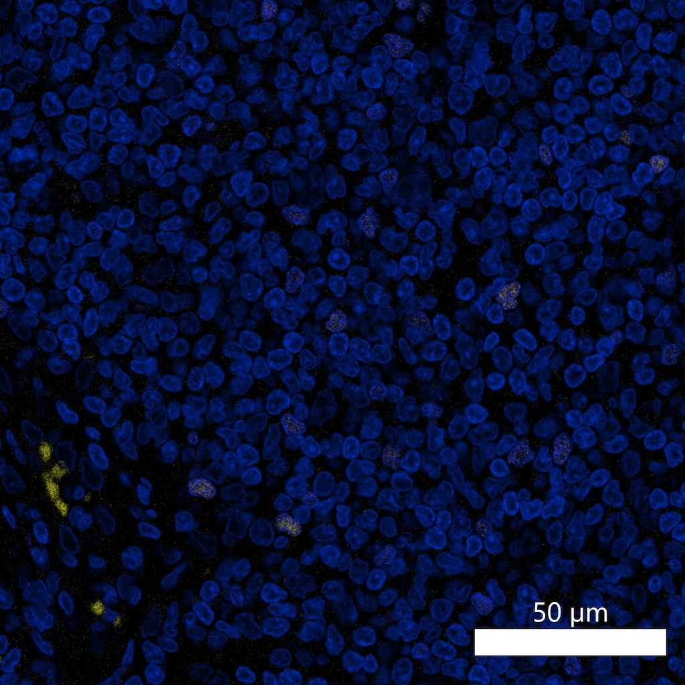

# Configurations

| UniProt Accession Number   | Reagent Type     | Target Name / Protein Biomarker   | Target Species   | Host Organism   | Isotype   | Clonality   | Vendor                   | Catalog Number   | Conjugate   | RRID        | Availability   | Method                 | Tissue Preservation               | Target Tissue   | Tissue State        | Detergent         | Antigen Retrieval Conditions                                                               | Dye Inactivation Conditions   | Recommend   | Agree                                                        | Disagree   | Contributor         | Notes       |
|:---------------------------|:-----------------|:----------------------------------|:-----------------|:----------------|:----------|:------------|:-------------------------|:-----------------|:------------|:------------|:---------------|:-----------------------|:----------------------------------|:----------------|:--------------------|:------------------|:-------------------------------------------------------------------------------------------|:------------------------------|:------------|:-------------------------------------------------------------|:-----------|:--------------------|:------------|
| Q9BZS1                     | Primary Antibody | FOXP3                             | Human            | Mouse           | IgG1      | 236A/E7     | Thermo Fisher Scientific | 41-4777-82       | eF570       | AB_2573609  | Stock          | IBEX2D Manual          | 1:4 Cytofix/Cytoperm Fixed Frozen | Lymph Node      | NA                  | 0.3% Triton-X-100 | NA                                                                                         | 1 mg/ml LiBH4 15 minutes      | Yes         | [0000-0003-4379-8967](https://orcid.org/0000-0003-4379-8967) [[3](#publications), [1](#publications)] | NA         | [0000-0003-4379-8967](https://orcid.org/0000-0003-4379-8967) |             |
| Q99JB6                     | Primary Antibody | FOXP3                             | Mouse            | Rat             | IgG2a     | FJK-16s     | Thermo Fisher Scientific | 41-5773-82       | eF570       | AB_11219073 | Stock          | IBEX2D Manual          | 1:4 Cytofix/Cytoperm Fixed Frozen | Small Intestine | NA                  | 0.3% Triton-X-100 | NA                                                                                         | 1 mg/ml LiBH4 15 minutes      | Yes         | [0000-0003-4379-8967](https://orcid.org/0000-0003-4379-8967) [[3](#publications)]                     | NA         | [0000-0003-4379-8967](https://orcid.org/0000-0003-4379-8967) | [1](#notes) |
| Q9BZS1                     | Primary Antibody | FOXP3                             | Human            | Mouse           | IgG1      | 236A/E7     | Thermo Fisher Scientific | 41-4777-82       | eF570       | AB_2573609  | Stock          | IBEX2D Manual          | 1:4 Cytofix/Cytoperm Fixed Frozen | Lymph Node      | Follicular Lymphoma | 0.3% Triton-X-100 | NA                                                                                         | 1 mg/ml LiBH4 15 minutes      | Yes         | [0000-0003-4379-8967](https://orcid.org/0000-0003-4379-8967) [[2](#publications)]                     | NA         | [0000-0003-4379-8967](https://orcid.org/0000-0003-4379-8967) |             |
| Q9BZS1                     | Primary Antibody | FOXP3                             | Human            | Mouse           | IgG1      | 236A/E7     | Thermo Fisher Scientific | 41-4777-82       | eF570       | AB_2573609  | Stock          | Multiplexed 2D Imaging | FFPE                              | Tonsil          | NA                  | 0.3% Triton-X-100 | pH 6 for 30 minutes ER1 (AR9961) and pH 9 for 30 minutes ER2 (AR9640) using the Leica Bond | NA                            | No          | [0000-0003-4379-8967](https://orcid.org/0000-0003-4379-8967)                                          | NA         | [0000-0003-4379-8967](https://orcid.org/0000-0003-4379-8967) | [2](#notes) |
| Q9BZS1                     | Primary Antibody | FOXP3                             | Human            | Mouse           | IgG1      | 236A/E7     | Thermo Fisher Scientific | 41-4777-82       | eF570       | AB_2573609 | Stock          | Multiplexed 2D Imaging | FFPE                  | Tonsil          | NA             | 0.3% Triton-X-100 | pH 6 for 30 minutes ER1 (AR9961) and pH 9 for 30 minutes ER2 (AR9640) using the Leica Bond | NA                            | No          | [0000-0003-4379-8967](https://orcid.org/0000-0003-4379-8967) | NA         | [0000-0003-4379-8967](https://orcid.org/0000-0003-4379-8967) | [3](#notes) |

# Publications

1. A. J. Radtke et al., "IBEX: an iterative immunolabeling and chemical bleaching
 method for high-content imaging of diverse tissues", *Nat. Protoc.*, 17(2):378-401, 2022, [doi: 10.1038/s41596-021-00644-9](https://doi.org/10.1038/s41596-021-00644-9).

    A. J. Radtke et al., "Accompanying dataset for: IBEX: An iterative immunolabeling and chemical bleaching method for high-content imaging of diverse tissues", [doi: 10.5281/zenodo.5244550](https://doi.org/10.5281/zenodo.5244551).

2. A. J. Radtke et al., "A Multi-scale, Multiomic Atlas of Human Normal and Follicular Lymphoma Lymph Nodes", *bioRxiv*, 2022, [doi: 10.1101/2022.06.03.494716](https://doi.org/10.1101/2022.06.03.494716).

3. A. J. Radtke et al., "IBEX: A versatile multiplex optical imaging approach for deep phenotyping and spatial analysis of cells in complex tissues", *Proc Natl Acad Sci*, 117(52):33455–33465, 2020, [doi:10.1073/pnas.2018488117](https://doi.org/10.1073/pnas.2018488117)

# Additional Notes

1. Validated by Evelyn Kandov (No ORCID)
2. This antibody works well in fixed frozen tissues but is very dim in human FFPE samples. This conjugate is particularly challenging due to autofluorescence from red blood cells. Red blood cells are small and round like the anticipated nuclear pattern of FOXP3. FOXP3 needs to be amplified with a secondary antibody in human FFPE samples. Clone also appears to be sensitive to antigen retrieval conditions (pH 9 is best).
3. Antibody labels nuclei of T cells in FFPE tissues after dual antigen retrieval (pH 6 and pH 9). Signal is dim and the eF570 conjugate can give a false positive with autofluorescence from red blood cells. Recommendations: Amplify signal with a secondary antibody, perform dual antigen retrieval, and use at a concentration of 1:25 for best signal.

| Human tonsil FFPE : FOXP3 (yellow, catalog number 41-4777-82) and Hoechst (blue, catalog number 40046) |
|:-------:|
|  |
