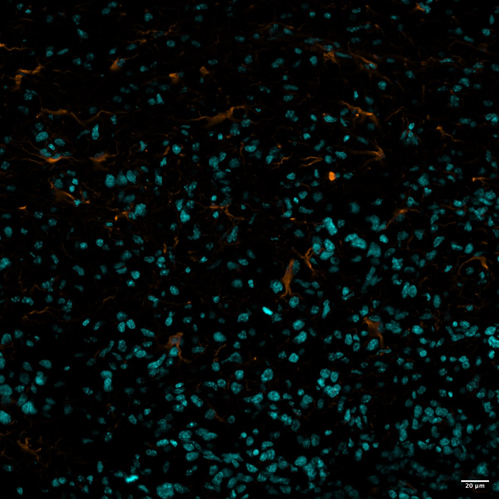

# Configurations

| UniProt Accession Number   | Reagent Type     | Target Name / Protein Biomarker   | Target Species   | Host Organism   | Isotype   | Clonality   | Vendor                   | Catalog Number   | Conjugate   | RRID       | Availability   | Method                 | Tissue Preservation   | Target Tissue   | Tissue State   | Detergent          | Antigen Retrieval Conditions   | Dye Inactivation Conditions   | Recommend   | Agree                                                        | Disagree   | Contributor                                                  | Notes       |
|:---------------------------|:-----------------|:----------------------------------|:-----------------|:----------------|:----------|:------------|:-------------------------|:-----------------|:------------|:-----------|:---------------|:-----------------------|:----------------------|:----------------|:---------------|:-------------------|:-------------------------------|:------------------------------|:------------|:-------------------------------------------------------------|:-----------|:-------------------------------------------------------------|:------------|
| P03995                     | Primary Antibody | GFAP                              | Mouse            | Mouse           | IgG1      | GA5         | Thermo Fisher Scientific | 41-9892-82       | eF570       | AB_2573656 | Stock          | Multiplexed 2D Imaging | 4% PFA Fixed Frozen   | Brain           | Tumor          | 0.3% Triton-X-100 | NA                             | NA                            | Yes         | [0000-0002-6944-6997](https://orcid.org/0000-0002-6944-6997) | NA         | [0000-0002-6944-6997](https://orcid.org/0000-0002-6944-6997) | [1](#notes) |

# Publications

# Additional Notes

1. Dilution 1:50.

| Mouse Brain Tumor Hochest (Cyan) GFAP (Orange Thermo #41-9892-82) |
|:-------:|
|  |
