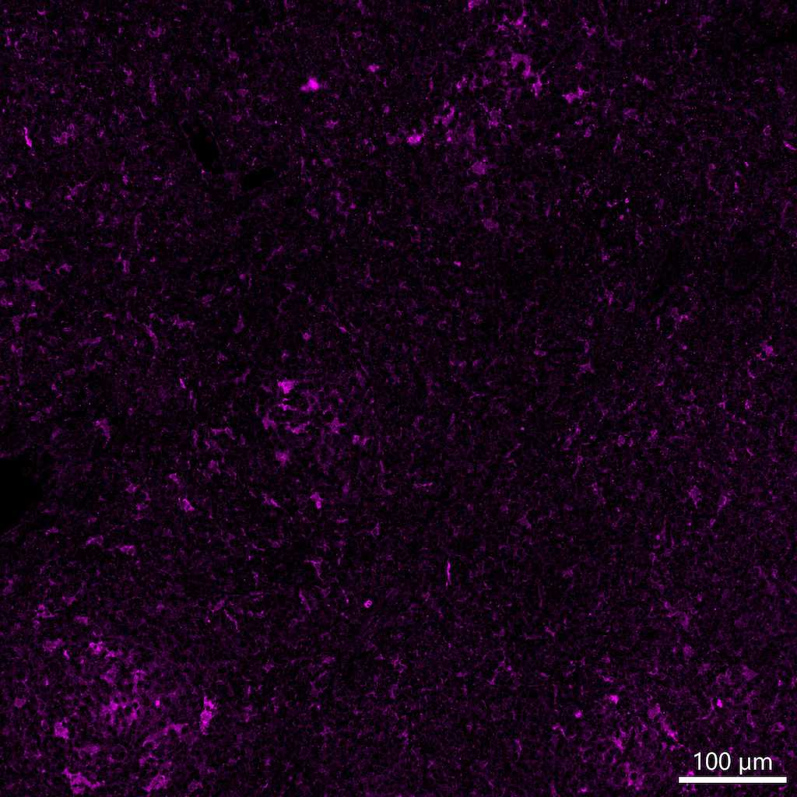

# Configurations

| UniProt Accession Number   | Reagent Type     | Target Name / Protein Biomarker   | Target Species   | Host Organism   | Isotype   | Clonality   | Vendor            | Catalog Number   | Conjugate   | RRID   | Availability   | Method                 | Tissue Preservation   | Target Tissue   | Tissue State        | Detergent         | Antigen Retrieval Conditions                                                               | Dye Inactivation Conditions   | Recommend   | Agree                                                        | Disagree   | Contributor                                                  | Notes       |
|:---------------------------|:-----------------|:----------------------------------|:-----------------|:----------------|:----------|:------------|:------------------|:-----------------|:------------|:-------|:---------------|:-----------------------|:----------------------|:----------------|:--------------------|:------------------|:-------------------------------------------------------------------------------------------|:------------------------------|:------------|:-------------------------------------------------------------|:-----------|:-------------------------------------------------------------|:------------|
| P15104                     | Primary Antibody | Glutamine Synthetase              | Human            | Mouse           | IgG2a     | OTI1F4      | Novus Biologicals | NBP2-70834AF647  | AF647       | NA     | Stock          | Multiplexed 2D Imaging | FFPE                  | Lymph Node      | Follicular Lymphoma | 0.3% Triton-X-100 | pH 6 for 30 minutes ER1 (AR9961) and pH 9 for 30 minutes ER2 (AR9640) using the Leica Bond | NA                            | No          | [0000-0003-4379-8967](https://orcid.org/0000-0003-4379-8967) | NA         | [0000-0003-4379-8967](https://orcid.org/0000-0003-4379-8967) | [1](#notes) |

# Publications

# Additional Notes

1. Antibody labeling is inconclusive and appears to label stromal cells (based on morphology and location) in a follicular lymphoma FFPE tissue section. Used at a dilution of 1:50. Requires a good positive control and further testing. Does colocalize with other glutamine synthetase antibody (Ab302584).

| Human follicular lymphoma FFPE: Glutamine synthetase (magenta, catalog number NBP2-70834AF647) |
|:-------:|
|  |
