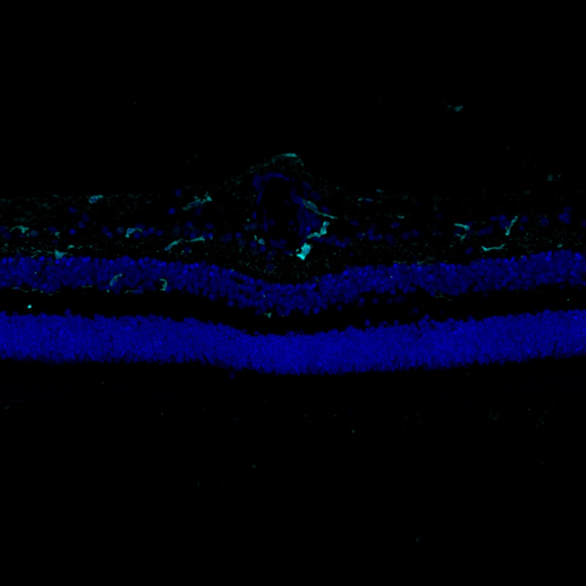

# Configurations

| UniProt Accession Number   | Reagent Type       | Target Name / Protein Biomarker   | Target Species   | Host Organism   | Isotype   | Clonality   | Vendor                   | Catalog Number   | Conjugate    | RRID       | Availability   | Method        | Tissue Preservation               | Target Tissue   | Tissue State   | Detergent    | Antigen Retrieval Conditions   | Dye Inactivation Conditions   | Recommend   | Agree                                                        | Disagree   | Contributor                                                  | Notes       |
|:---------------------------|:-------------------|:----------------------------------|:-----------------|:----------------|:----------|:------------|:-------------------------|:-----------------|:-------------|:-----------|:---------------|:--------------|:----------------------------------|:----------------|:---------------|:-------------|:-------------------------------|:------------------------------|:------------|:-------------------------------------------------------------|:-----------|:-------------------------------------------------------------|:------------|
| NA                         | Secondary Antibody | Goat IgG (H+L)                    | Human            | Donkey          | IgG       | Polyclonal  | Thermo Fisher Scientific | A32816           | AF555 (Plus) | AB_2762839 | Stock          | IBEX2D Manual | 1:4 Cytofix/Cytoperm Fixed Frozen | Retina          | NA             | 0.1% Saponin | NA                             | 1 mg/ml LiBH4 15 minutes      | Yes         | [0000-0003-2088-8310](https://orcid.org/0000-0003-2088-8310) | NA         | [0000-0003-2088-8310](https://orcid.org/0000-0003-2088-8310) | [1](#notes) |

# Publications

# Additional Notes

1. Used to detect Iba1 (Abcam ab5076).

| Human retina: Iba1 (cyan, catalog number ab5076 and A32816) and Hoechst (blue, catalog number 40046) |
|:-------:|
|  |
