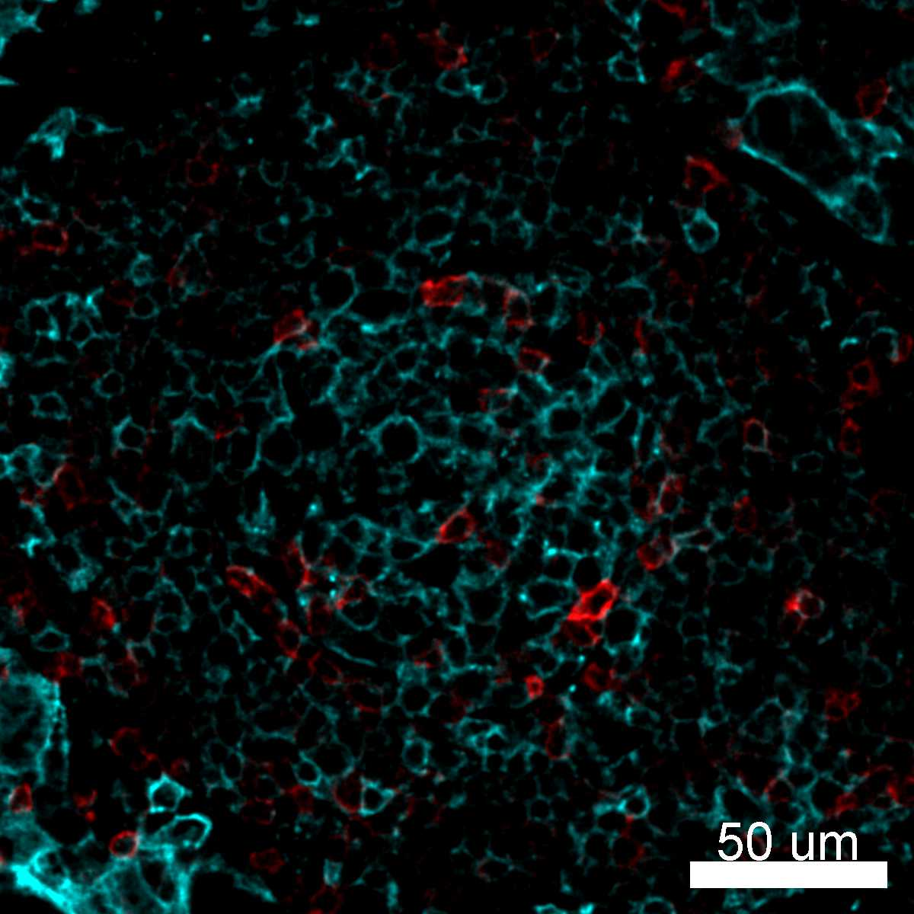

# Configurations

| UniProt Accession Number   | Reagent Type     | Target Name / Protein Biomarker   | Target Species   | Host Organism   | Isotype   | Clonality   | Vendor            | Catalog Number   | Conjugate   | RRID      | Availability   | Method                 | Tissue Preservation               | Target Tissue   | Tissue State        | Detergent         | Antigen Retrieval Conditions                                                               | Dye Inactivation Conditions                                            | Recommend   | Agree                                                        | Disagree   | Contributor         | Notes       |
|:---------------------------|:-----------------|:----------------------------------|:-----------------|:----------------|:----------|:------------|:------------------|:-----------------|:------------|:----------|:---------------|:-----------------------|:----------------------------------|:----------------|:--------------------|:------------------|:-------------------------------------------------------------------------------------------|:-----------------------------------------------------------------------|:------------|:-------------------------------------------------------------|:-----------|:--------------------|:------------|
| P01903                     | Primary Antibody | HLA-DR                            | Human            | Mouse           | IgG2a     | L243        | BioLegend         | 307620           | AF488       | AB_493175 | Stock          | IBEX2D Manual          | 1:4 Cytofix/Cytoperm Fixed Frozen | Liver           | NA                  | 0.3% Triton-X-100 | NA                                                                                         | 1 mg/ml LiBH4 15 minutes                                               | Yes         | [0000-0003-4379-8967](https://orcid.org/0000-0003-4379-8967) [[3](#publications), [1](#publications)] | NA         | [0000-0003-4379-8967](https://orcid.org/0000-0003-4379-8967) |             |
| P01903                     | Primary Antibody | HLA-DR                            | Human            | Mouse           | IgG2a     | L243        | BioLegend         | 307620           | AF488       | AB_493175 | Stock          | IBEX2D Manual          | 1:4 Cytofix/Cytoperm Fixed Frozen | Lymph Node      | NA                  | 0.3% Triton-X-100 | NA                                                                                         | 1 mg/ml LiBH4 15 minutes                                               | Yes         | [0000-0003-4379-8967](https://orcid.org/0000-0003-4379-8967) [[3](#publications), [1](#publications)] | NA         | [0000-0003-4379-8967](https://orcid.org/0000-0003-4379-8967) |             |
| P01903                     | Primary Antibody | HLA-DR                            | Human            | Mouse           | IgG2a     | L243        | BioLegend         | 307620           | AF488       | AB_493175 | Stock          | IBEX2D Automated       | 1:4 Cytofix/Cytoperm Fixed Frozen | Skin            | NA                  | 0.3% Triton-X-100 | NA                                                                                         | 0.5 mg/ml LiBH4 10 minutes continuous exchange with automated protocol | Yes         | [0000-0003-4379-8967](https://orcid.org/0000-0003-4379-8967) [[1](#publications)]                     | NA         | [0000-0003-4379-8967](https://orcid.org/0000-0003-4379-8967) |             |
| P01903                     | Primary Antibody | HLA-DR                            | Human            | Mouse           | IgG2a     | L243        | BioLegend         | 307619           | AF488       | AB_493176 | Stock          | IBEX2D Manual          | 1:4 Cytofix/Cytoperm Fixed Frozen | Lymph Node      | NA                  | 0.3% Triton-X-100 | NA                                                                                         | 1 mg/ml LiBH4 15 minutes                                               | Yes         | [0000-0003-4379-8967](https://orcid.org/0000-0003-4379-8967) [[3](#publications), [1](#publications)] | NA         | [0000-0003-4379-8967](https://orcid.org/0000-0003-4379-8967) |             |
| P01903                     | Primary Antibody | HLA-DR                            | Human            | Mouse           | IgG2a     | L243        | BioLegend         | 307620           | AF488       | AB_493175 | Stock          | IBEX2D Manual          | 1:4 Cytofix/Cytoperm Fixed Frozen | Lymph Node      | Follicular Lymphoma | 0.3% Triton-X-100 | NA                                                                                         | 1 mg/ml LiBH4 15 minutes                                               | Yes         | [0000-0003-4379-8967](https://orcid.org/0000-0003-4379-8967) [[2](#publications)]                     | NA         | [0000-0003-4379-8967](https://orcid.org/0000-0003-4379-8967) |             |
| P01903                     | Primary Antibody | HLA-DR                            | Human            | Mouse           | IgG2b     | LN-3        | Novus Biologicals | NBP2-47670AF488  | AF488       | NA        | Stock          | Multiplexed 2D Imaging | FFPE                              | Tonsil          | NA                  | 0.3% Triton-X-100 | pH 6 for 30 minutes ER1 (AR9961) and pH 9 for 30 minutes ER2 (AR9640) using the Leica Bond | NA                                                                     | Yes         | [0000-0003-4379-8967](https://orcid.org/0000-0003-4379-8967)                                          | NA         | [0000-0003-4379-8967](https://orcid.org/0000-0003-4379-8967) | [1](#notes) |
| P01903                     | Primary Antibody | HLA-DR                            | Human            | Mouse           | IgG2b     | LN-3        | Novus Biologicals | NBP2-47670AF488  | AF488       | NA     | Stock          | Multiplexed 2D Imaging | FFPE                  | Lymph node      | Follicular Lymphoma | 0.3% Triton-X-100 | pH 6 for 30 minutes ER1 (AR9961) and pH 9 for 30 minutes ER2 (AR9640) using the Leica Bond | NA                            | Yes         | [0000-0003-4379-8967](https://orcid.org/0000-0003-4379-8967) | NA         | [0000-0003-4379-8967](https://orcid.org/0000-0003-4379-8967) |   [1](#notes) |

# Publications

1. A. J. Radtke et al., "IBEX: an iterative immunolabeling and chemical bleaching
 method for high-content imaging of diverse tissues", *Nat. Protoc.*, 17(2):378-401, 2022, [doi: 10.1038/s41596-021-00644-9](https://doi.org/10.1038/s41596-021-00644-9).

    A. J. Radtke et al., "Accompanying dataset for: IBEX: An iterative immunolabeling and chemical bleaching method for high-content imaging of diverse tissues", [doi: 10.5281/zenodo.5244550](https://doi.org/10.5281/zenodo.5244551).

2. A. J. Radtke et al., "A Multi-scale, Multiomic Atlas of Human Normal and Follicular Lymphoma Lymph Nodes", *bioRxiv*, 2022, [doi: 10.1101/2022.06.03.494716](https://doi.org/10.1101/2022.06.03.494716).

3. A. J. Radtke et al., "IBEX: A versatile multiplex optical imaging approach for deep phenotyping and spatial analysis of cells in complex tissues", *Proc Natl Acad Sci*, 117(52):33455–33465, 2020, [doi:10.1073/pnas.2018488117](https://doi.org/10.1073/pnas.2018488117)

# Additional Notes

1. Labels macrophages, dendritic cells, and B cells in FFPE tissues.

| Human lymph node: HLA-DR (cyan, catalog number 307620) and CD69 (red, catalog number 310918) |
|:-------:|
|  |

| Human lymph node: HLA-DR (purple, catalog number 307620) and Valpha7.2 (yellow, catalog number 351726) |
|:-------:|
|  |

| Human liver: HLA-DR (cyan, catalog number 307620) and Vimentin (red, catalog number 677807) |
|:-------:|
|  |

| Human FFPE follicular lymphoma lymph node: HLA-DR (red, catalog number NBP2-47670AF488) |
|:-------:|
|  |

| Human FFPE follicular lymphoma lymph node: HLA-DR (red, catalog number NBP2-47670AF488) and PD-1 (cyan, catalog number ab275126) |
|:-------:|
|  |
