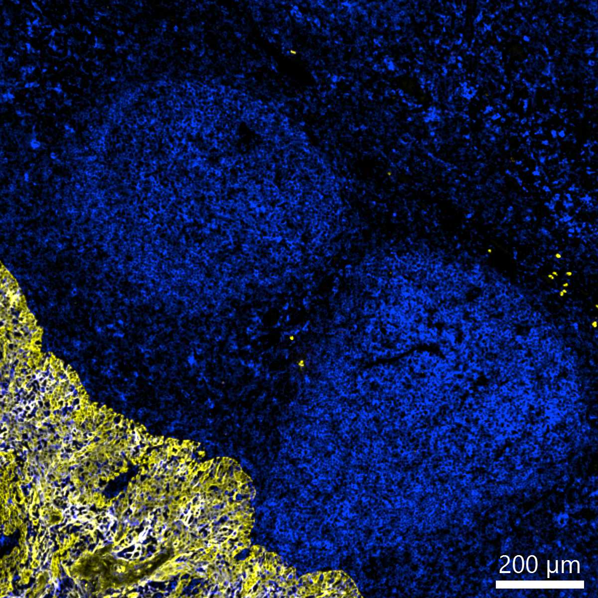

# Configurations

| UniProt Accession Number   | Reagent Type     | Target Name / Protein Biomarker   | Target Species   | Host Organism   | Isotype   | Clonality   | Vendor            | Catalog Number       | Conjugate   | RRID   | Availability   | Method                 | Tissue Preservation   | Target Tissue   | Tissue State   | Detergent         | Antigen Retrieval Conditions                                       | Dye Inactivation Conditions   | Recommend   | Agree                                                        | Disagree   | Contributor                                                  | Notes   |
|:---------------------------|:-----------------|:----------------------------------|:-----------------|:----------------|:----------|:------------|:------------------|:---------------------|:------------|:-------|:---------------|:-----------------------|:----------------------|:----------------|:---------------|:------------------|:-------------------------------------------------------------------|:------------------------------|:------------|:-------------------------------------------------------------|:-----------|:-------------------------------------------------------------|:--------|
| P01903                     | Primary Antibody | HLA-DR                            | Human            | Mouse           | IgG1      | TAL 1B5     | Novus Biologicals | NB600-989AF532-0.1ml | AF532       | NA     | Stock          | Multiplexed 2D Imaging | FFPE                  | Tonsil          | NA             | 0.3% Triton-X-100 | pH 9.5 for 15 minutes in a pressure cooker (Borg Decloaker BD1000) | NA                            | Yes         | [0000-0001-9561-4256](https://orcid.org/0000-0001-9561-4256) | NA         | [0000-0001-9561-4256](https://orcid.org/0000-0001-9561-4256) |         |

# Publications

# Additional Notes

| Human tonsil FFPE: HLA-DR (blue, catalog number NB600-989AF532-0.1ml) and pan-Cytokeratin (yellow, catalog number NBP2-33200AF700) |
|:-------:|
|  |
