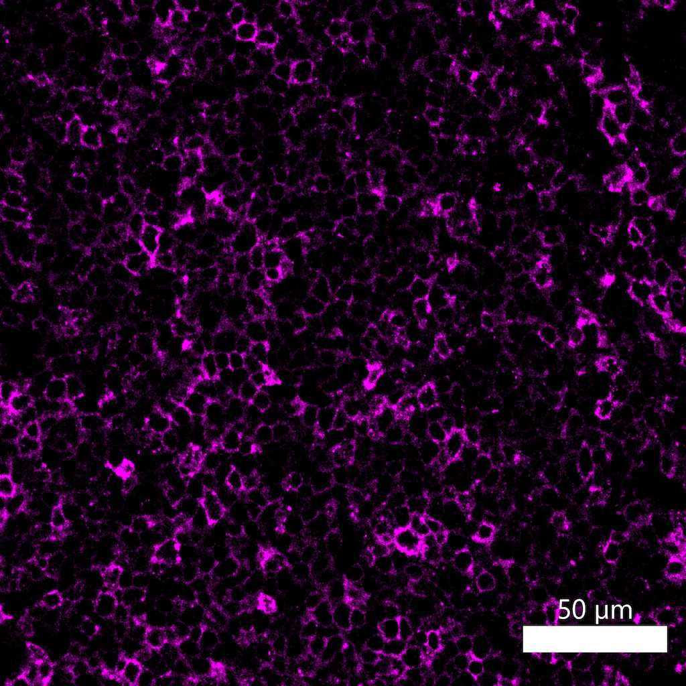

# Configurations

| UniProt Accession Number   | Reagent Type     | Target Name / Protein Biomarker   | Target Species   | Host Organism   | Isotype   | Clonality   | Vendor            | Catalog Number   | Conjugate   | RRID      | Availability   | Method                 | Tissue Preservation               | Target Tissue   | Tissue State   | Detergent         | Antigen Retrieval Conditions                                  | Dye Inactivation Conditions   | Recommend   | Agree                                    | Disagree   | Contributor         | Notes       |
|:---------------------------|:-----------------|:----------------------------------|:-----------------|:----------------|:----------|:------------|:------------------|:-----------------|:------------|:----------|:---------------|:-----------------------|:----------------------------------|:----------------|:---------------|:------------------|:--------------------------------------------------------------|:------------------------------|:------------|:-----------------------------------------|:-----------|:--------------------|:------------|
| P01903                     | Primary Antibody | HLA-DR                            | Human            | Mouse           | IgG2a     | L243        | BioLegend         | 307622           | AF647       | AB_493177 | Stock          | Multiplexed 2D Imaging | 1:4 Cytofix/Cytoperm Fixed Frozen | Lymph Node      | NA             | 0.3% Triton-X-100 | NA                                                            | NA                            | Yes         | [0000-0003-4379-8967](https://orcid.org/0000-0003-4379-8967)                      | NA         | [0000-0003-4379-8967](https://orcid.org/0000-0003-4379-8967) | [1](#notes) |
| P01903                     | Primary Antibody | HLA-DR                            | Human            | Mouse           | IgG2a     | LN-3        | Novus Biologicals | NBP2-47670AF647  | AF647       | NA        | Stock          | Multiplexed 2D Imaging | FFPE                              | Tonsil          | NA             | 0.3% Triton-X-100 | pH 6 for 40 minutes at 95C (AR6 Akoya Biosciences AR600250ML) | NA                            | Yes         | [0000-0003-4379-8967](https://orcid.org/0000-0003-4379-8967) [[1](#publications)] | NA         | [0000-0003-4379-8967](https://orcid.org/0000-0003-4379-8967) | [2](#notes) |
| P01903                     | Primary Antibody | HLA-DR                            | Human            | Mouse           | IgG2a     | LN-3        | Novus Biologicals | NBP2-47670AF647  | AF647       | NA     | Stock          | Multiplexed 2D Imaging | FFPE                  | Tonsil          | NA             | 0.3% Triton-X-100 | pH 6 for 30 minutes ER1 (AR9961) and pH 9 for 30 minutes ER2 (AR9640) using the Leica Bond | NA                            | Yes         | [0000-0003-4379-8967](https://orcid.org/0000-0003-4379-8967) | NA         | [0000-0003-4379-8967](https://orcid.org/0000-0003-4379-8967) | [3](#notes) |
| P01903                     | Primary Antibody | HLA-DR                            | Human            | Mouse           | IgG2a     | L243        | BioLegend |           307622 | AF647       | AB_493177 | Stock          | Multiplexed 2D Imaging | 1:4 Cytofix/Cytoperm Fixed Frozen | Jejunum         | NA             | 0.3% Triton-X-100 | NA                             | NA                            | Yes         | [0000-0003-4379-8967](https://orcid.org/0000-0003-4379-8967) | NA         | [0000-0003-4379-8967](https://orcid.org/0000-0003-4379-8967) |    [4](#notes)     |

# Publications

1. Q. Xu et al., "Adaptive immune responses to SARS-CoV-2 persist in the pharyngeal lymphoid tissue of children", *Nat. Nat Immunol.*, , [doi: 10.1038/s41590-022-01367-z](https://doi.org/10.1038/s41590-022-01367-z).

# Additional Notes

1. Clone L243 labels professional antigen presenting cells in fixed frozen tissues prepared from diverse organs. Several conjugates are suitable for IBEX experiments.
2. Clone LN-3 labels professional antigen presenting cells in FFPE tissues from diverse organs. Several conjugates are suitable for IBEX experiments.
3. Antibody labels the membranes of B cells and myeloid cells in the tonsil. Use at a dilution of 1:100. LN-3 clone is an excellent clone for FFPE tissues and works in many different conjugates.

| Human tonsil FFPE: HLA-DR (magenta, catalog number NBP2-47670AF647) |
|:-------:|
|  |

4. 
| Human jejunum: HLA-DR (pink, catalog number 307622) and EpCAM (blue, catalog number 324228) |
|:-------:|
|  |
