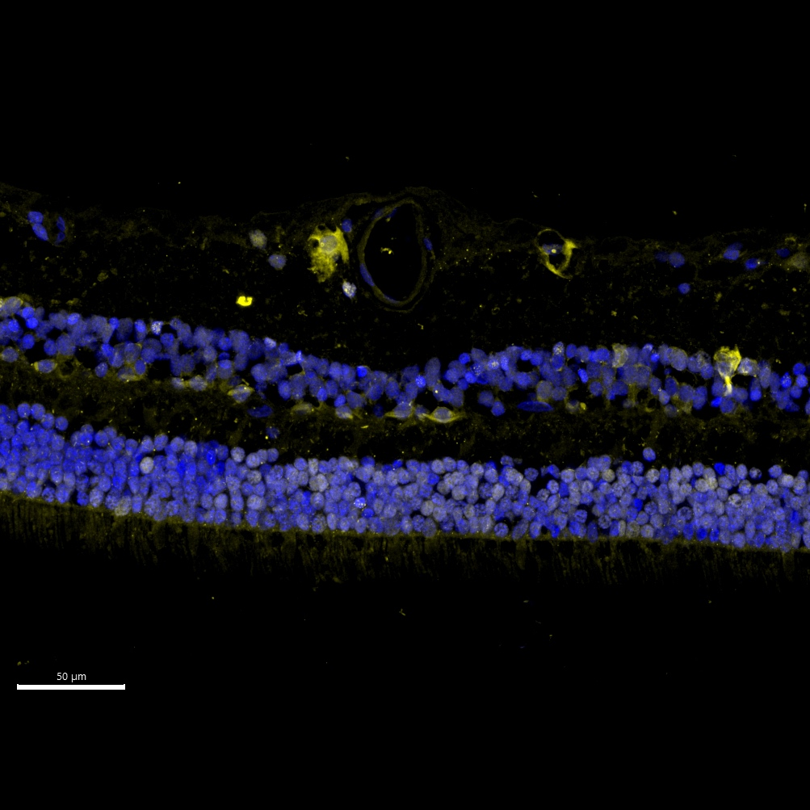

# Configurations

| UniProt Accession Number   | Reagent Type     | Target Name / Protein Biomarker   | Target Species   | Host Organism   | Isotype   | Clonality   | Vendor      | Catalog Number   | Conjugate   | RRID       | Availability   | Method        | Tissue Preservation               | Target Tissue   | Tissue State   | Detergent   | Antigen Retrieval Conditions   | Dye Inactivation Conditions                                  | Recommend   | Agree                                                        | Disagree   | Contributor                                                  | Notes   |
|:---------------------------|:-----------------|:----------------------------------|:-----------------|:----------------|:----------|:------------|:------------|:-----------------|:------------|:-----------|:---------------|:--------------|:----------------------------------|:----------------|:---------------|:------------|:-------------------------------|:-------------------------------------------------------------|:------------|:-------------------------------------------------------------|:-----------|:-------------------------------------------------------------|:--------|
| P16104                     | Primary Antibody | Histone H2A.X                     | Human            | Rabbit          | IgG       | Polyclonal  | Proteintech | 10856-1-AP       | AF546       | AB_2114985 | Custom         | IBEX2D Manual | 1:4 Cytofix/Cytoperm Fixed Frozen | Retina          | Healthy        | 0.1% Tween  | NA                             | Does not bleach within 15 minutes of 1 mg/ml LiBH4 treatment | Yes         | [0009-0004-2219-8641](https://orcid.org/0009-0004-2219-8641) | NA         | [0009-0004-2219-8641](https://orcid.org/0009-0004-2219-8641) |         |

# Publications

# Additional Notes

| Mouse retina: Isolectin GS-IB4 (green, catalogue number I21413) and DAPI (blue, catalogue number D9542-1MG) |
|:-------:|
|  |